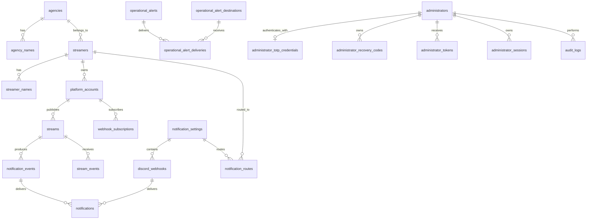

# StreamNotifyBot データ設計書

## 1. 文書の目的

本書は、`やりたいこと.md` のテーブル案を正規化し、要件を実現するために必要な概念データモデルを示します。データベースは MariaDB 10.5 を使用しますが、物理型や制約の詳細は未決定のため、型名や制約は論理表現です。

テーブル名、カラム名、型、マイグレーション方式は、採用するフレームワークとデータベースの規約に合わせて最終決定します。

## 2. 設計方針

- 内部 ID と外部サービスの ID を分離する
- 内部 ID は連番に依存せず、推測困難な UUID 等を第一候補とする
- 変更され得るハンドルと、安定したプラットフォーム ID を分離する
- 配信者、所属事務所、翻訳可能な名称を分離する
- 通知タイミングの処理記録と、Discord Webhook ごとの投稿結果を分離して追跡する
- 外部イベントと定期処理の冪等性を、一意制約と処理記録で支える
- 秘密情報を通常の一覧、ログ、CSV 出力から除外できる構造にする
- 日時は UTC で保存し、表示時に対象タイムゾーンへ変換する

## 3. 概念 ER 図

`notification_routes` により、1人の配信者へ複数の通知設定を関連付けます。対応プラットフォーム一覧はデータベースで管理せず、コードで定義します。

## 4. テーブル定義案

共通カラムとして、必要に応じて `created_at`、`updated_at`、楽観ロック用の版番号を持たせます。

### 4.1 `notification_settings`

4種類の通知種別の送信先をまとめる論理的な通知設定を表します。

| カラム | 論理型 | 必須 | 説明 |
| --- | --- | --- | --- |
| `id` | UUID | yes | 内部 ID |
| `display_name` | string | yes | 管理画面で使う一意な表示名 |
| `is_enabled` | boolean | yes | 通知設定全体の有効状態 |

制約:

- `display_name` は空文字を禁止する
- 大文字小文字を同一視するかは、データベース選定時に決定する

### 4.2 `discord_webhooks`

通知設定の通知種別ごとに登録する複数の Discord Webhook を表します。

| カラム | 論理型 | 必須 | 説明 |
| --- | --- | --- | --- |
| `id` | UUID | yes | 内部 ID |
| `notification_setting_id` | UUID | yes | 通知設定 ID |
| `notification_type` | enum/string | yes | `video_upload`, `pre_stream`, `live`, `stream_end` のいずれか |
| `encrypted_value` | binary | yes | XChaCha20-Poly1305 による Webhook URL の暗号文と認証タグ |
| `encryption_nonce` | binary(24) | yes | 暗号化ごとに生成するノンス |
| `encryption_key_id` | string | yes | 暗号化に使用した鍵の識別子 |
| `encryption_format_version` | integer | yes | 暗号化形式。初期値は `1` |
| `url_fingerprint` | binary(32) | no | 正規化したWebhook IDとトークンから生成するHMAC-SHA-256 |
| `fingerprint_key_id` | string | no | フィンガープリント生成に使用した鍵の識別子 |
| `display_hint` | string | no | 一覧表示用のマスク済み識別子 |
| `is_enabled` | boolean | yes | 個別の有効状態 |
| `last_succeeded_at` | datetime | no | 直近の送信成功日時 |
| `last_failed_at` | datetime | no | 直近の送信失敗日時 |
| `last_error_code` | string | no | 秘密情報を含まないエラー識別子 |

注意:

- URL 全体を検索、ログ、通常 CSV の対象にしない
- URL を更新しても通知設定 ID と通知種別は変えない
- 空または空白だけの URL は保存せず、通知種別に Webhook レコードがない状態を「送信しない」とする
- URLを保存する場合は暗号化関連列、`url_fingerprint`、`fingerprint_key_id`を必須とする
- URLはHTTPSの`discord.com/api/webhooks/{webhook_id}/{webhook_token}`形式だけを許可し、検証後に標準形式へ再構築する
- 暗号化には PHP の Sodium 拡張による XChaCha20-Poly1305 を使用し、追加認証データを `stream-notify-bot:secret:v1\0discord_webhook_url\0{id}\0{encryption_key_id}` とする
- HMAC入力は`discord-webhook:v1\0{webhook_id}\0{webhook_token}`とし、トークンの大文字小文字を維持する
- フィンガープリント鍵には32バイト以上のランダム値を使用し、URL暗号化鍵とは分離してリポジトリ、DB、Dockerイメージの外で管理する
- `(notification_setting_id, notification_type, fingerprint_key_id, url_fingerprint)`を一意とする
- 同じURLの無効レコードがある場合は新規作成せず、既存レコードを再有効化する
- 鍵ローテーション中は現行鍵と照合用鍵のすべてで登録時の重複を検索し、既存URLを復号して現行鍵のフィンガープリントへ順次移行する

### 4.2.1 秘密情報の暗号化エンベロープ

API 資格情報や Webhook 検証用シークレットなど、ほかの復号が必要な秘密情報にも次の構造を適用します。

| 項目 | 論理型 | 説明 |
| --- | --- | --- |
| `encrypted_value` | binary | 暗号文と認証タグ |
| `encryption_nonce` | binary(24) | レコードごと、暗号化ごとに生成するノンス |
| `encryption_key_id` | string | 復号鍵を選択する非秘密の識別子 |
| `encryption_format_version` | integer | 暗号化形式のバージョン |

- 暗号化鍵は 256 ビットとし、リポジトリ、DB、Web 公開ディレクトリ、Docker イメージの外にある鍵リングで管理する
- 追加認証データは `stream-notify-bot:secret:v1\0{purpose}\0{record_uuid}\0{key_id}` とし、用途とレコード間で暗号文を移動できないようにする
- 管理者パスワードはこの構造を使用せず、一方向のパスワードハッシュとして保存する
- 平文、暗号文、ノンス、鍵 ID、フィンガープリントを通常 CSV へ含めない
- 暗号化済み DB バックアップから復元する場合はレコード UUID を維持し、必要な鍵リングを別経路で復元する
- 鍵リングを失った暗号文は復元不能とし、自動削除や平文へのフォールバックを行わない

### 4.3 `agencies`

配信者の所属事務所を表します。「個人勢」も所属区分として登録できます。

| カラム | 論理型 | 必須 | 説明 |
| --- | --- | --- | --- |
| `id` | UUID | yes | 内部 ID |
| `code` | string | yes | 言語に依存しない一意コード |
| `default_language_code` | string | yes | 名称取得時の既定言語。初期値は`ja` |
| `is_independent` | boolean | yes | 個人勢区分かどうか |

### 4.4 `agency_names`

事務所名の多言語表現を保持します。

| カラム | 論理型 | 必須 | 説明 |
| --- | --- | --- | --- |
| `agency_id` | UUID | yes | 事務所 ID |
| `language_code` | string | yes | 正規化済みBCP 47言語コード。初期対応は`ja`または`en` |
| `name` | string | yes | 表示名 |
| `short_name` | string | no | 短縮名 |

主キーまたは一意制約は`(agency_id, language_code)`とします。`agencies.default_language_code`と同じ言語の行を必須とし、既定言語の行は直接削除できません。`short_name`がNULLの場合は同じ行の`name`を表示に使用します。

### 4.5 `streamers`

プラットフォームに依存しない配信者を表します。

| カラム | 論理型 | 必須 | 説明 |
| --- | --- | --- | --- |
| `id` | UUID | yes | 内部 ID |
| `agency_id` | UUID | yes | 所属区分 ID。事務所に所属しない場合は「個人勢」区分を参照する |
| `default_language_code` | string | yes | 名称取得時の既定言語。初期値は`ja` |
| `color_code` | string | no | `#RRGGBB` 形式の表示色 |
| `is_enabled` | boolean | yes | 監視対象かどうか |

`agency_id` は NULL を許容しません。所属事務所がないことを欠損値で表現せず、`agencies.is_independent` が真の「個人勢」区分へ関連付けます。

### 4.6 `streamer_names`

配信者名の多言語表現を保持します。

| カラム | 論理型 | 必須 | 説明 |
| --- | --- | --- | --- |
| `streamer_id` | UUID | yes | 配信者 ID |
| `language_code` | string | yes | 正規化済みBCP 47言語コード。初期対応は`ja`または`en` |
| `name` | string | yes | 表示名 |

主キーまたは一意制約は`(streamer_id, language_code)`とします。`streamers.default_language_code`と同じ言語の行を必須とし、既定言語の行は直接削除できません。

名称管理の共通規則:

- 初期対応言語はコードで定義した`ja`と`en`に限定する
- 言語コードは大文字小文字を区別せず検証し、BCP 47の推奨表記へ正規化して保存する
- 既定言語変更時は変更先名称の存在を検証し、同じトランザクションで更新する
- 名称の前後の空白を除去し、空白だけの値、改行、制御文字を拒否する
- 名称自体には一意制約を設けず、同名のエンティティと言語間の同一表記を許可する
- 要求言語、将来の基本言語、エンティティの既定言語の順に解決し、整合性違反時は固定文言とエラー状態を使用する
- プラットフォーム由来の`platform_accounts.name`と管理者が登録する`streamer_names.name`を分離し、API同期で後者を更新しない
- UI・通知固定文言、通知設定表示名、プラットフォーム名、外部サービス由来の名称と配信タイトルは翻訳テーブルへ含めない

### 4.7 プラットフォームカタログ（コード定義）

対応プラットフォームは、プラットフォーム固有の API、認証、Webhook、状態変換の実装を必要とするため、データベースの可変マスタではなくコードで定義します。

| 項目 | 論理型 | 必須 | 説明 |
| --- | --- | --- | --- |
| `code` | string | yes | `youtube` 等の一意コード |
| `display_id` | string | yes | 画面上でプラットフォームを識別するための ID。チャンネル名やアカウントの表示名ではない |
| `adapter` | class/service | yes | API、認証、Webhook、ポーリング、状態変換を実装する Platform Adapter |

`code` は永続データから参照する安定した識別子、`display_id` は管理画面などへ表示する識別子として区別します。`code` と `display_id` はコード上で重複を禁止します。追加・削除には実装、テスト、デプロイを必要とし、管理画面や CSV から変更できないものとします。

### 4.8 `platform_accounts`

配信者とプラットフォーム上のアカウントを関連付けます。

| カラム | 論理型 | 必須 | 説明 |
| --- | --- | --- | --- |
| `id` | UUID | yes | 内部 ID |
| `streamer_id` | UUID | yes | 配信者 ID |
| `platform_code` | string | yes | コードで定義されたプラットフォームコード |
| `external_id` | string | yes | API から取得した安定 ID |
| `registration_identifier` | string | yes | 登録時に利用者が入力したハンドル、ユーザーログイン、Screen ID等。API同期で上書きしない |
| `display_id` | string | no | ハンドル、ユーザーログイン、Screen ID など、利用者が識別に使う表示上の ID |
| `name` | string | no | プラットフォーム上のチャンネル名またはユーザー名 |
| `profile_url` | string | no | EmbedのAuthorから開く配信者ページURL |
| `icon_url` | string | no | WebhookのアバターとEmbedのAuthor・Footerに使うアイコンURL |
| `offline_image_url` | string | no | 配信終了時に使用できるプラットフォームのオフライン画像URL |
| `is_enabled` | boolean | yes | 監視対象かどうか |
| `resolved_at` | datetime | yes | 最後に API で解決した日時 |
| `api_data_refreshed_at` | datetime | no | API由来の表示情報を最後に取得・更新した日時 |
| `api_data_expires_at` | datetime | no | プラットフォーム規約に基づくAPIデータの絶対期限 |

制約:

- `(platform_code, external_id)` を一意とする
- `display_id` は変更され得るため主キーにしない
- `registration_identifier`は利用者入力とAPI由来値を分離するために保持し、通常CSVではこの値を移行して安定IDを再解決する
- `display_id` と `name` を混同せず、API が両方を返す場合は個別に保存する
- 外部 ID は数値と仮定せず文字列として扱う

### 4.9 `webhook_subscriptions`

プラットフォーム側の Webhook 購読状態を保持します。

| カラム | 論理型 | 必須 | 説明 |
| --- | --- | --- | --- |
| `id` | UUID | yes | 内部 ID |
| `platform_account_id` | UUID | yes | 対象アカウント ID |
| `external_subscription_id` | string | no | プラットフォーム側の購読 ID |
| `status` | enum/string | yes | `pending`, `active`, `error`, `expired` 等 |
| `expires_at` | datetime | no | 有効期限 |
| `renew_after` | datetime | no | 更新処理の実行予定日時 |
| `last_attempted_at` | datetime | no | 直近試行日時 |
| `failure_count` | integer | yes | 連続失敗回数 |
| `processing_lease_until` | datetime | no | 重複更新を防ぐリース期限 |
| `last_error_code` | string | no | 秘密情報を含まないエラー識別子 |

### 4.10 `streams`

プラットフォーム上の配信を表します。

| カラム | 論理型 | 必須 | 説明 |
| --- | --- | --- | --- |
| `id` | UUID | yes | 内部 ID |
| `platform_account_id` | UUID | yes | 配信アカウント ID |
| `external_id` | string | yes | プラットフォーム上の配信 ID |
| `status` | enum/string | yes | 共通配信状態 |
| `title` | string | no | 配信タイトル |
| `stream_url` | string | no | 許可済みプラットフォームの URL |
| `thumbnail_url` | string | no | サムネイル URL |
| `scheduled_at` | datetime | no | 配信予定日時 |
| `started_at` | datetime | no | 実開始日時 |
| `ended_at` | datetime | no | 優先規則により採用したUTCの終了起点 |
| `ended_at_source` | enum/string | no | `platform_api`, `verified_webhook`, `first_observed` のいずれか |
| `source_updated_at` | datetime | no | 外部サービス側の更新日時 |
| `last_polled_at` | datetime | no | 直近取得日時 |
| `next_poll_at` | datetime | no | 次回取得予定日時 |
| `tracking_ends_at` | datetime | no | `ended_at + 168時間`で算定したUTCの低頻度追跡・通知削除期限 |
| `notification_lifecycle_completed_at` | datetime | no | 全投稿削除、送信先なし、または恒久失敗により通知処理を終了した日時 |
| `api_data_refreshed_at` | datetime | no | API由来データを最後に取得・更新した日時 |
| `api_data_expires_at` | datetime | no | プラットフォーム規約に基づくAPIデータの絶対期限 |
| `api_data_purge_at` | datetime | no | 通知削除とバックアップ保持期間を考慮したDB削除予定日時 |
| `poll_lease_until` | datetime | no | 重複ポーリング防止用リース期限 |

制約:

- `(platform_account_id, external_id)` を一意とする
- 終了起点は`platform_api`、`verified_webhook`、`first_observed`の順に優先する
- `tracking_ends_at`は`ended_at + 168時間`とし、終了起点の変更と同じトランザクションで再計算する
- 現在時刻が`tracking_ends_at`未満の場合だけ低頻度ポーリング対象とし、以上の場合は通知削除対象とする
- 配信中へ戻った場合は`ended_at`、`ended_at_source`、`tracking_ends_at`をNULLへ戻す

### 4.11 `stream_events`

受信した外部イベントの重複排除と調査に必要な最小情報を保持します。

| カラム | 論理型 | 必須 | 説明 |
| --- | --- | --- | --- |
| `id` | UUID | yes | 内部 ID |
| `platform_code` | string | yes | コードで定義されたプラットフォームコード |
| `external_event_id` | string | no | 提供される場合のイベント ID |
| `deduplication_key` | string | yes | 重複排除用キー |
| `stream_id` | UUID | no | 解決後の配信 ID |
| `event_type` | string | yes | 正規化済みイベント種別 |
| `source_occurred_at` | datetime | no | 外部サービス上の発生日時 |
| `received_at` | datetime | yes | 受信日時 |
| `processed_at` | datetime | no | 処理完了日時 |
| `status` | enum/string | yes | `received`, `processed`, `ignored`, `error` 等 |
| `failure_count` | integer | yes | 連続失敗回数 |
| `next_attempt_at` | datetime | no | Cron で再試行する日時 |
| `processing_lease_until` | datetime | no | 重複処理を防ぐリース期限 |

生のリクエスト本文は秘密情報や個人情報を含む可能性があるため、無期限に保存しません。必要な場合は保存項目と保持期間をプラットフォームごとに定義します。

#### 4.11.1 `synchronization_runs`

プラットフォームアカウントの初回・復旧同期を、Cronの実行をまたいで再開するための実行状態を保持します。

| カラム | 論理型 | 必須 | 説明 |
| --- | --- | --- | --- |
| `id` | UUID | yes | 同期実行ID |
| `platform_account_id` | UUID | yes | 同期対象のプラットフォームアカウントID |
| `sync_type` | enum/string | yes | `initial`または`recovery` |
| `status` | enum/string | yes | `pending`, `processing`, `completed`, `error`等 |
| `started_at` | datetime | no | 同期開始日時。以後に届いたWebhookとの照合起点 |
| `scope_ends_at` | datetime | no | Twitch・TwitCastingの配信予定同期期間上限 |
| `completed_at` | datetime | no | 対象範囲を最後まで正常取得した日時 |
| `failure_count` | integer | yes | 連続失敗回数 |
| `next_attempt_at` | datetime | no | Cronで再試行する日時 |
| `processing_lease_until` | datetime | no | 重複実行を防ぐリース期限 |
| `last_error_code` | string | no | 秘密情報を含まないエラー識別子 |

同じアカウントで同じ種別の未完了同期を複数作成しません。保存済み配信予定との欠落比較は`completed`へ遷移する直前に行い、途中失敗した同期結果を削除・取消判定へ使用しません。

#### 4.11.2 `synchronization_batches`

同期実行内のAPIバッチまたはページ単位の処理状態を保持します。

| カラム | 論理型 | 必須 | 説明 |
| --- | --- | --- | --- |
| `id` | UUID | yes | 同期バッチID |
| `synchronization_run_id` | UUID | yes | 同期実行ID |
| `operation_code` | string | yes | Atom取得、`videos.list`、現在配信、配信予定等の操作コード |
| `batch_number` | integer | yes | 同期実行内の処理順序 |
| `request_scope_key` | string | yes | 同じ取得範囲を識別する内部キー |
| `continuation_token` | string | no | 次ページ取得に使う不透明なカーソル |
| `status` | enum/string | yes | `pending`, `processing`, `completed`, `error`等 |
| `item_count` | integer | yes | このバッチで取得または処理した件数 |
| `failure_count` | integer | yes | 連続失敗回数 |
| `next_attempt_at` | datetime | no | Cronで再試行する日時 |
| `processing_lease_until` | datetime | no | 重複処理を防ぐリース期限 |
| `last_error_code` | string | no | 秘密情報を含まないエラー識別子 |

`(synchronization_run_id, operation_code, batch_number)`を一意とします。成功したバッチは再実行せず、失敗または未完了のバッチだけを再試行します。同一カーソルが同じ取得範囲で反復した場合は異常として同期を停止します。

#### 4.11.3 `synchronization_batch_items`

YouTubeの最大50件単位の動画IDなど、バッチへ割り当てた外部項目を保持します。

| カラム | 論理型 | 必須 | 説明 |
| --- | --- | --- | --- |
| `synchronization_batch_id` | UUID | yes | 同期バッチID |
| `external_id` | string | yes | プラットフォーム上の安定した項目ID |
| `status` | enum/string | yes | `pending`, `processed`, `unavailable`, `error`等 |
| `processed_at` | datetime | no | 処理完了日時 |
| `last_error_code` | string | no | 秘密情報を含まないエラー識別子 |

`(synchronization_batch_id, external_id)`を一意とし、別ページやWebhookから同じ項目を取得した場合も`streams`の外部ID一意制約と通知の冪等キーで重複を防ぎます。YouTubeの`videos.list`の正常応答に含まれないIDは`unavailable`とし、無期限に再試行しません。

### 4.12 `notification_events`

通知タイミングまたは表示情報の変更ごとに、通知処理の単位を保持します。送信先がない場合も処理済みであることを記録し、同じ通知の再生成を防ぎます。

| カラム | 論理型 | 必須 | 説明 |
| --- | --- | --- | --- |
| `id` | UUID | yes | 内部 ID |
| `stream_id` | UUID | yes | 配信 ID |
| `event_type` | enum/string | yes | `video_uploaded`, `waiting_room_created`, `starts_in_30_minutes`, `scheduled_time_reached`, `stream_started`, `stream_ended`, `display_information_changed` のいずれか |
| `notification_type` | enum/string | yes | `video_upload`, `pre_stream`, `live`, `stream_end` のいずれか |
| `event_key` | string | yes | 同じ通知タイミングまたは情報変更を識別する冪等キー |
| `content_hash` | string | no | BOT が表示する情報から生成したハッシュ |
| `occurred_at` | datetime | yes | 通知条件が成立した日時 |
| `processed_at` | datetime | no | 既存投稿の削除と新規送信の処理完了日時 |
| `status` | enum/string | yes | `pending`, `processing`, `processed`, `no_destination`, `error` 等 |
| `failure_count` | integer | yes | 連続失敗回数 |
| `next_attempt_at` | datetime | no | Cron で再試行する日時 |
| `processing_lease_until` | datetime | no | 重複処理を防ぐリース期限 |
| `last_error_code` | string | no | 秘密情報を含まないエラー識別子 |
| `retention_started_at` | datetime | no | 処理完了、送信先なし、または恒久失敗による保持期間の起算日時 |

制約:

- `event_key` を一意とし、定期処理や外部イベントの重複による二重通知を防ぐ
- 待機所の初回検知では、検知時刻に該当する最も進んだ通知フェーズだけを作成する
- 配信終了後の表示情報変更では通知イベントを作成しない

### 4.13 `notifications`

通知イベントに対する Discord Webhook ごとの投稿結果を保持します。

| カラム | 論理型 | 必須 | 説明 |
| --- | --- | --- | --- |
| `id` | UUID | yes | 内部 ID |
| `notification_event_id` | UUID | yes | 通知イベント ID |
| `discord_webhook_id` | UUID | yes | 送信先 Webhook ID |
| `discord_message_id` | string | no | 削除に使う Discord メッセージ ID |
| `status` | enum/string | yes | `pending`, `sent`, `send_error`, `delete_pending`, `delete_error`, `deleted` 等 |
| `sent_at` | datetime | no | 送信成功日時 |
| `delete_after` | datetime | no | 配信終了後の削除予定日時 |
| `deleted_at` | datetime | no | 削除完了日時 |
| `failure_count` | integer | yes | 連続失敗回数 |
| `next_attempt_at` | datetime | no | 再試行予定日時 |
| `processing_lease_until` | datetime | no | 重複送信または削除を防ぐリース期限 |
| `last_error_code` | string | no | 秘密情報を含まないエラー識別子 |
| `retention_started_at` | datetime | no | 投稿削除完了または恒久失敗による保持期間の起算日時 |

制約と運用規則:

- `(notification_event_id, discord_webhook_id)` を一意とする
- 新しい通知イベントを処理する前に、同じ配信の `sent` または `delete_error` 状態の投稿をすべて削除対象にする
- 削除完了後、対象通知種別に設定された空ではない有効な Webhook ごとにレコードを作成して新規投稿する
- 有効な Webhook がない場合は新しい `notifications` レコードを作成せず、通知イベントを `no_destination` として完了する
- 削除失敗は `delete_error`、送信失敗は `send_error` として区別し、再試行する操作を明確にする
- 新規送信開始後は Webhook ごとに成功、失敗、再試行を管理し、1件の送信失敗で他の Webhook への送信を止めない

### 4.14 `notification_routes`

どの配信者にどの通知設定を適用するかを表します。

| カラム | 論理型 | 必須 | 説明 |
| --- | --- | --- | --- |
| `id` | UUID | yes | 内部 ID |
| `streamer_id` | UUID | yes | 配信者 ID |
| `notification_setting_id` | UUID | yes | 通知設定 ID |
| `is_enabled` | boolean | yes | 経路の有効状態 |

`(streamer_id, notification_setting_id)` を一意とし、1人の配信者に複数の通知設定を関連付けられるようにします。

### 4.15 `polling_policies`

プラットフォームと配信状態ごとのポーリング方針を保持します。

| カラム | 論理型 | 必須 | 説明 |
| --- | --- | --- | --- |
| `id` | UUID | yes | 内部 ID |
| `platform_code` | string | yes | コードで定義されたプラットフォームコード |
| `phase` | enum/string | yes | `scheduled`, `imminent`, `live`, `ended`, `error` 等 |
| `interval_seconds` | integer | yes | 基本ポーリング間隔 |
| `is_enabled` | boolean | yes | 方針の有効状態 |

`(platform_code, phase)` を一意とします。初期値と推奨範囲は次のとおりです。

| `phase` | YouTube | Twitch | TwitCasting | 推奨範囲 |
| --- | ---: | ---: | ---: | ---: |
| `scheduled` | 900 | 900 | 900 | 300～86400 |
| `imminent` | 60 | 300 | 300 | 60～900 |
| `live` | 60 | 300 | 300 | 60～900 |
| `ended` | 21600 | 21600 | 21600 | 3600～86400 |
| `error` | 300 | 300 | 300 | 60～86400 |

`interval_seconds`は60以上604800以下とします。0による無効化は認めず、`is_enabled`を使用します。推奨範囲外の値には警告を表示し、外部Cronの起動間隔より短い値を設定しても実際の実行頻度は上がらないことを表示します。

### 4.16 `job_policies`

レンタルサーバーの性能と実行制限に合わせて、Cron から起動するジョブの実行方針を保持します。

| カラム | 論理型 | 必須 | 説明 |
| --- | --- | --- | --- |
| `id` | UUID | yes | 内部 ID |
| `job_type` | enum/string | yes | Webhook 後続処理、配信ポーリング、購読更新、通知処理、クリーンアップ等のコード |
| `batch_size` | integer | yes | 1回に新しく取得する最大件数 |
| `max_runtime_seconds` | integer | yes | 新しい処理を開始できる最大実行時間 |
| `max_attempts` | integer | yes | 一時障害の最大試行回数 |
| `retry_initial_delay_seconds` | integer | yes | 最初の再試行までの待機時間 |
| `retry_max_delay_seconds` | integer | yes | 再試行間隔の上限 |
| `backoff_multiplier` | decimal | yes | 再試行間隔へ掛ける倍率 |
| `jitter_percent` | integer | yes | 再試行時刻へ加えるランダム幅の割合 |
| `lease_seconds` | integer | yes | 重複実行を防ぐリース時間 |
| `is_enabled` | boolean | yes | ジョブ種別が有効かどうか |

`job_type` は一意とします。リース時間は最大実行時間より長くし、すべての設定値へサーバー側の検証と絶対上限を設けます。

初期値:

| `job_type` | `batch_size` | `max_runtime_seconds` | `max_attempts` | `lease_seconds` |
| --- | ---: | ---: | ---: | ---: |
| `webhook_event` | 50 | 45 | 8 | 120 |
| `stream_polling` | 20 | 45 | 5 | 120 |
| `subscription_renewal` | 20 | 45 | 8 | 120 |
| `notification` | 20 | 45 | 8 | 120 |
| `cleanup` | 100 | 45 | 20 | 120 |

共通初期値は、`retry_initial_delay_seconds = 60`、`retry_max_delay_seconds = 3600`、`backoff_multiplier = 2.0`、`jitter_percent = 20`、`is_enabled = true` とします。`max_attempts` は初回実行を含む総試行回数です。

絶対制約:

- `batch_size`: 1以上1000以下
- `max_runtime_seconds`: 5以上900以下
- `max_attempts`: 1以上20以下
- `retry_initial_delay_seconds`: 1以上86400以下
- `retry_max_delay_seconds`: `retry_initial_delay_seconds` 以上604800以下
- `backoff_multiplier`: 1.0以上10.0以下
- `jitter_percent`: 0以上50以下
- `lease_seconds`: `max_runtime_seconds + max(30, max_runtime_secondsの20%を秒単位で切り上げた値)` 以上3600以下

設定変更は新しく取得するリースから適用し、既存リースの期限は変更しません。設定値による再試行より、外部サービスのレート制限時刻や恒久エラーの停止規則を優先します。

### 4.17 `platform_api_policies`

利用者ごとに異なる API 利用予算を保持します。

| カラム | 論理型 | 必須 | 説明 |
| --- | --- | --- | --- |
| `id` | UUID | yes | 内部 ID |
| `platform_code` | string | yes | コードで定義されたプラットフォームコード |
| `quota_bucket_code` | string | yes | 同一プラットフォーム内のQuota区分コード |
| `period_seconds` | integer | no | 固定期間制限の場合の集計期間。応答ヘッダーに従う場合は未設定 |
| `allocation_units` | integer | no | 外部サービス上の割当量。動的な場合は未設定 |
| `application_limit_units` | integer | no | アプリケーションが使用できる上限 |
| `normal_budget_units` | integer | no | 通常優先度の処理が使用できる上限 |
| `priority_reserve_units` | integer | no | 優先度の高い処理用に確保する量 |
| `warning_percent` | integer | yes | アプリケーション上限に対する警告率 |
| `critical_percent` | integer | yes | アプリケーション上限に対する危険率 |

`(platform_code, quota_bucket_code)`を一意とします。`normal_budget_units + priority_reserve_units <= application_limit_units <= allocation_units`を満たす必要があります。警告率と危険率は1以上100以下とし、`warning_percent < critical_percent`とします。動的な制限では、API応答から得た割当量、残量、リセット時刻を実行時データとして使用します。

初期値は、YouTube一般Quotaを10000 unit/日、アプリケーション上限8000、通常処理枠6000、優先処理用予約枠2000、警告70%、危険90%とします。Twitchは応答ヘッダーの割当量に対する60%を通常処理枠、80%を優先処理込みの上限として20%を残します。TwitCastingは60 request/60秒、通常処理枠36、アプリケーション上限48、優先処理用予約枠12とします。エンドポイント固有制限がある場合は別のQuota区分として管理します。

### 4.18 `platform_api_usage`

アプリケーション内で実行した API 操作の推定利用量を期間単位で集計します。

| カラム | 論理型 | 必須 | 説明 |
| --- | --- | --- | --- |
| `id` | UUID | yes | 内部 ID |
| `platform_code` | string | yes | コードで定義されたプラットフォームコード |
| `quota_bucket_code` | string | yes | 集計対象のQuota区分コード |
| `period_started_at` | datetime | yes | プラットフォーム規則に基づく集計期間の開始日時 |
| `estimated_units` | integer | yes | アプリケーション内で消費した推定利用量 |
| `reported_limit_units` | integer | no | API応答が示した割当量または上限 |
| `reported_remaining_units` | integer | no | API応答が示した残量 |
| `reported_reset_at` | datetime | no | API応答が示したリセット日時 |
| `updated_at` | datetime | yes | 最終集計日時 |

`(platform_code, quota_bucket_code, period_started_at)`を一意とします。`estimated_units`は外部でのAPI利用を含まない推定値であり、外部サービスが示す実際の残量として表示しません。`reported_*`が取得できる場合は推定値と区別して表示し、外部コンソールで実使用量を確認する案内を併記します。

### 4.19 `operational_alert_destinations`

通常の配信通知とは独立した管理者向け Discord Webhook を保持します。Webhook URLには4.2.1の暗号化エンベロープを適用し、用途を`operational_alert_webhook_url`とします。

| カラム | 論理型 | 必須 | 説明 |
| --- | --- | --- | --- |
| `id` | UUID | yes | 内部 ID |
| `display_hint` | string | yes | マスク済み識別子 |
| `encrypted_value` | binary | yes | Webhook URL の暗号文と認証タグ |
| `encryption_nonce` | binary(24) | yes | 暗号化ごとに生成するノンス |
| `encryption_key_id` | string | yes | 暗号化鍵 ID |
| `encryption_format_version` | integer | yes | 暗号化形式のバージョン |
| `url_fingerprint` | binary(32) | yes | URL 重複検知用 HMAC-SHA-256 |
| `fingerprint_key_id` | string | yes | フィンガープリント鍵 ID |
| `minimum_severity` | enum/string | yes | 送信する最低重要度 |
| `is_enabled` | boolean | yes | 送信先の有効状態 |

### 4.20 `operational_alert_policies`

| カラム | 論理型 | 必須 | 説明 |
| --- | --- | --- | --- |
| `id` | UUID | yes | 内部 ID |
| `alert_type` | enum/string | yes | コードで定義する障害種別 |
| `severity` | enum/string | yes | `critical`, `error`, `warning`, `info` |
| `consecutive_failure_threshold` | integer | no | 連続失敗回数。即時通知では未設定 |
| `duration_threshold_seconds` | integer | no | 継続時間。即時通知では未設定 |
| `renotify_interval_seconds` | integer | yes | 継続障害の再通知間隔。初期値21600秒 |
| `notify_on_recovery` | boolean | yes | 復旧通知を送るか |
| `is_enabled` | boolean | yes | 障害通知の有効状態 |

連続失敗回数は1～100、継続時間は60～604800秒、再通知間隔は900～604800秒とします。即時通知対象は失敗回数と継続時間を未設定とし、アプリケーション定義によって最初の検出時に通知します。

### 4.21 `operational_alerts`

| カラム | 論理型 | 必須 | 説明 |
| --- | --- | --- | --- |
| `id` | UUID | yes | 内部 ID |
| `alert_type` | enum/string | yes | 障害種別 |
| `target_type` | string | yes | 対象種別 |
| `target_id` | string | yes | UUIDまたは安定した対象コード |
| `severity` | enum/string | yes | 発生時の重要度 |
| `status` | enum/string | yes | `open`, `resolved`, `disabled` |
| `first_detected_at` | datetime | yes | 最初の検出日時 |
| `last_detected_at` | datetime | yes | 最終検出日時 |
| `resolved_at` | datetime | no | 復旧または終了日時 |
| `failure_count` | integer | yes | 累計失敗回数 |
| `last_error_code` | string | no | 秘密情報を含まないエラーコード |
| `correlation_id` | string | no | 関連ログを追跡する相関 ID |
| `last_notified_at` | datetime | no | 最終通知日時 |
| `next_notification_at` | datetime | no | 次回再通知日時 |
| `acknowledged_at` | datetime | no | 管理者が確認した日時 |

`alert_type`、`target_type`、`target_id`が同じ発生中障害は、トランザクションと物理設計で選定する制約によって1件に集約します。復旧済み履歴は複数保持できるようにします。確認済みは状態と分離し、確認操作だけで`resolved`へ変更しません。

### 4.22 `operational_alert_deliveries`

| カラム | 論理型 | 必須 | 説明 |
| --- | --- | --- | --- |
| `id` | UUID | yes | 内部 ID |
| `operational_alert_id` | UUID | yes | 障害 ID |
| `destination_id` | UUID | yes | 運用通知先 ID |
| `notification_kind` | enum/string | yes | `opened`, `renotified`, `resolved` |
| `status` | enum/string | yes | `pending`, `sent`, `error` |
| `attempt_count` | integer | yes | 試行回数 |
| `next_attempt_at` | datetime | no | 次回試行日時 |
| `sent_at` | datetime | no | 送信完了日時 |
| `last_error_code` | string | no | 秘密情報を含まないエラーコード |

運用通知の送信失敗から新しい`operational_alerts`を作成せず、このテーブル内で上限付き再試行を管理します。

### 4.23 `job_heartbeats`

| カラム | 論理型 | 必須 | 説明 |
| --- | --- | --- | --- |
| `job_type` | enum/string | yes | ジョブ種別。主キー |
| `expected_interval_seconds` | integer | yes | 外部Cronに設定した想定実行間隔 |
| `last_started_at` | datetime | no | 最終開始日時 |
| `last_succeeded_at` | datetime | no | 最終正常完了日時 |
| `last_finished_at` | datetime | no | 成否を問わない最終終了日時 |
| `last_result` | enum/string | no | `succeeded`, `failed`, `aborted` |

遅延判定は`last_succeeded_at`を基準に`max(expected_interval_seconds * 2, 600)`を初期猶予とし、管理画面では300～604800秒の範囲で上書き可能にします。

### 4.24 `retention_policies`

| カラム | 論理型 | 必須 | 説明 |
| --- | --- | --- | --- |
| `data_type` | enum/string | yes | コードで定義する保持対象。主キー |
| `retention_days` | integer | yes | データ本体の保持日数 |
| `effective_backup_retention_days` | integer | no | APIデータ期限算定に使う実効バックアップ保持日数 |
| `is_enabled` | boolean | yes | 自動クリーンアップの有効状態 |

値はデータ種別ごとに基本設計書11.1の絶対範囲を検証します。YouTube APIデータを含むバックアップでは`effective_backup_retention_days`を必須とし、1～14日だけを許可します。YouTube APIデータの期限内削除に必要な方針は`is_enabled = true`を強制し、管理画面やCSVから無効化できません。

### 4.25 `administrators`

管理画面へログインするローカル管理者を保持します。メールアドレスと外部アカウントIDは初期仕様では保持しません。

| カラム | 論理型 | 必須 | 説明 |
| --- | --- | --- | --- |
| `id` | UUID | yes | 管理者内部ID |
| `login_id` | string | yes | 小文字へ正規化した一意なログインID |
| `display_name` | string | yes | 管理画面と監査ログで使用する表示名 |
| `role` | enum/string | yes | `owner`または`administrator` |
| `status` | enum/string | yes | `pending`, `active`, `disabled`, `deleted` |
| `password_hash` | string | no | Argon2idのパスワードハッシュ。未設定・削除時はNULL |
| `authentication_version` | integer | yes | 認証情報・権限変更時に増加させるセッション失効用の版 |
| `password_changed_at` | datetime | no | パスワード設定・変更日時 |
| `totp_enrolled_at` | datetime | no | TOTP登録完了日時 |
| `last_login_at` | datetime | no | 最終ログイン成功日時 |
| `disabled_at` | datetime | no | 無効化日時 |
| `deleted_at` | datetime | no | 削除日時 |

`login_id`は前後空白を除去してASCII小文字へ正規化し、3～64文字の英数字、`.`、`_`、`-`だけを許可して一意とします。`active`へ遷移するにはパスワードとTOTP登録を必須とします。最後の有効な`owner`と操作中の管理者自身を無効化、削除、降格できない制約は、トランザクション内の再確認とロックで保証します。

### 4.26 `administrator_totp_credentials`

| カラム | 論理型 | 必須 | 説明 |
| --- | --- | --- | --- |
| `administrator_id` | UUID | yes | 管理者ID。主キー |
| `encrypted_value` | binary | yes | TOTP秘密値の暗号文と認証タグ |
| `encryption_nonce` | binary(24) | yes | 暗号化ごとに生成するノンス |
| `encryption_key_id` | string | yes | 暗号化鍵ID |
| `encryption_format_version` | integer | yes | 暗号化形式のバージョン |
| `last_accepted_time_step` | integer | no | 同じTOTPコードの再利用防止に使う最終受理期間 |

4.2.1の暗号化エンベロープを適用し、用途を`administrator_totp_secret`とします。秘密値は登録時のQRコード表示と認証判定時だけ復号し、画面への再表示、ログ、通常CSVへの出力を行いません。

### 4.27 `administrator_recovery_codes`

| カラム | 論理型 | 必須 | 説明 |
| --- | --- | --- | --- |
| `id` | UUID | yes | 回復コード内部ID |
| `administrator_id` | UUID | yes | 管理者ID |
| `code_hash` | binary(32) | yes | 十分な乱数を持つ回復コードのSHA-256ハッシュ |
| `created_at` | datetime | yes | 発行日時 |
| `used_at` | datetime | no | 使用日時 |

管理者ごとに未使用コードを10件発行し、平文は発行直後に一度だけ表示します。TOTP再設定、パスワード・TOTP回復、管理者削除時に未使用コードをすべて失効します。

### 4.28 `administrator_tokens`

初期設定、招待、パスワード・TOTP回復に使用する一度限りのトークンを保持します。

| カラム | 論理型 | 必須 | 説明 |
| --- | --- | --- | --- |
| `id` | UUID | yes | トークン内部ID |
| `administrator_id` | UUID | no | 対象管理者。初期`owner`作成前はNULL |
| `purpose` | enum/string | yes | `initial_setup`, `invitation`, `credential_reset` |
| `token_hash` | binary(32) | yes | 256ビット以上の生トークンのSHA-256ハッシュ |
| `created_by_administrator_id` | UUID | no | 発行した`owner`。初期設定とCLI回復ではNULL |
| `expires_at` | datetime | yes | 有効期限 |
| `consumed_at` | datetime | no | 使用日時 |
| `revoked_at` | datetime | no | 失効日時 |

`token_hash`を一意とし、生トークンはURLを発行した時点で一度だけ表示します。招待と回復の有効期限は30分とし、使用時は対象、用途、有効期限、未使用・未失効状態を同一トランザクションで検証して消費済みにします。

### 4.29 `administrator_sessions`

| カラム | 論理型 | 必須 | 説明 |
| --- | --- | --- | --- |
| `id` | UUID | yes | セッション内部ID |
| `administrator_id` | UUID | yes | 管理者ID |
| `token_hash` | binary(32) | yes | Cookieに格納するセッションIDのSHA-256ハッシュ |
| `authentication_version` | integer | yes | 作成時の管理者認証版 |
| `created_at` | datetime | yes | ログイン日時 |
| `last_activity_at` | datetime | yes | 最終操作日時 |
| `idle_expires_at` | datetime | yes | 無操作期限 |
| `absolute_expires_at` | datetime | yes | ログインからの絶対期限 |
| `reauthenticated_at` | datetime | no | パスワードとTOTPで最後に再認証した日時 |
| `source_ip` | binary/string | yes | IPv4またはIPv6の送信元アドレス |
| `user_agent` | string | no | 長さと制御文字を検証したUser-Agent |
| `revoked_at` | datetime | no | 明示失効日時 |

`token_hash`を一意とし、生のセッションIDは保存しません。管理者の`authentication_version`と一致しないセッション、期限切れ、失効済み、無効・削除済み管理者のセッションを拒否します。

### 4.30 `authentication_attempts`

ログイン試行制限と異常検知に必要な最小情報を保持します。

| カラム | 論理型 | 必須 | 説明 |
| --- | --- | --- | --- |
| `id` | UUID | yes | 試行内部ID |
| `login_identifier_hash` | binary(32) | yes | 正規化した入力ログインIDのHMAC-SHA-256 |
| `source_ip` | binary/string | yes | IPv4またはIPv6の送信元アドレス |
| `attempted_at` | datetime | yes | 試行日時 |
| `result` | enum/string | yes | `succeeded`または内部用の失敗分類 |
| `retry_after` | datetime | no | 次に試行可能となる日時 |

存在しないログインIDの入力値を平文で保存せず、ログインIDと送信元IPの両方で15分間の失敗回数を集計します。HMAC鍵は用途`authentication_throttle_key`として、暗号化鍵やWebhookフィンガープリント鍵と分離してリポジトリ、DB、Web公開ディレクトリ、Dockerイメージの外で管理します。失敗理由は画面へ返さず、運用通知では個別入力値を表示しません。

### 4.31 `authentication_policies`

| カラム | 論理型 | 必須 | 説明 |
| --- | --- | --- | --- |
| `id` | UUID | yes | 単一方針行のID |
| `idle_timeout_minutes` | integer | yes | 無操作期限。既定30、範囲5～120 |
| `absolute_timeout_hours` | integer | yes | 絶対期限。既定12、範囲1～24 |
| `reauthentication_minutes` | integer | yes | 高リスク操作の再認証期限。初期10分 |
| `failure_window_minutes` | integer | yes | 失敗集計期間。初期15分 |
| `failure_threshold` | integer | yes | 待機開始までの失敗回数。初期5回 |
| `maximum_delay_minutes` | integer | yes | 段階的待機の上限。初期15分 |
| `initial_setup_completed_at` | datetime | no | 最初の`owner`作成により初期設定を恒久無効化した日時 |

単一行だけを保持し、絶対期限を無操作期限以上にします。`initial_setup_completed_at`は一度設定した後にアプリケーションからNULLへ戻せません。安全性を低下させる変更は再認証と監査ログの対象にし、コードで定義した絶対範囲を超える値を保存しません。

### 4.32 `audit_logs`

| カラム | 論理型 | 必須 | 説明 |
| --- | --- | --- | --- |
| `id` | UUID | yes | 監査イベントID |
| `occurred_at` | datetime | yes | UTCの操作日時 |
| `actor_administrator_id` | UUID | no | 認証済み操作者。未認証イベントはNULL |
| `actor_display_snapshot` | string | no | 操作時点の表示用識別子 |
| `action_code` | string | yes | コードで定義する操作種別 |
| `target_type` | string | no | 対象種別 |
| `target_id` | string | no | 対象内部ID |
| `result` | enum/string | yes | `succeeded`, `failed`, `denied` |
| `correlation_id` | string | yes | 関連ログを追跡する相関ID |
| `source_ip` | binary/string | no | 送信元IP |
| `user_agent` | string | no | 長さと制御文字を検証したUser-Agent |
| `change_summary` | structured data | no | 秘密情報を除外した変更前後の要約 |
| `error_code` | string | no | 秘密情報を含まないエラーコード |

アプリケーションからは追加だけを許可し、更新APIと任意削除APIを設けません。保持期限に達した行は専用クリーンアップだけが削除します。管理画面の状態変更と監査ログ追加は同じトランザクションで行い、監査ログの追加失敗時は状態変更をロールバックします。変更要約は許可した項目だけから構築し、パスワード、TOTP、回復コード、セッション・セットアップ・リセットトークン、Webhook URL、API資格情報、暗号文、ノンス、鍵を含めません。

## 5. 削除と保持

- 通知タイミングまたは表示情報が変わった場合は、同じ配信の既存投稿を削除してから新しい投稿を作成する
- 配信終了通知の投稿は、UTCの`tracking_ends_at`に到達した後のクリーンアップ処理で削除する
- 削除失敗は通知削除ジョブで再試行し、`tracking_ends_at`を延長しない
- DiscordのNot Foundは削除済みとして扱い、削除完了後の終了時刻訂正だけでは投稿を復元しない
- `notification_events`と`notifications`は処理終了またはDiscord投稿削除完了から30日で物理削除する
- 処理済み`stream_events`は30日、期限切れ購読履歴は初期30日、復旧済み障害は初期180日、Quota使用量は初期400日保持する
- YouTube API由来データは保持目的で再取得せず、`api_data_purge_at = min(notification_lifecycle_completed_at + 14日, api_data_refreshed_at + 30日 - effective_backup_retention)`で削除期限を算定する
- 有効なYouTubeアカウントのAPI由来表示情報は通常同期で30日以内に更新し、無効化後は再取得せず`api_data_expires_at`までに削除する
- YouTube APIデータを含むアプリ管理バックアップは初期7日、最大14日とし、稼働DBと保持中バックアップの双方から最終取得後30暦日以内に削除する
- 通知結果へYouTube API由来メタデータを複製せず、APIデータ削除後は内部処理情報だけを保持する
- 履歴参照用レコードでは外部IDを元値と無関係なランダム墓標IDへ置換し、タイトル、URL、画像、API由来の`content_hash`をNULLにする
- 冪等キーと相関IDにはAPI由来値を直接埋め込まず、内部UUIDまたは削除可能な対応表を使用する
- `platform_api_usage`はコンテンツのAPIメタデータを保持せず、アプリケーション内の操作種別と推定消費量だけを集計する
- 配信者、所属区分、プラットフォームアカウント、通知設定は即時無効化後に初期30日論理削除し、猶予期間後に識別情報を匿名化する
- Webhook URL、API資格情報、セッションなどの秘密情報は論理削除期間を待たず、削除操作時に暗号化関連値を含めて物理削除する
- 無効化した管理者は認証情報を保持して全セッションと未使用トークンを失効し、削除した管理者はパスワードハッシュ、TOTP秘密値、回復コード、セッション、未使用トークンを即時削除する
- 管理者墓標は監査ログの参照中は保持し、監査ログ保持終了後に参照がなくなった場合だけ物理削除する
- 期限切れ・使用済み管理者トークンと失効・期限切れセッションは7日、認証試行は30日、監査ログは既定365日保持する
- 処理待ち、再試行待ち、リース中、追跡中、発生中障害など未完了データを保持期限だけで削除しない
- 履歴参照用の墓標は関連履歴の保持終了後、参照のないものを子レコードから順に物理削除する
- 「個人勢」の既定区分は削除不可とする
- OAuth認可取消または利用者の削除要求では、可能な限り即時、遅くとも7暦日以内に関連データとトークンを削除する
- 復元したバックアップの期限切れデータは表示や通常処理の前にクリーンアップする

## 6. CSV 方針

### 6.1 通常CSV対象

| CSV種別 | インポート可能列 |
| --- | --- |
| `notification_settings` | `schema_version`, `id`, `display_name`, `is_enabled` |
| `agencies` | `schema_version`, `id`, `code`, `default_language_code`, `is_independent` |
| `agency_names` | `schema_version`, `agency_id`, `language_code`, `name`, `short_name` |
| `streamers` | `schema_version`, `id`, `agency_id`, `default_language_code`, `color_code`, `is_enabled` |
| `streamer_names` | `schema_version`, `streamer_id`, `language_code`, `name` |
| `platform_accounts` | `schema_version`, `id`, `streamer_id`, `platform_code`, `registration_identifier`, `is_enabled` |
| `notification_routes` | `schema_version`, `id`, `streamer_id`, `notification_setting_id`, `is_enabled` |
| `polling_policies` | `schema_version`, `platform_code`, `phase`, `interval_seconds`, `is_enabled` |
| `job_policies` | `schema_version`と4.16で定義した管理可能な方針列 |
| `platform_api_policies` | `schema_version`と4.17で定義した管理可能な予算列 |
| `operational_alert_policies` | `schema_version`と4.20で定義した管理可能な方針列 |
| `retention_policies` | `schema_version`, `data_type`, `retention_days`, `effective_backup_retention_days`, `is_enabled` |

Discord・運用通知Webhook、API資格情報、管理者認証、セッション、実行履歴、API由来キャッシュは対象外とします。暗号文、ノンス、鍵ID、フィンガープリント、内部処理状態、日時、リース、再試行、エラー、論理削除列も含めません。`platform_accounts`の安定外部IDとAPI由来表示情報は出力せず、利用者入力の`registration_identifier`から移行先で再解決します。

### 6.2 形式とバージョン

- エクスポートはUTF-8 BOM付き、カンマ区切り、CRLF、全フィールド二重引用符付きとする
- インポートはBOM付き・なしUTF-8だけを許可し、ほかの文字コードや区切りを推測しない
- 値中の二重引用符を二重化し、制御文字、NUL、フィールド内改行を拒否する
- nullable列の空フィールドをNULLとし、空文字を値として許可しない
- 日時はUTC、真偽値は`true`・`false`、UUIDは小文字標準形式、小数点は`.`へ固定する
- `schema_version`を先頭列に必須とし、初期値を`1`とする
- 全行で同じバージョンを必須とし、未対応・混在バージョンを拒否する
- CSV種別は管理画面またはCLIで指定し、ファイル名から推測しない
- 種別とバージョンごとに列名と順序を固定し、重複、未知列、不足、順序違いを拒否する

### 6.3 反映規則

- 追加は既存主キー・一意キーとの重複をエラーにする
- 追加・更新は一致行を更新し、存在しない行を追加し、CSVにない既存行を変更しない
- 置換はCSVにない既存行を論理削除または無効化し、物理削除や秘密情報の変更を行わない
- 既定方式は追加・更新とし、置換では削除・無効化予定件数の追加確認を必須とする
- 参照関係、一意性、変更不可列を全行検証し、1ファイルを全件成功または全件ロールバックする
- 新規IDが空欄の場合はプレビュー時にUUIDを生成し、参照用の対応表を提供する
- `platform_accounts`は`registration_identifier`からDB反映前に全件の安定IDをAPI解決し、1件でも失敗すれば反映しない
- YouTube APIデータの期限内削除など必須方針を無効化または絶対上限超過させる入力を拒否する

### 6.4 プレビュー、一時ファイル、上限

- プレビューは追加、更新、変更なし、無効化、エラー、警告、API解決件数、推定Quotaを表示する
- ファイルハッシュ、CSV種別、更新方式、DB基準状態を結び付け、初期30分で失効させる
- 一時ファイルはWeb公開ディレクトリ外へ保存し、期限切れ、完了、失敗時に削除する
- 初期上限は10 MiB、50,000行、1フィールド16 KiBとする
- 絶対上限は100 MiB、500,000行、1フィールド1 MiB、プレビュー24時間とする
- 全件をメモリへ展開せず、ストリーム読み込みとステージングを使用する
- 生CSVを処理結果として保持せず、内容をログへ出力しない

### 6.5 数式注入とエラー結果

文字列列が先頭空白を除いて`=`、`+`、`-`、`@`で始まる場合は先頭へ`'`を付け、元値が`'`で始まる場合は`''`へ二重化します。インポートではこの可逆規則に一致する場合だけ元へ戻します。

エラー結果には物理行番号、データ行番号、列名、エラーコード、説明、マスク・長さ制限済み入力値を含め、同じ形式のUTF-8 BOM付きCSVで出力します。エラー結果やID対応表を含むすべてのCSV出力に同じ数式注入対策を適用します。

## 7. インデックス案

データ量と実行計画を計測した上で確定しますが、初期候補は次のとおりです。

- `platform_accounts(platform_code, external_id)` unique
- `streams(platform_account_id, external_id)` unique
- `streams(next_poll_at, status)`
- `streams(tracking_ends_at, status)`
- `streams(api_data_purge_at)`
- `stream_events(deduplication_key)` unique
- `stream_events(next_attempt_at, status)`
- `webhook_subscriptions(renew_after, status)`
- `notification_events(event_key)` unique
- `notification_events(stream_id, status)`
- `notification_events(next_attempt_at, status)`
- `notifications(notification_event_id, discord_webhook_id)` unique
- `discord_webhooks(notification_setting_id, notification_type, fingerprint_key_id, url_fingerprint)` unique
- `notifications(next_attempt_at, status)`
- `notifications(delete_after, status)`
- `notification_routes(streamer_id, notification_setting_id)` unique

## 8. トランザクションと同時実行

- 配信状態の更新と `notification_events` の作成は、可能な限り同一トランザクションで行う
- 新しい通知イベントでは既存投稿の削除完了後に送信対象を確定し、有効な Webhook がなければ `no_destination` として完了する
- Discord 送信などの外部通信中は、データベーストランザクションを保持し続けない
- 外部通信の前後で状態を記録し、途中失敗から再開できるようにする
- Discord Webhook ごとの処理を独立して記録し、一部失敗時は未完了の対象だけを再試行する
- 通知イベントの送信先確定時は、選択したURLを復号して現行鍵のフィンガープリントを算出し、同じURLを1件へ集約してから`notifications`を作成する
- Cron の重複起動には、対象行のロックまたは期限付きリースを用いる
- 専用キューを使用せず、各業務テーブルの処理状態、再試行時刻、リース期限を Cron ジョブの処理待ち情報として使用する
- 一意制約違反を通常の競合として処理し、重複レコードを作らない
- CSVはステージングで全行検証し、管理者の確定後に1ファイル単位のトランザクションで全件反映または全件ロールバックする

## 9. マイグレーション

- スキーマ変更は順序付きマイグレーションとして管理する
- アプリケーションコードと互換性のある段階的変更を優先する
- 破壊的変更の前に、バックアップ、移行、ロールバック方法を確認する
- 初期データとサンプルデータを区別し、実在の秘密情報を含めない
- データベース製品ごとの差異を自動テストまたは Docker 環境で検証する
- 平文の秘密情報から移行する場合は、暗号化、復号検証、平文削除をレコード単位の同一トランザクションで行い、平文の一時ファイルやログを作成しない
- 暗号化鍵のローテーションは、現在の鍵 ID を条件にした冪等な更新とし、処理件数を鍵 ID ごとに確認できるようにする
- 保持期間短縮は削除件数と対象期間のプレビュー後に適用し、クリーンアップは期限と処理状態を再確認して小さなバッチで実行する

## 10. 未決事項

- MariaDB 10.5 における UUID、日時、JSON、ロック機能の具体的な利用方法

## 11. 関連文書

- [要件定義書](要件定義書.md)
- [基本設計書](基本設計書.md)
- [初期構想メモ](../やりたいこと.md)
