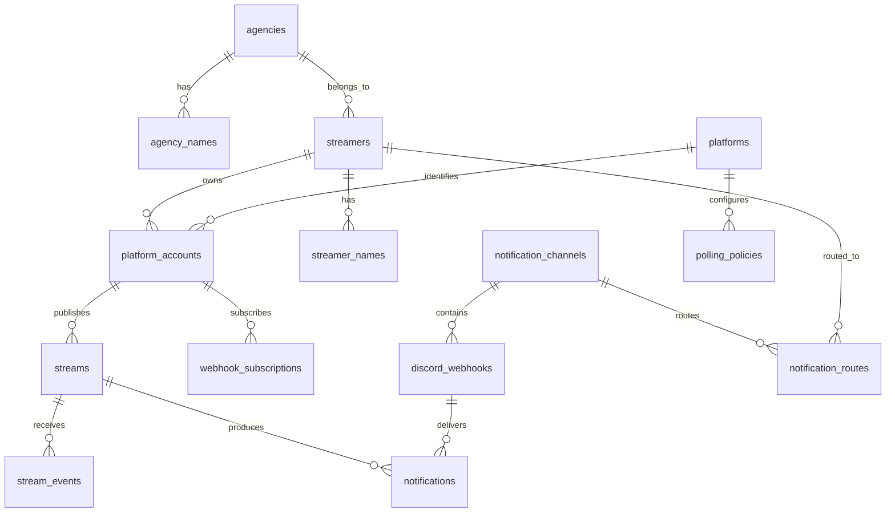

# StreamNotifyBot データ設計書

## 1. 文書の目的

本書は、`やりたいこと.md` のテーブル案を正規化し、要件を実現するために必要な概念データモデルを示します。データベース製品が未決定のため、型名や制約は論理表現です。

テーブル名、カラム名、型、マイグレーション方式は、採用するフレームワークとデータベースの規約に合わせて最終決定します。

## 2. 設計方針

- 内部 ID と外部サービスの ID を分離する
- 内部 ID は連番に依存せず、推測困難な UUID 等を第一候補とする
- 変更され得るハンドルと、安定したプラットフォーム ID を分離する
- 配信者、所属事務所、翻訳可能な名称を分離する
- Discord Webhook ごとに通知投稿を追跡する
- 外部イベントと定期処理の冪等性を、一意制約と処理記録で支える
- 秘密情報を通常の一覧、ログ、CSV 出力から除外できる構造にする
- 日時は UTC で保存し、表示時に対象タイムゾーンへ変換する

## 3. 概念 ER 図

`notification_routes` は「どの配信者をどの通知先へ送るか」という元メモで未定義の関係を表す設計案です。全配信者を全通知先へ送る仕様の場合は不要です。

## 4. テーブル定義案

共通カラムとして、必要に応じて `created_at`、`updated_at`、楽観ロック用の版番号を持たせます。

### 4.1 `notification_channels`

論理的な通知先を表します。

| カラム | 論理型 | 必須 | 説明 |
| --- | --- | --- | --- |
| `id` | UUID | yes | 内部 ID |
| `display_name` | string | yes | 管理画面で使う一意な表示名 |
| `is_enabled` | boolean | yes | 通知先全体の有効状態 |

制約:

- `display_name` は空文字を禁止する
- 大文字小文字を同一視するかは、データベース選定時に決定する

### 4.2 `discord_webhooks`

通知先に属する複数の Discord Webhook を表します。

| カラム | 論理型 | 必須 | 説明 |
| --- | --- | --- | --- |
| `id` | UUID | yes | 内部 ID |
| `notification_channel_id` | UUID | yes | 通知先 ID |
| `secret_value` | secret/string | yes | Webhook URL。保存時暗号化を推奨 |
| `display_hint` | string | yes | 一覧表示用のマスク済み識別子 |
| `is_enabled` | boolean | yes | 個別の有効状態 |
| `last_succeeded_at` | datetime | no | 直近の送信成功日時 |
| `last_failed_at` | datetime | no | 直近の送信失敗日時 |
| `last_error_code` | string | no | 秘密情報を含まないエラー識別子 |

注意:

- URL 全体を検索、ログ、通常 CSV の対象にしない
- URL を更新しても論理通知先 ID は変えない
- 同じ URL の重複登録を検知できるよう、鍵付きハッシュの保存を検討する

### 4.3 `agencies`

配信者の所属事務所を表します。「個人勢」も所属区分として登録できます。

| カラム | 論理型 | 必須 | 説明 |
| --- | --- | --- | --- |
| `id` | UUID | yes | 内部 ID |
| `code` | string | yes | 言語に依存しない一意コード |
| `is_independent` | boolean | yes | 個人勢区分かどうか |

### 4.4 `agency_names`

事務所名の多言語表現を保持します。

| カラム | 論理型 | 必須 | 説明 |
| --- | --- | --- | --- |
| `agency_id` | UUID | yes | 事務所 ID |
| `language_code` | string | yes | BCP 47 等の言語コード |
| `name` | string | yes | 表示名 |
| `short_name` | string | no | 短縮名 |

主キーまたは一意制約は `(agency_id, language_code)` とします。

### 4.5 `streamers`

プラットフォームに依存しない配信者を表します。

| カラム | 論理型 | 必須 | 説明 |
| --- | --- | --- | --- |
| `id` | UUID | yes | 内部 ID |
| `agency_id` | UUID | no | 所属事務所 ID。未所属を許容する案 |
| `color_code` | string | no | `#RRGGBB` 形式の表示色 |
| `is_enabled` | boolean | yes | 監視対象かどうか |

### 4.6 `streamer_names`

配信者名の多言語表現を保持します。

| カラム | 論理型 | 必須 | 説明 |
| --- | --- | --- | --- |
| `streamer_id` | UUID | yes | 配信者 ID |
| `language_code` | string | yes | 言語コード |
| `name` | string | yes | 表示名 |

主キーまたは一意制約は `(streamer_id, language_code)` とします。初期対応言語を日本語と英語に限定するかは未決事項です。

### 4.7 `platforms`

配信プラットフォーム種別を表します。

| カラム | 論理型 | 必須 | 説明 |
| --- | --- | --- | --- |
| `id` | UUID または code | yes | 内部 ID |
| `code` | string | yes | `youtube` 等の一意コード |
| `display_id` | string | yes | 画面上でプラットフォームを識別するための ID。チャンネル名やアカウントの表示名ではない |
| `is_enabled` | boolean | yes | システム全体の有効状態 |

`code` はプログラム内部で参照する安定した識別子、`display_id` は管理画面などへ表示する識別子として区別します。`display_id` には一意制約を設定します。

プラットフォーム一覧がコードで固定される場合は列挙値として管理し、データベースで可変にする必要性を実装前に再評価します。

### 4.8 `platform_accounts`

配信者とプラットフォーム上のアカウントを関連付けます。

| カラム | 論理型 | 必須 | 説明 |
| --- | --- | --- | --- |
| `id` | UUID | yes | 内部 ID |
| `streamer_id` | UUID | yes | 配信者 ID |
| `platform_id` | UUID/code | yes | プラットフォーム ID |
| `external_id` | string | yes | API から取得した安定 ID |
| `display_id` | string | no | ハンドル、ユーザーログイン、Screen ID など、利用者が識別に使う表示上の ID |
| `name` | string | no | プラットフォーム上のチャンネル名またはユーザー名 |
| `is_enabled` | boolean | yes | 監視対象かどうか |
| `resolved_at` | datetime | yes | 最後に API で解決した日時 |

制約:

- `(platform_id, external_id)` を一意とする
- `display_id` は変更され得るため主キーにしない
- `display_id` と `name` を混同せず、API が両方を返す場合は個別に保存する
- 外部 ID は数値と仮定せず文字列として扱う

### 4.9 `webhook_subscriptions`

プラットフォーム側の Webhook 購読状態を保持します。

| カラム | 論理型 | 必須 | 説明 |
| --- | --- | --- | --- |
| `id` | UUID | yes | 内部 ID |
| `platform_account_id` | UUID | yes | 対象アカウント ID |
| `external_subscription_id` | string | no | プラットフォーム側の購読 ID |
| `status` | enum/string | yes | `pending`, `active`, `error`, `expired` 等 |
| `expires_at` | datetime | no | 有効期限 |
| `renew_after` | datetime | no | 更新処理の実行予定日時 |
| `last_attempted_at` | datetime | no | 直近試行日時 |
| `failure_count` | integer | yes | 連続失敗回数 |
| `last_error_code` | string | no | 秘密情報を含まないエラー識別子 |

### 4.10 `streams`

プラットフォーム上の配信を表します。

| カラム | 論理型 | 必須 | 説明 |
| --- | --- | --- | --- |
| `id` | UUID | yes | 内部 ID |
| `platform_account_id` | UUID | yes | 配信アカウント ID |
| `external_id` | string | yes | プラットフォーム上の配信 ID |
| `status` | enum/string | yes | 共通配信状態 |
| `title` | string | no | 配信タイトル |
| `stream_url` | string | no | 許可済みプラットフォームの URL |
| `thumbnail_url` | string | no | サムネイル URL |
| `scheduled_at` | datetime | no | 配信予定日時 |
| `started_at` | datetime | no | 実開始日時 |
| `ended_at` | datetime | no | 終了日時 |
| `source_updated_at` | datetime | no | 外部サービス側の更新日時 |
| `last_polled_at` | datetime | no | 直近取得日時 |
| `next_poll_at` | datetime | no | 次回取得予定日時 |
| `tracking_ends_at` | datetime | no | 低頻度追跡の終了日時 |
| `poll_lease_until` | datetime | no | 重複ポーリング防止用リース期限 |

制約:

- `(platform_account_id, external_id)` を一意とする
- 終了時刻、追跡期限、通知削除期限の算定規則を共通化する

### 4.11 `stream_events`

受信した外部イベントの重複排除と調査に必要な最小情報を保持します。

| カラム | 論理型 | 必須 | 説明 |
| --- | --- | --- | --- |
| `id` | UUID | yes | 内部 ID |
| `platform_id` | UUID/code | yes | プラットフォーム ID |
| `external_event_id` | string | no | 提供される場合のイベント ID |
| `deduplication_key` | string | yes | 重複排除用キー |
| `stream_id` | UUID | no | 解決後の配信 ID |
| `event_type` | string | yes | 正規化済みイベント種別 |
| `source_occurred_at` | datetime | no | 外部サービス上の発生日時 |
| `received_at` | datetime | yes | 受信日時 |
| `processed_at` | datetime | no | 処理完了日時 |
| `status` | enum/string | yes | `received`, `processed`, `ignored`, `error` 等 |

生のリクエスト本文は秘密情報や個人情報を含む可能性があるため、無期限に保存しません。必要な場合は保存項目と保持期間をプラットフォームごとに定義します。

### 4.12 `notifications`

Discord Webhook ごとの投稿状態を保持します。

| カラム | 論理型 | 必須 | 説明 |
| --- | --- | --- | --- |
| `id` | UUID | yes | 内部 ID |
| `stream_id` | UUID | yes | 配信 ID |
| `discord_webhook_id` | UUID | yes | 送信先 Webhook ID |
| `notification_type` | string | yes | 投稿方式確定後の通知種別 |
| `discord_message_id` | string | no | 更新と削除に使うメッセージ ID |
| `content_hash` | string | no | 不要な再送を避ける内容ハッシュ |
| `status` | enum/string | yes | `pending`, `sent`, `error`, `deleted` 等 |
| `sent_at` | datetime | no | 初回送信日時 |
| `discord_updated_at` | datetime | no | Discord 上の直近更新日時 |
| `delete_after` | datetime | no | 削除予定日時 |
| `deleted_at` | datetime | no | 削除完了日時 |
| `failure_count` | integer | yes | 連続失敗回数 |
| `next_attempt_at` | datetime | no | 再試行予定日時 |
| `last_error_code` | string | no | 秘密情報を含まないエラー識別子 |

投稿を配信単位で更新する案では、`(stream_id, discord_webhook_id, notification_type)` を一意とします。

### 4.13 `notification_routes`（設計案）

どの配信者をどの通知先へ送るかを表します。

| カラム | 論理型 | 必須 | 説明 |
| --- | --- | --- | --- |
| `id` | UUID | yes | 内部 ID |
| `streamer_id` | UUID | yes | 配信者 ID |
| `notification_channel_id` | UUID | yes | 通知先 ID |
| `is_enabled` | boolean | yes | 経路の有効状態 |

`(streamer_id, notification_channel_id)` を一意とします。プラットフォーム単位の振り分けが必要な場合は、`platform_id` または `platform_account_id` を追加する案を比較します。

### 4.14 `polling_policies`

プラットフォームと配信状態ごとのポーリング方針を保持します。

| カラム | 論理型 | 必須 | 説明 |
| --- | --- | --- | --- |
| `id` | UUID | yes | 内部 ID |
| `platform_id` | UUID/code | yes | プラットフォーム ID |
| `phase` | enum/string | yes | `scheduled`, `imminent`, `live`, `ended`, `error` 等 |
| `interval_seconds` | integer | yes | 基本ポーリング間隔 |
| `is_enabled` | boolean | yes | 方針の有効状態 |

管理者入力には、プラットフォーム API の制約に基づく下限とシステム上の上限を設けます。

## 5. 削除と保持

- Discord 投稿は、配信終了後 1 週間を基準に削除する
- `notifications` の履歴レコードは、Discord 投稿削除後も運用調査のため保持する案とする
- 配信、イベント、ログ、インポート結果の保持期間は別途決定する
- 配信者や通知先の削除は、履歴との参照を壊さないよう無効化または論理削除を第一候補とする
- 秘密情報は、Webhook の削除またはローテーション時に利用不能にし、不要な旧値を保持しない

## 6. CSV 方針

### 6.1 通常エクスポート対象案

- 通知先チャンネル
- 所属事務所と名称
- 配信者と名称
- プラットフォームアカウント
- 通知経路
- ポーリング方針

Discord Webhook URL、API 資格情報、セッション、暗号鍵は通常エクスポートへ含めません。Webhook の設定有無を示す場合は、内部 ID、マスク済み表示、状態だけを出力します。

### 6.2 インポート規則

- テーブル種別とスキーマバージョンを識別できる形式にする
- ヘッダー名を固定し、未知列と不足列の扱いを定義する
- UUID、言語コード、カラーコード、日時、真偽値を検証する
- 外部キー参照を反映前に検証する
- 追加、更新、置換のどの方式かを明示させる
- 不正行を黙って読み飛ばさない
- 数式として解釈され得る値を安全に出力する
- 大容量ファイルはストリーム処理し、メモリへ全件展開しない

## 7. インデックス案

データ量と実行計画を計測した上で確定しますが、初期候補は次のとおりです。

- `platform_accounts(platform_id, external_id)` unique
- `streams(platform_account_id, external_id)` unique
- `streams(next_poll_at, status)`
- `streams(tracking_ends_at, status)`
- `stream_events(deduplication_key)` unique
- `webhook_subscriptions(renew_after, status)`
- `notifications(stream_id, discord_webhook_id, notification_type)` unique
- `notifications(next_attempt_at, status)`
- `notifications(delete_after, status)`
- `notification_routes(streamer_id, notification_channel_id)` unique

## 8. トランザクションと同時実行

- 配信状態の更新と通知処理予定の作成は、可能な限り同一トランザクションで行う
- Discord 送信などの外部通信中は、データベーストランザクションを保持し続けない
- 外部通信の前後で状態を記録し、途中失敗から再開できるようにする
- Cron の重複起動には、対象行のロックまたは期限付きリースを用いる
- 一意制約違反を通常の競合として処理し、重複レコードを作らない
- CSV の大規模インポートは、全件一括か処理単位ごとかを明示し、部分反映状態を報告する

## 9. マイグレーション

- スキーマ変更は順序付きマイグレーションとして管理する
- アプリケーションコードと互換性のある段階的変更を優先する
- 破壊的変更の前に、バックアップ、移行、ロールバック方法を確認する
- 初期データとサンプルデータを区別し、実在の秘密情報を含めない
- データベース製品ごとの差異を自動テストまたは Docker 環境で検証する

## 10. 未決事項

- 使用するデータベース製品と、その UUID、日時、JSON、ロック機能
- 名称を翻訳テーブルで管理する範囲と対応言語
- 配信者と通知先の関連付け粒度
- Discord 通知を更新型または追加投稿型のどちらにするか
- Discord Webhook URL の暗号化方式と鍵の配置
- CSV の文字コード、区切り文字、スキーマバージョン形式
- 履歴、イベント、ログの保持期間
- 削除済み配信や配信者を論理削除する期間
- 配信終了後 1 週間の算定規則

## 11. 関連文書

- [要件定義書](要件定義書.md)
- [基本設計書](基本設計書.md)
- [初期構想メモ](../やりたいこと.md)
