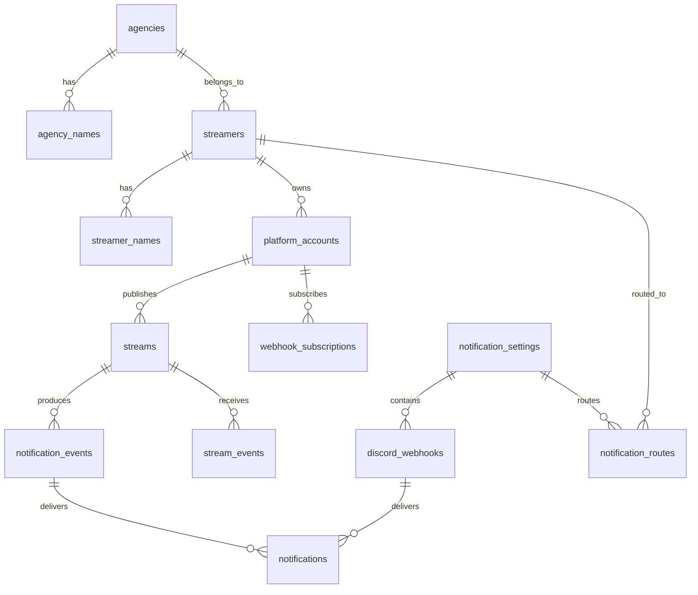

# StreamNotifyBot データ設計書

## 1. 文書の目的

本書は、`やりたいこと.md` のテーブル案を正規化し、要件を実現するために必要な概念データモデルを示します。データベースは MariaDB 10.5 を使用しますが、物理型や制約の詳細は未決定のため、型名や制約は論理表現です。

テーブル名、カラム名、型、マイグレーション方式は、採用するフレームワークとデータベースの規約に合わせて最終決定します。

## 2. 設計方針

- 内部 ID と外部サービスの ID を分離する
- 内部 ID は連番に依存せず、推測困難な UUID 等を第一候補とする
- 変更され得るハンドルと、安定したプラットフォーム ID を分離する
- 配信者、所属事務所、翻訳可能な名称を分離する
- 通知タイミングの処理記録と、Discord Webhook ごとの投稿結果を分離して追跡する
- 外部イベントと定期処理の冪等性を、一意制約と処理記録で支える
- 秘密情報を通常の一覧、ログ、CSV 出力から除外できる構造にする
- 日時は UTC で保存し、表示時に対象タイムゾーンへ変換する

## 3. 概念 ER 図

`notification_routes` により、1人の配信者へ複数の通知設定を関連付けます。対応プラットフォーム一覧はデータベースで管理せず、コードで定義します。

## 4. テーブル定義案

共通カラムとして、必要に応じて `created_at`、`updated_at`、楽観ロック用の版番号を持たせます。

### 4.1 `notification_settings`

4種類の通知種別の送信先をまとめる論理的な通知設定を表します。

| カラム | 論理型 | 必須 | 説明 |
| --- | --- | --- | --- |
| `id` | UUID | yes | 内部 ID |
| `display_name` | string | yes | 管理画面で使う一意な表示名 |
| `is_enabled` | boolean | yes | 通知設定全体の有効状態 |

制約:

- `display_name` は空文字を禁止する
- 大文字小文字を同一視するかは、データベース選定時に決定する

### 4.2 `discord_webhooks`

通知設定の通知種別ごとに登録する複数の Discord Webhook を表します。

| カラム | 論理型 | 必須 | 説明 |
| --- | --- | --- | --- |
| `id` | UUID | yes | 内部 ID |
| `notification_setting_id` | UUID | yes | 通知設定 ID |
| `notification_type` | enum/string | yes | `video_upload`, `pre_stream`, `live`, `stream_end` のいずれか |
| `secret_value` | secret/string | no | Webhook URL。保存時暗号化を推奨。空の場合は送信しない |
| `url_fingerprint` | binary(32) | no | 正規化したWebhook IDとトークンから生成するHMAC-SHA-256 |
| `fingerprint_key_id` | string | no | フィンガープリント生成に使用した鍵の識別子 |
| `display_hint` | string | no | 一覧表示用のマスク済み識別子 |
| `is_enabled` | boolean | yes | 個別の有効状態 |
| `last_succeeded_at` | datetime | no | 直近の送信成功日時 |
| `last_failed_at` | datetime | no | 直近の送信失敗日時 |
| `last_error_code` | string | no | 秘密情報を含まないエラー識別子 |

注意:

- URL 全体を検索、ログ、通常 CSV の対象にしない
- URL を更新しても通知設定 ID と通知種別は変えない
- 空または空白だけのURLは無効として扱い、送信対象に含めない
- URLが存在する場合は`url_fingerprint`と`fingerprint_key_id`を必須とし、空の場合は両方をNULLにする
- URLはHTTPSの`discord.com/api/webhooks/{webhook_id}/{webhook_token}`形式だけを許可し、検証後に標準形式へ再構築する
- HMAC入力は`discord-webhook:v1\0{webhook_id}\0{webhook_token}`とし、トークンの大文字小文字を維持する
- フィンガープリント鍵には32バイト以上のランダム値を使用し、URL暗号化鍵とは分離してリポジトリ、DB、Dockerイメージの外で管理する
- `(notification_setting_id, notification_type, fingerprint_key_id, url_fingerprint)`を一意とする
- 同じURLの無効レコードがある場合は新規作成せず、既存レコードを再有効化する
- 鍵ローテーション中は現行鍵と照合用鍵のすべてで登録時の重複を検索し、既存URLを復号して現行鍵のフィンガープリントへ順次移行する

### 4.3 `agencies`

配信者の所属事務所を表します。「個人勢」も所属区分として登録できます。

| カラム | 論理型 | 必須 | 説明 |
| --- | --- | --- | --- |
| `id` | UUID | yes | 内部 ID |
| `code` | string | yes | 言語に依存しない一意コード |
| `is_independent` | boolean | yes | 個人勢区分かどうか |

### 4.4 `agency_names`

事務所名の多言語表現を保持します。

| カラム | 論理型 | 必須 | 説明 |
| --- | --- | --- | --- |
| `agency_id` | UUID | yes | 事務所 ID |
| `language_code` | string | yes | BCP 47 等の言語コード |
| `name` | string | yes | 表示名 |
| `short_name` | string | no | 短縮名 |

主キーまたは一意制約は `(agency_id, language_code)` とします。

### 4.5 `streamers`

プラットフォームに依存しない配信者を表します。

| カラム | 論理型 | 必須 | 説明 |
| --- | --- | --- | --- |
| `id` | UUID | yes | 内部 ID |
| `agency_id` | UUID | yes | 所属区分 ID。事務所に所属しない場合は「個人勢」区分を参照する |
| `color_code` | string | no | `#RRGGBB` 形式の表示色 |
| `is_enabled` | boolean | yes | 監視対象かどうか |

`agency_id` は NULL を許容しません。所属事務所がないことを欠損値で表現せず、`agencies.is_independent` が真の「個人勢」区分へ関連付けます。

### 4.6 `streamer_names`

配信者名の多言語表現を保持します。

| カラム | 論理型 | 必須 | 説明 |
| --- | --- | --- | --- |
| `streamer_id` | UUID | yes | 配信者 ID |
| `language_code` | string | yes | 言語コード |
| `name` | string | yes | 表示名 |

主キーまたは一意制約は `(streamer_id, language_code)` とします。初期対応言語を日本語と英語に限定するかは未決事項です。

### 4.7 プラットフォームカタログ（コード定義）

対応プラットフォームは、プラットフォーム固有の API、認証、Webhook、状態変換の実装を必要とするため、データベースの可変マスタではなくコードで定義します。

| 項目 | 論理型 | 必須 | 説明 |
| --- | --- | --- | --- |
| `code` | string | yes | `youtube` 等の一意コード |
| `display_id` | string | yes | 画面上でプラットフォームを識別するための ID。チャンネル名やアカウントの表示名ではない |
| `adapter` | class/service | yes | API、認証、Webhook、ポーリング、状態変換を実装する Platform Adapter |

`code` は永続データから参照する安定した識別子、`display_id` は管理画面などへ表示する識別子として区別します。`code` と `display_id` はコード上で重複を禁止します。追加・削除には実装、テスト、デプロイを必要とし、管理画面や CSV から変更できないものとします。

### 4.8 `platform_accounts`

配信者とプラットフォーム上のアカウントを関連付けます。

| カラム | 論理型 | 必須 | 説明 |
| --- | --- | --- | --- |
| `id` | UUID | yes | 内部 ID |
| `streamer_id` | UUID | yes | 配信者 ID |
| `platform_code` | string | yes | コードで定義されたプラットフォームコード |
| `external_id` | string | yes | API から取得した安定 ID |
| `display_id` | string | no | ハンドル、ユーザーログイン、Screen ID など、利用者が識別に使う表示上の ID |
| `name` | string | no | プラットフォーム上のチャンネル名またはユーザー名 |
| `profile_url` | string | no | EmbedのAuthorから開く配信者ページURL |
| `icon_url` | string | no | WebhookのアバターとEmbedのAuthor・Footerに使うアイコンURL |
| `offline_image_url` | string | no | 配信終了時に使用できるプラットフォームのオフライン画像URL |
| `is_enabled` | boolean | yes | 監視対象かどうか |
| `resolved_at` | datetime | yes | 最後に API で解決した日時 |

制約:

- `(platform_code, external_id)` を一意とする
- `display_id` は変更され得るため主キーにしない
- `display_id` と `name` を混同せず、API が両方を返す場合は個別に保存する
- 外部 ID は数値と仮定せず文字列として扱う

### 4.9 `webhook_subscriptions`

プラットフォーム側の Webhook 購読状態を保持します。

| カラム | 論理型 | 必須 | 説明 |
| --- | --- | --- | --- |
| `id` | UUID | yes | 内部 ID |
| `platform_account_id` | UUID | yes | 対象アカウント ID |
| `external_subscription_id` | string | no | プラットフォーム側の購読 ID |
| `status` | enum/string | yes | `pending`, `active`, `error`, `expired` 等 |
| `expires_at` | datetime | no | 有効期限 |
| `renew_after` | datetime | no | 更新処理の実行予定日時 |
| `last_attempted_at` | datetime | no | 直近試行日時 |
| `failure_count` | integer | yes | 連続失敗回数 |
| `processing_lease_until` | datetime | no | 重複更新を防ぐリース期限 |
| `last_error_code` | string | no | 秘密情報を含まないエラー識別子 |

### 4.10 `streams`

プラットフォーム上の配信を表します。

| カラム | 論理型 | 必須 | 説明 |
| --- | --- | --- | --- |
| `id` | UUID | yes | 内部 ID |
| `platform_account_id` | UUID | yes | 配信アカウント ID |
| `external_id` | string | yes | プラットフォーム上の配信 ID |
| `status` | enum/string | yes | 共通配信状態 |
| `title` | string | no | 配信タイトル |
| `stream_url` | string | no | 許可済みプラットフォームの URL |
| `thumbnail_url` | string | no | サムネイル URL |
| `scheduled_at` | datetime | no | 配信予定日時 |
| `started_at` | datetime | no | 実開始日時 |
| `ended_at` | datetime | no | 優先規則により採用したUTCの終了起点 |
| `ended_at_source` | enum/string | no | `platform_api`, `verified_webhook`, `first_observed` のいずれか |
| `source_updated_at` | datetime | no | 外部サービス側の更新日時 |
| `last_polled_at` | datetime | no | 直近取得日時 |
| `next_poll_at` | datetime | no | 次回取得予定日時 |
| `tracking_ends_at` | datetime | no | `ended_at + 168時間`で算定したUTCの低頻度追跡・通知削除期限 |
| `poll_lease_until` | datetime | no | 重複ポーリング防止用リース期限 |

制約:

- `(platform_account_id, external_id)` を一意とする
- 終了起点は`platform_api`、`verified_webhook`、`first_observed`の順に優先する
- `tracking_ends_at`は`ended_at + 168時間`とし、終了起点の変更と同じトランザクションで再計算する
- 現在時刻が`tracking_ends_at`未満の場合だけ低頻度ポーリング対象とし、以上の場合は通知削除対象とする
- 配信中へ戻った場合は`ended_at`、`ended_at_source`、`tracking_ends_at`をNULLへ戻す

### 4.11 `stream_events`

受信した外部イベントの重複排除と調査に必要な最小情報を保持します。

| カラム | 論理型 | 必須 | 説明 |
| --- | --- | --- | --- |
| `id` | UUID | yes | 内部 ID |
| `platform_code` | string | yes | コードで定義されたプラットフォームコード |
| `external_event_id` | string | no | 提供される場合のイベント ID |
| `deduplication_key` | string | yes | 重複排除用キー |
| `stream_id` | UUID | no | 解決後の配信 ID |
| `event_type` | string | yes | 正規化済みイベント種別 |
| `source_occurred_at` | datetime | no | 外部サービス上の発生日時 |
| `received_at` | datetime | yes | 受信日時 |
| `processed_at` | datetime | no | 処理完了日時 |
| `status` | enum/string | yes | `received`, `processed`, `ignored`, `error` 等 |
| `failure_count` | integer | yes | 連続失敗回数 |
| `next_attempt_at` | datetime | no | Cron で再試行する日時 |
| `processing_lease_until` | datetime | no | 重複処理を防ぐリース期限 |

生のリクエスト本文は秘密情報や個人情報を含む可能性があるため、無期限に保存しません。必要な場合は保存項目と保持期間をプラットフォームごとに定義します。

### 4.12 `notification_events`

通知タイミングまたは表示情報の変更ごとに、通知処理の単位を保持します。送信先がない場合も処理済みであることを記録し、同じ通知の再生成を防ぎます。

| カラム | 論理型 | 必須 | 説明 |
| --- | --- | --- | --- |
| `id` | UUID | yes | 内部 ID |
| `stream_id` | UUID | yes | 配信 ID |
| `event_type` | enum/string | yes | `video_uploaded`, `waiting_room_created`, `starts_in_30_minutes`, `scheduled_time_reached`, `stream_started`, `stream_ended`, `display_information_changed` のいずれか |
| `notification_type` | enum/string | yes | `video_upload`, `pre_stream`, `live`, `stream_end` のいずれか |
| `event_key` | string | yes | 同じ通知タイミングまたは情報変更を識別する冪等キー |
| `content_hash` | string | no | BOT が表示する情報から生成したハッシュ |
| `occurred_at` | datetime | yes | 通知条件が成立した日時 |
| `processed_at` | datetime | no | 既存投稿の削除と新規送信の処理完了日時 |
| `status` | enum/string | yes | `pending`, `processing`, `processed`, `no_destination`, `error` 等 |
| `failure_count` | integer | yes | 連続失敗回数 |
| `next_attempt_at` | datetime | no | Cron で再試行する日時 |
| `processing_lease_until` | datetime | no | 重複処理を防ぐリース期限 |
| `last_error_code` | string | no | 秘密情報を含まないエラー識別子 |

制約:

- `event_key` を一意とし、定期処理や外部イベントの重複による二重通知を防ぐ
- 待機所の初回検知では、検知時刻に該当する最も進んだ通知フェーズだけを作成する
- 配信終了後の表示情報変更では通知イベントを作成しない

### 4.13 `notifications`

通知イベントに対する Discord Webhook ごとの投稿結果を保持します。

| カラム | 論理型 | 必須 | 説明 |
| --- | --- | --- | --- |
| `id` | UUID | yes | 内部 ID |
| `notification_event_id` | UUID | yes | 通知イベント ID |
| `discord_webhook_id` | UUID | yes | 送信先 Webhook ID |
| `discord_message_id` | string | no | 削除に使う Discord メッセージ ID |
| `status` | enum/string | yes | `pending`, `sent`, `send_error`, `delete_pending`, `delete_error`, `deleted` 等 |
| `sent_at` | datetime | no | 送信成功日時 |
| `delete_after` | datetime | no | 配信終了後の削除予定日時 |
| `deleted_at` | datetime | no | 削除完了日時 |
| `failure_count` | integer | yes | 連続失敗回数 |
| `next_attempt_at` | datetime | no | 再試行予定日時 |
| `processing_lease_until` | datetime | no | 重複送信または削除を防ぐリース期限 |
| `last_error_code` | string | no | 秘密情報を含まないエラー識別子 |

制約と運用規則:

- `(notification_event_id, discord_webhook_id)` を一意とする
- 新しい通知イベントを処理する前に、同じ配信の `sent` または `delete_error` 状態の投稿をすべて削除対象にする
- 削除完了後、対象通知種別に設定された空ではない有効な Webhook ごとにレコードを作成して新規投稿する
- 有効な Webhook がない場合は新しい `notifications` レコードを作成せず、通知イベントを `no_destination` として完了する
- 削除失敗は `delete_error`、送信失敗は `send_error` として区別し、再試行する操作を明確にする
- 新規送信開始後は Webhook ごとに成功、失敗、再試行を管理し、1件の送信失敗で他の Webhook への送信を止めない

### 4.14 `notification_routes`

どの配信者にどの通知設定を適用するかを表します。

| カラム | 論理型 | 必須 | 説明 |
| --- | --- | --- | --- |
| `id` | UUID | yes | 内部 ID |
| `streamer_id` | UUID | yes | 配信者 ID |
| `notification_setting_id` | UUID | yes | 通知設定 ID |
| `is_enabled` | boolean | yes | 経路の有効状態 |

`(streamer_id, notification_setting_id)` を一意とし、1人の配信者に複数の通知設定を関連付けられるようにします。

### 4.15 `polling_policies`

プラットフォームと配信状態ごとのポーリング方針を保持します。

| カラム | 論理型 | 必須 | 説明 |
| --- | --- | --- | --- |
| `id` | UUID | yes | 内部 ID |
| `platform_code` | string | yes | コードで定義されたプラットフォームコード |
| `phase` | enum/string | yes | `scheduled`, `imminent`, `live`, `ended`, `error` 等 |
| `interval_seconds` | integer | yes | 基本ポーリング間隔 |
| `is_enabled` | boolean | yes | 方針の有効状態 |

`(platform_code, phase)` を一意とします。初期値と推奨範囲は次のとおりです。

| `phase` | YouTube | Twitch | TwitCasting | 推奨範囲 |
| --- | ---: | ---: | ---: | ---: |
| `scheduled` | 900 | 900 | 900 | 300～86400 |
| `imminent` | 60 | 300 | 300 | 60～900 |
| `live` | 60 | 300 | 300 | 60～900 |
| `ended` | 21600 | 21600 | 21600 | 3600～86400 |
| `error` | 300 | 300 | 300 | 60～86400 |

`interval_seconds`は60以上604800以下とします。0による無効化は認めず、`is_enabled`を使用します。推奨範囲外の値には警告を表示し、外部Cronの起動間隔より短い値を設定しても実際の実行頻度は上がらないことを表示します。

### 4.16 `job_policies`

レンタルサーバーの性能と実行制限に合わせて、Cron から起動するジョブの実行方針を保持します。

| カラム | 論理型 | 必須 | 説明 |
| --- | --- | --- | --- |
| `id` | UUID | yes | 内部 ID |
| `job_type` | enum/string | yes | Webhook 後続処理、配信ポーリング、購読更新、通知処理、クリーンアップ等のコード |
| `batch_size` | integer | yes | 1回に新しく取得する最大件数 |
| `max_runtime_seconds` | integer | yes | 新しい処理を開始できる最大実行時間 |
| `max_attempts` | integer | yes | 一時障害の最大試行回数 |
| `retry_initial_delay_seconds` | integer | yes | 最初の再試行までの待機時間 |
| `retry_max_delay_seconds` | integer | yes | 再試行間隔の上限 |
| `backoff_multiplier` | decimal | yes | 再試行間隔へ掛ける倍率 |
| `jitter_percent` | integer | yes | 再試行時刻へ加えるランダム幅の割合 |
| `lease_seconds` | integer | yes | 重複実行を防ぐリース時間 |
| `is_enabled` | boolean | yes | ジョブ種別が有効かどうか |

`job_type` は一意とします。リース時間は最大実行時間より長くし、すべての設定値へサーバー側の検証と絶対上限を設けます。

初期値:

| `job_type` | `batch_size` | `max_runtime_seconds` | `max_attempts` | `lease_seconds` |
| --- | ---: | ---: | ---: | ---: |
| `webhook_event` | 50 | 45 | 8 | 120 |
| `stream_polling` | 20 | 45 | 5 | 120 |
| `subscription_renewal` | 20 | 45 | 8 | 120 |
| `notification` | 20 | 45 | 8 | 120 |
| `cleanup` | 100 | 45 | 20 | 120 |

共通初期値は、`retry_initial_delay_seconds = 60`、`retry_max_delay_seconds = 3600`、`backoff_multiplier = 2.0`、`jitter_percent = 20`、`is_enabled = true` とします。`max_attempts` は初回実行を含む総試行回数です。

絶対制約:

- `batch_size`: 1以上1000以下
- `max_runtime_seconds`: 5以上900以下
- `max_attempts`: 1以上20以下
- `retry_initial_delay_seconds`: 1以上86400以下
- `retry_max_delay_seconds`: `retry_initial_delay_seconds` 以上604800以下
- `backoff_multiplier`: 1.0以上10.0以下
- `jitter_percent`: 0以上50以下
- `lease_seconds`: `max_runtime_seconds + max(30, max_runtime_secondsの20%を秒単位で切り上げた値)` 以上3600以下

設定変更は新しく取得するリースから適用し、既存リースの期限は変更しません。設定値による再試行より、外部サービスのレート制限時刻や恒久エラーの停止規則を優先します。

### 4.17 `platform_api_policies`

利用者ごとに異なる API 利用予算を保持します。

| カラム | 論理型 | 必須 | 説明 |
| --- | --- | --- | --- |
| `id` | UUID | yes | 内部 ID |
| `platform_code` | string | yes | コードで定義されたプラットフォームコード |
| `quota_bucket_code` | string | yes | 同一プラットフォーム内のQuota区分コード |
| `period_seconds` | integer | no | 固定期間制限の場合の集計期間。応答ヘッダーに従う場合は未設定 |
| `allocation_units` | integer | no | 外部サービス上の割当量。動的な場合は未設定 |
| `application_limit_units` | integer | no | アプリケーションが使用できる上限 |
| `normal_budget_units` | integer | no | 通常優先度の処理が使用できる上限 |
| `priority_reserve_units` | integer | no | 優先度の高い処理用に確保する量 |
| `warning_percent` | integer | yes | アプリケーション上限に対する警告率 |
| `critical_percent` | integer | yes | アプリケーション上限に対する危険率 |

`(platform_code, quota_bucket_code)`を一意とします。`normal_budget_units + priority_reserve_units <= application_limit_units <= allocation_units`を満たす必要があります。警告率と危険率は1以上100以下とし、`warning_percent < critical_percent`とします。動的な制限では、API応答から得た割当量、残量、リセット時刻を実行時データとして使用します。

初期値は、YouTube一般Quotaを10000 unit/日、アプリケーション上限8000、通常処理枠6000、優先処理用予約枠2000、警告70%、危険90%とします。Twitchは応答ヘッダーの割当量に対する60%を通常処理枠、80%を優先処理込みの上限として20%を残します。TwitCastingは60 request/60秒、通常処理枠36、アプリケーション上限48、優先処理用予約枠12とします。エンドポイント固有制限がある場合は別のQuota区分として管理します。

### 4.18 `platform_api_usage`

アプリケーション内で実行した API 操作の推定利用量を期間単位で集計します。

| カラム | 論理型 | 必須 | 説明 |
| --- | --- | --- | --- |
| `id` | UUID | yes | 内部 ID |
| `platform_code` | string | yes | コードで定義されたプラットフォームコード |
| `quota_bucket_code` | string | yes | 集計対象のQuota区分コード |
| `period_started_at` | datetime | yes | プラットフォーム規則に基づく集計期間の開始日時 |
| `estimated_units` | integer | yes | アプリケーション内で消費した推定利用量 |
| `reported_limit_units` | integer | no | API応答が示した割当量または上限 |
| `reported_remaining_units` | integer | no | API応答が示した残量 |
| `reported_reset_at` | datetime | no | API応答が示したリセット日時 |
| `updated_at` | datetime | yes | 最終集計日時 |

`(platform_code, quota_bucket_code, period_started_at)`を一意とします。`estimated_units`は外部でのAPI利用を含まない推定値であり、外部サービスが示す実際の残量として表示しません。`reported_*`が取得できる場合は推定値と区別して表示し、外部コンソールで実使用量を確認する案内を併記します。

## 5. 削除と保持

- 通知タイミングまたは表示情報が変わった場合は、同じ配信の既存投稿を削除してから新しい投稿を作成する
- 配信終了通知の投稿は、UTCの`tracking_ends_at`に到達した後のクリーンアップ処理で削除する
- 削除失敗は通知削除ジョブで再試行し、`tracking_ends_at`を延長しない
- DiscordのNot Foundは削除済みとして扱い、削除完了後の終了時刻訂正だけでは投稿を復元しない
- `notification_events` と `notifications` の履歴レコードは、Discord 投稿削除後も運用調査に必要な期間保持する
- 配信、イベント、ログ、インポート結果の保持期間は別途決定する
- 配信者や通知設定の削除は、履歴との参照を壊さないよう無効化または論理削除を第一候補とする
- 秘密情報は、Webhook の削除またはローテーション時に利用不能にし、不要な旧値を保持しない

## 6. CSV 方針

### 6.1 通常エクスポート対象案

- 通知設定
- 所属事務所と名称
- 配信者と名称
- プラットフォームアカウント
- 通知経路
- ポーリング方針

Discord Webhook URL、API 資格情報、セッション、暗号鍵は通常エクスポートへ含めません。Webhook の設定有無を示す場合は、内部 ID、マスク済み表示、状態だけを出力します。

### 6.2 インポート規則

- テーブル種別とスキーマバージョンを識別できる形式にする
- ヘッダー名を固定し、未知列と不足列の扱いを定義する
- UUID、言語コード、カラーコード、日時、真偽値を検証する
- 外部キー参照を反映前に検証する
- 追加、更新、置換のどの方式かを明示させる
- 不正行を黙って読み飛ばさない
- 数式として解釈され得る値を安全に出力する
- 大容量ファイルはストリーム処理し、メモリへ全件展開しない

## 7. インデックス案

データ量と実行計画を計測した上で確定しますが、初期候補は次のとおりです。

- `platform_accounts(platform_code, external_id)` unique
- `streams(platform_account_id, external_id)` unique
- `streams(next_poll_at, status)`
- `streams(tracking_ends_at, status)`
- `stream_events(deduplication_key)` unique
- `stream_events(next_attempt_at, status)`
- `webhook_subscriptions(renew_after, status)`
- `notification_events(event_key)` unique
- `notification_events(stream_id, status)`
- `notification_events(next_attempt_at, status)`
- `notifications(notification_event_id, discord_webhook_id)` unique
- `discord_webhooks(notification_setting_id, notification_type, fingerprint_key_id, url_fingerprint)` unique
- `notifications(next_attempt_at, status)`
- `notifications(delete_after, status)`
- `notification_routes(streamer_id, notification_setting_id)` unique

## 8. トランザクションと同時実行

- 配信状態の更新と `notification_events` の作成は、可能な限り同一トランザクションで行う
- 新しい通知イベントでは既存投稿の削除完了後に送信対象を確定し、有効な Webhook がなければ `no_destination` として完了する
- Discord 送信などの外部通信中は、データベーストランザクションを保持し続けない
- 外部通信の前後で状態を記録し、途中失敗から再開できるようにする
- Discord Webhook ごとの処理を独立して記録し、一部失敗時は未完了の対象だけを再試行する
- 通知イベントの送信先確定時は、選択したURLを復号して現行鍵のフィンガープリントを算出し、同じURLを1件へ集約してから`notifications`を作成する
- Cron の重複起動には、対象行のロックまたは期限付きリースを用いる
- 専用キューを使用せず、各業務テーブルの処理状態、再試行時刻、リース期限を Cron ジョブの処理待ち情報として使用する
- 一意制約違反を通常の競合として処理し、重複レコードを作らない
- CSV の大規模インポートは、全件一括か処理単位ごとかを明示し、部分反映状態を報告する

## 9. マイグレーション

- スキーマ変更は順序付きマイグレーションとして管理する
- アプリケーションコードと互換性のある段階的変更を優先する
- 破壊的変更の前に、バックアップ、移行、ロールバック方法を確認する
- 初期データとサンプルデータを区別し、実在の秘密情報を含めない
- データベース製品ごとの差異を自動テストまたは Docker 環境で検証する

## 10. 未決事項

- MariaDB 10.5 における UUID、日時、JSON、ロック機能の具体的な利用方法
- 名称を翻訳テーブルで管理する範囲と対応言語
- Discord Webhook URL の暗号化方式と鍵の配置
- CSV の文字コード、区切り文字、スキーマバージョン形式
- 履歴、イベント、ログの保持期間
- 削除済み配信や配信者を論理削除する期間

## 11. 関連文書

- [要件定義書](要件定義書.md)
- [基本設計書](基本設計書.md)
- [初期構想メモ](../やりたいこと.md)
