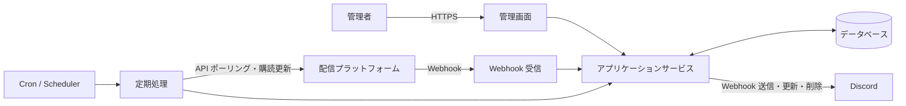

# StreamNotifyBot 基本設計書

## 1. 文書の目的

本書は、[要件定義書](要件定義書.md)を実現するための基本構造と処理境界を示します。PHP 8.5.9 と MariaDB 10.5 を前提とし、未選定のフレームワークに依存しない論理設計とします。

## 2. 設計原則

- 一般的な PHP Web ホスティングと Docker の双方で実行可能にする
- 常駐プロセスを必須とせず、定期処理は Cron 等から起動可能にする
- 配信プラットフォーム固有処理をアダプターとして分離する
- 対応プラットフォーム一覧はコードで固定し、管理画面から追加・削除しない
- Webhook とポーリングの入力を共通の配信状態へ正規化する
- 外部イベント、定期処理、Discord 通知を冪等にする
- 通知タイミングごとに既存投稿を削除し、現在の通知種別へ新規投稿する
- 秘密情報を業務データと分離し、表示、ログ、エクスポートを制限する
- 外部サービスの一時障害がシステム全体へ波及しないよう、処理単位を分離する

## 3. システムコンテキスト



## 4. 論理コンポーネント

| コンポーネント | 責務 |
| --- | --- |
| 管理 UI | 通知設定、通知種別ごとのWebhook URL、所属区分、配信者、アカウント、ポーリング設定、CSV の操作 |
| 認証・認可 | 管理画面へのアクセス制御、セッション管理、CSRF 対策 |
| Webhook Receiver | 検証要求への応答、署名検証、重複排除、イベント受付 |
| Platform Adapter | 識別子解決、購読管理、配信取得、応答の正規化 |
| Stream Service | 配信の登録、状態遷移、追跡期限の判定 |
| Notification Service | 通知タイミングの判定、Discord 投稿の削除と新規作成、重複防止 |
| Polling Scheduler | 対象抽出、呼び出し間隔、レート制限、再試行の制御 |
| Subscription Scheduler | Webhook 購読期限の監視と更新 |
| Cleanup Service | 追跡期限を過ぎた配信の通知削除と監視終了 |
| CSV Service | テーブル別の検証、インポート、エクスポート |
| Repository | データベースとの読み書きとトランザクション境界 |
| Secret Store | Webhook URL、API 資格情報などの安全な保管 |

## 5. 推奨レイヤー構成

```text
Presentation
├─ Admin HTTP
├─ Platform Webhook HTTP
└─ CLI / Scheduled Commands

Application
├─ Stream discovery and synchronization
├─ Subscription renewal
├─ Discord notification
├─ Cleanup
└─ CSV import/export

Domain
├─ Streamer and platform account
├─ Stream and status transition
├─ Notification setting and notification type
└─ Polling policy

Infrastructure
├─ Database repositories
├─ Platform API adapters
├─ Discord Webhook client
├─ Clock
└─ Logging and secret access
```

フレームワークを採用した場合は、その標準構成を優先しつつ、外部 API とドメイン判断の境界を維持します。

## 6. 主要処理フロー

### 6.1 配信者アカウント登録

1. 管理者が配信者の所属区分を選択する
2. 事務所に所属しない配信者の場合は「個人勢」区分を選択する
3. 管理者がプラットフォーム種別とハンドルまたは Screen ID を入力する
4. 所属区分が存在すること、プラットフォーム種別がコードで定義された対応対象であること、入力形式を検証する
5. 対象の Platform Adapter が API で安定 ID と表示情報を取得する
6. 既存のプラットフォームアカウントとの重複を確認する
7. 配信者へ所属区分とアカウントを関連付けて保存する
8. Webhook 対応プラットフォームの場合、購読を開始する
9. 結果と、失敗時は再実行可能な理由を表示する

保存と外部購読を単一トランザクションにはできないため、購読状態を保持し、失敗した購読だけを後から再試行できるようにします。

新しいプラットフォームを追加する場合は、プラットフォームコード、画面表示用ID、Platform Adapter、状態変換、認証、Webhook、ポーリング処理を実装し、テスト後にデプロイします。

#### 6.1.1 名称の言語管理

初期対応言語はBCP 47の`ja`と`en`とし、対応言語一覧はコードで固定します。言語タグは大文字小文字を区別せず受け付け、BCP 47の推奨表記へ正規化してから保存します。初期対応のデータ入力では`ja`と`en`だけを許可し、`ja-JP`や`en-US`などの地域コード付きタグは未対応として拒否します。基本言語へのフォールバックは、将来地域コードへ対応した場合に適用します。

言語別テーブルで管理する値は、事務所名、事務所短縮名、配信者名です。プラットフォーム上のチャンネル名、ハンドル、配信タイトル、通知設定の管理用表示名、プラットフォームの`code`と`display_id`は翻訳対象にしません。管理画面とDiscord通知の固定文言も初期仕様では日本語とし、将来のUI・通知文言の多言語化はコード側の言語リソースとして別に設計します。

事務所と配信者は`default_language_code`を持ち、同じ言語コードの名称行を必須とします。既存データと「個人勢」区分の既定言語は`ja`とし、「個人勢」には`ja: 個人勢`と`en: Independent`を初期登録します。英語名は自動翻訳せず、公式英語名または管理者が指定したローマ字表記を保存します。

名称は次の順に解決します。

1. 要求された言語と完全一致する名称
2. 将来地域コードへ対応した場合は要求言語の基本言語
3. エンティティの既定言語の名称
4. データ不整合時は固定文言「名称未設定」を表示し、秘密情報を含まないエラーを記録する

事務所短縮名が空の場合は、同じ言語行の正式名を使用します。別言語の短縮名にはフォールバックしません。DiscordのWebhook表示名とEmbed Authorはプラットフォーム上の配信者名を優先し、取得できない場合だけ管理対象の配信者名を上記規則で解決します。

既定言語の名称行は直接削除できません。既定言語を変更する場合は変更先の名称行が存在することを検証し、既定言語と名称行を同じトランザクションで更新します。名称の前後の空白を除去し、空白だけの値、改行、制御文字を拒否します。短縮名の空文字はNULLへ正規化し、表示時は出力先に応じてエスケープします。プラットフォームAPIの同期では言語別名称を上書きしません。

### 6.2 Webhook 受信

1. チャレンジ応答など、プラットフォーム固有の検証要求を処理する
2. 署名、タイムスタンプ、検証トークンなどを確認する
3. イベント ID または内容の一意キーで重複を排除する
4. 外部イベントを共通イベントへ正規化する
5. 受信イベントを処理待ちとして保存する
6. API から最新情報を取得する後続処理を登録する
7. Webhook への応答を完了する

Webhook の応答時間制限が厳しい場合は、受信記録だけを同期的に行い、後続処理をデータベース上の処理待ちレコードとして保存します。保存した処理は Cron から起動する短時間の PHP CLI コマンドで実行します。

Webhook のペイロードだけでは通知を確定しません。後続処理で API から最新情報を取得して共通状態へ反映し、通知条件を判定します。API 取得に失敗した場合は不完全な情報で通知せず、処理待ち状態を維持して上限付きで再試行します。

### 6.3 配信ポーリング

1. `next_poll_at` が現在時刻以前の対象を、上限件数付きで取得する
2. プラットフォームと資格情報単位のレート制限を確認する
3. Platform Adapter から最新情報を取得する
4. 共通状態へ正規化し、保存済み状態との差分を判定する
5. 状態、時刻、BOTが表示する情報の差分から通知タイミングを判定する
6. 状態とポリシーに基づいて次回実行時刻を設定する
7. 現在時刻が配信終了後の追跡期限以上の場合はポーリングせず、クリーンアップ対象にする

複数の Cron 実行が重なっても同じ対象を同時処理しないよう、ロックまたはリース期限を使用します。

#### 配信終了後168時間の算定

「1週間」はカレンダー日ではなく正確な168時間とし、終了起点、追跡期限、現在時刻はUTCで比較します。管理画面で表示するときだけ利用者のタイムゾーンへ変換します。終了起点は次の順に採用します。

1. プラットフォームAPIが返す正式な配信終了時刻
2. 署名などを検証済みのWebhookが示すイベント発生時刻
3. ポーリングで終了状態を初めて確認した時刻

期限前により優先度の高い終了時刻を取得した場合は、`終了起点 + 168時間`で追跡期限を再計算します。訂正によって期限が後ろへ移れば追跡を延長し、前へ移った結果すでに期限へ到達していれば次のクリーンアップ対象にします。古いイベントや優先度の低い情報では、優先度の高い終了時刻を上書きしません。

一時切断や誤判定後に配信中へ戻った場合は、終了時刻、終了時刻の取得元、追跡期限を解除し、配信中のポーリングへ戻します。再度終了した時点で新しい終了起点を設定します。通知投稿の削除が完了した後は、終了時刻だけが訂正されても投稿や低頻度追跡を復元しません。ただし、配信中への復帰は新しい状態遷移として追跡を再開します。

#### プラットフォーム別の取得分担

| プラットフォーム | Webhook による変更検知 | API ポーリングによる最新状態取得と補完 |
| --- | --- | --- |
| YouTube | WebSub で動画・待機所の発見とタイトル・説明変更を検知する | 動画種別、予定時刻、開始、終了、タイトル、サムネイルを取得し、Webhook 欠落を補完する |
| Twitch | EventSub の `stream.online`、`stream.offline`、`channel.update` を受信する | 配信予定、配信状態、タイトル、サムネイルを取得し、Webhook 欠落を補完する |
| TwitCasting | `livestart`、`liveend`、`liveschedulecreate`、`livescheduleupdate`、`livescheduledelete` を受信する | 現在の配信、配信予定、タイトル、サムネイルを取得し、Webhook 欠落を補完する |

Twitch と TwitCasting の動画投稿通知は初期対象外とします。Webhook とポーリングが同じ変更を検知した場合は同じ冪等キーへ正規化し、古いイベントによって保存済み状態を過去へ戻しません。

#### YouTube の初回・復旧同期

YouTube アカウントの初回登録時と、Webhook 停止などの障害から復旧した時は、次の順序で同期します。

1. WebSub 購読を開始し、受信イベントを保存できる状態にする
2. チャンネル ID を指定して Atom フィードを1回取得する
3. フィード内の動画 ID を保存済みデータと照合して重複排除する
4. 未取得の動画 ID を最大50件のバッチへ分割する
5. バッチごとに `videos.list` を呼び出し、動画種別、配信状態、予定・開始・終了日時、表示情報を取得する
6. 成功したバッチを完了として記録し、失敗したバッチだけを再試行する

初回・復旧同期の対象は Atom フィードに含まれる範囲とし、`search.list` やアップロード再生リストを使った過去方向のページネーションは行いません。WebSub と同期処理が同じ動画を検知した場合は、プラットフォーム動画 ID と冪等キーで重複を排除します。

### 6.4 通知タイミング判定

通知タイミングと送信先の通知種別を次のとおり判定します。

| 通知タイミング | 通知種別 | 判定 |
| --- | --- | --- |
| 動画投稿 | 動画投稿 | 通常動画の新規投稿を検知したとき |
| 待機所作成 | 配信開始前 | 開始30分より前に待機所を初めて検知したとき |
| 配信開始30分前 | 配信開始前 | 追跡中の待機所が開始30分前に達したとき、または開始30分以内に初めて検知したとき |
| 配信開始予定時間 | 配信開始前 | 追跡中の待機所が予定時刻に達したとき、または予定時刻以降かつ開始前に初めて検知したとき |
| 配信開始 | 配信中 | 配信開始を検知したとき |
| 配信終了 | 配信終了 | 配信終了を検知したとき |
| 表示情報変更 | 現在状態に対応する通知種別 | タイトル、開始時刻、サムネイルなどが変わったとき。ただし配信終了後は通知しない |

待機所の初回検知では、検知時点に該当する最も進んだ通知タイミングだけを採用します。これにより、30分以内の初回検知で待機所作成を重複通知したり、予定時刻以降の初回検知で過去の通知をまとめて送ったりしません。

### 6.5 Discord 通知

通知設定は、動画投稿、配信開始前、配信中、配信終了の4種類の通知種別ごとに複数のDiscord Webhook URLを保持します。通知時は、配信者に関連付けられたすべての通知設定から、対象通知種別の空ではない有効なURLを抽出し、現行鍵で算出したフィンガープリントによって同じURLを1件へ集約します。

1. 通知タイミングと通知種別を確定する
2. 配信者に関連付けられた通知設定を取得する
3. その配信に対して現在有効な既存のDiscord投稿をすべて取得する
4. 保存済みのWebhook IDとメッセージ IDを使用して既存投稿を削除する
5. 対象通知種別の空ではないすべての有効なWebhook URLを取得する
6. 有効なURLがなければ、新規投稿を行わず処理を完了する
7. 配信状態と配信者情報から新しい通知内容を作成する
8. すべての有効なWebhook URLへ新規投稿し、Webhook IDとDiscordメッセージ IDを保存する
9. 通知イベントの冪等キーを保存し、同じ通知タイミングまたは情報変更の重複投稿を防ぐ
10. 配信終了の起点から168時間に到達したら、残っている投稿を削除して削除日時を保存する

既存投稿の削除が一時的に失敗した場合は、新規投稿へ進まず削除を再試行します。Discord から Not Found が返された投稿は削除済みとして扱います。既存投稿の削除完了後に新規投稿を開始し、その一部が失敗した場合は、送信先単位で結果と再試行状態を記録して未完了の送信先だけを再試行します。

168時間経過後の削除失敗も通知削除ジョブの上限付き再試行に従います。削除の再試行中も低頻度ポーリングは再開せず、削除期限は延長しません。実際の削除時刻は外部Cronの起動粒度により期限以降の最初の実行時刻となります。

#### 6.5.1 Webhook URL検証と重複排除

管理画面へ入力されたURLは前後の空白を除去した後、URLとして分解し、次をすべて満たす場合だけ受け付けます。

- スキームが`https`
- ホストが`discord.com`
- ユーザー情報と明示ポートがない
- パスが`/api/webhooks/{webhook_id}/{webhook_token}`の形式
- Webhook IDが10進数字で、トークンが空でない
- パーセントエンコード、余分なパス、クエリ、フラグメントがない

検証後は`https://discord.com/api/webhooks/{webhook_id}/{webhook_token}`へ再構築します。トークンの大文字と小文字は変更しません。送信時にメッセージIDを取得するための`wait=true`はアプリケーションが付加し、保存URLには含めません。Discordのフォーラム・メディアチャンネル用`thread_id`は初期対象外とし、対応時はURLのクエリではなく独立した送信先設定として設計します。

フィンガープリント入力は、区切りの曖昧さを避けるため、次のバイト列とします。

```text
discord-webhook:v1\0{webhook_id}\0{webhook_token}
```

32バイト以上のランダムな専用鍵を用い、`HMAC-SHA-256`の32バイトバイナリ値を生成します。フィンガープリント鍵はWebhook URLの暗号化鍵と分離し、リポジトリ、DB、Dockerイメージの外から読み込みます。鍵IDは秘密情報ではないためレコードへ保存しますが、鍵、URL、トークン、フィンガープリントはログへ出力しません。

登録時の重複範囲は、通知設定ID、通知種別、Webhook URLです。同じURLの無効レコードがある場合は再有効化を案内します。異なる通知設定や通知種別では同じURLを許可しますが、通知イベントの送信先確定時に、復号した各URLから現行鍵のフィンガープリントを算出して同じ送信先を1件へ集約します。

鍵は次の順で無停止ローテーションします。

1. 新しい鍵を現行鍵として追加し、旧鍵を照合用として保持する
2. 登録時は現行鍵とすべての照合用鍵で候補フィンガープリントを生成して重複検索する
3. 新規・更新レコードは現行鍵で保存する
4. 既存URLを復号し、現行鍵のフィンガープリントへバッチ更新する
5. 全件移行と件数検証の完了後にだけ旧鍵を削除する

同じ現行鍵による同時登録はDBの一意制約で防ぎ、制約違反は通常の重複入力として処理します。アプリケーション内で秘密値由来のフィンガープリントを直接比較する場合は、タイミング差を抑える比較関数を使用します。

#### 6.5.2 Webhook表示

- Webhookの表示名にはプラットフォーム上の配信者名、アバターには配信者アイコンを使用する
- 通常の本文は空とし、通知内容はEmbedとリンクボタンで表現する
- 表示名またはアイコンを取得できない場合は、不正な値を送信せず、設定済みのWebhook既定値へフォールバックする

#### 6.5.3 Embed構成

| 要素 | 表示内容 |
| --- | --- |
| Author | プラットフォーム上の配信者名、配信者アイコン、配信者ページへのリンク |
| Title | 動画または配信のタイトル |
| URL | 動画または配信を直接開くURL |
| Description | 通知タイミングの文言と、予定時刻・タイトルの変更内容 |
| Field | 日時種別と `<t:UNIX:f> (<t:UNIX:R>)` 形式の絶対・相対時刻 |
| Image | 動画または配信のサムネイル。Twitchの配信終了時は取得できる場合にオフライン画像を使用 |
| Color | 配信者の表示色。未設定時はYouTube・Twitchが赤、TwitCastingが緑 |
| Footer | 通知作成時の日本標準時を `yyyy/MM/dd HH:mm:ss` 形式で表示し、配信者アイコンを併記 |

YouTubeとTwitchのサムネイルURLには、Discord側の画像キャッシュで古い画像が表示されないよう通知作成時刻をクエリ値として付加します。元URLにクエリがある場合も壊れないよう、URL構造に応じて `?` または `&` を使用します。画像URLを取得できない場合はImageを省略します。

#### 6.5.4 通知文言と日時

| 通知タイミング | Descriptionの基本文言 | 日時フィールド | 使用する日時 |
| --- | --- | --- | --- |
| 動画投稿 | 動画が投稿されました | 投稿時刻 | 動画の公開日時 |
| 待機所作成 | 配信が予約されました | 予定時刻 | 配信開始予定日時 |
| 配信開始30分前 | 30分以内に開始する配信があります | 予定時刻 | 配信開始予定日時 |
| 配信開始予定時間 | 配信開始予定時刻です | 予定時刻 | 配信開始予定日時 |
| 配信開始 | 配信が開始しました | 開始時刻 | 実際の配信開始日時 |
| 配信終了 | 配信が終了しました | 終了時刻 | 実際の配信終了日時 |

配信予定時刻が変更された場合は基本文言の前に「配信予定時刻が変更されました」、タイトルが変更された場合は基本文言の後に「配信タイトルが変更されました」を改行して追加します。両方が変わった場合は、予定時刻変更、基本文言、タイトル変更の順に表示します。サムネイルだけが変更された場合は、基本文言を維持して新しいImageへ差し替えます。

#### 6.5.5 X共有ボタン

- ラベルを「Xへ共有する」とするリンクボタンを1つ配置する
- 共有URLには動画または配信のURLとタイトルを含める
- URLエンコード後の共有URLが512文字を超える場合は、タイトル末尾を省略記号付きで切り詰める
- YouTubeはタイトルを共有文に使用し、TwitchとTwitCastingは「配信者名 / タイトル」を使用する

### 6.6 Webhook 購読更新

1. 有効期限が更新猶予期間内に入った購読を抽出する
2. Platform Adapter を通じて更新または再登録する
3. 新しい有効期限と外部購読 ID を保存する
4. 一時失敗はバックオフ付きで再試行する
5. 認証失敗など管理者対応が必要な場合は、状態をエラーにして記録する

### 6.7 CSV インポート

1. ファイルサイズ、文字コード、ヘッダーを検証する
2. 各行の型、値、参照先、一意性を検証する
3. 更新予定件数とエラーをプレビューする
4. 管理者の確定操作後、定義済みのトランザクション単位で反映する
5. 成功件数、失敗件数、失敗理由を表示する

秘密情報を含むデータの移行は、通常の CSV 機能から分離します。

### 6.8 Cron ジョブ

レンタルサーバーの Cron から、次の責務ごとに PHP CLI コマンドを起動します。

| コマンド責務 | 主な処理 |
| --- | --- |
| Webhook イベント処理 | 受信済みイベントの検証後処理、配信状態の更新 |
| 配信ポーリング | `next_poll_at` を迎えた配信情報の取得と通知判定 |
| 購読更新 | 更新期限を迎える Webhook 購読の更新 |
| 通知処理 | 通知イベントの送信、削除、失敗した処理の再試行 |
| クリーンアップ | 追跡期限を超えた配信の監視終了と Discord 投稿削除 |

- 各コマンドは処理件数または実行時間に上限を設け、レンタルサーバーの実行時間制限内で終了する
- 処理待ち、再試行時刻、失敗回数、リース期限は MariaDB へ保存する
- 同じ Cron が重複起動しても、期限付きリースと冪等キーにより同じ対象を並行処理しない
- 中断後は完了済み処理を重複実行せず、未完了または再試行対象だけを次回 Cron で処理する
- 専用キューと常駐ワーカーは初期構成に含めない

処理件数、最大実行時間、最大再試行回数、初期待機時間、最大待機時間、バックオフ倍率、ジッター率、リース時間はジョブ種別ごとに管理画面から変更可能にします。保存時には少なくとも次を検証します。

- すべての件数と時間が正の値である
- 最大待機時間が初期待機時間以上である
- リース時間が最大実行時間と終了処理に必要な余裕より長い
- 設定可能な絶対上限を超えてサーバーやデータベースを占有しない

#### 6.8.1 初期値

| ジョブ種別 | 処理件数 | 最大実行時間 | 最大試行回数 | リース時間 | 有効状態 |
| --- | ---: | ---: | ---: | ---: | --- |
| Webhook後続処理 | 50件 | 45秒 | 8回 | 120秒 | 有効 |
| 配信ポーリング | 20件 | 45秒 | 5回 | 120秒 | 有効 |
| Webhook購読更新 | 20件 | 45秒 | 8回 | 120秒 | 有効 |
| Discord通知・削除 | 20件 | 45秒 | 8回 | 120秒 | 有効 |
| クリーンアップ | 100件 | 45秒 | 20回 | 120秒 | 有効 |

最大試行回数には最初の実行を含めます。共通の再試行初期値は、初回待機60秒、最大待機3600秒、バックオフ倍率2.0、ジッター率20%とします。

#### 6.8.2 絶対上下限

| 設定 | 絶対下限 | 絶対上限 |
| --- | ---: | ---: |
| 処理件数 | 1件 | 1000件 |
| 最大実行時間 | 5秒 | 900秒 |
| 最大試行回数 | 1回 | 20回 |
| 初回再試行待機 | 1秒 | 86400秒 |
| 最大再試行待機 | 初回再試行待機以上 | 604800秒 |
| バックオフ倍率 | 1.0 | 10.0 |
| ジッター率 | 0% | 50% |
| リース時間 | 相関制約による最小値 | 3600秒 |

リース時間は、`最大実行時間 + max(30秒, 最大実行時間の20%)` 以上とし、20%の計算結果に端数がある場合は秒単位で切り上げます。処理件数の推奨上限は、Webhook後続処理500件、配信ポーリング200件、購読更新200件、通知処理200件、クリーンアップ1000件とし、超過時は警告します。

最大実行時間は新しい処理の開始を止める期限であり、処理中の外部通信や状態保存を強制的に打ち切る期限ではありません。設定変更は新しくリースを取得する処理から適用し、既存リースの期限は変更しません。

一時的な外部障害だけを設定済みバックオフの対象とし、レート制限では外部サービスの再開時刻、恒久的な4xxでは再試行停止、Discord削除時のNot Foundでは削除成功相当など、エラー分類固有の規則を優先します。

Cron の起動間隔はレンタルサーバー側の設定であり、アプリケーションの管理画面からは変更しません。管理画面には設定例と、アプリケーション側の最大実行時間より長い間隔で起動した場合に通知が遅延する可能性を表示します。

## 7. 配信状態モデル

プラットフォーム固有状態を、少なくとも次の共通状態へ正規化する案とします。

| 状態 | 意味 | 主な次状態 |
| --- | --- | --- |
| `video` | ライブ配信ではない通常動画 | 終端状態。ただし表示情報の変更はあり得る |
| `scheduled` | 配信予定が登録されている | `live`, `ended`, `cancelled` |
| `live` | 配信中 | `ended` |
| `ended` | 配信終了 | 終端状態。ただし情報更新はあり得る |
| `cancelled` | 中止または削除 | 終端状態 |
| `unknown` | 外部状態を確定できない | 任意の確定状態 |

外部イベントは順不同で届く可能性があるため、単純な列挙値の大小では遷移を判定しません。外部サービスの更新時刻、取得時刻、確度、現在状態を用いて判断し、古いイベントで新しい状態を巻き戻さないようにします。

待機所作成、開始30分前、開始予定時間は配信状態ではなく、`scheduled` と現在時刻から導出する通知フェーズとして管理します。実行済みフェーズを保存し、定期処理の再実行で同じ通知を重複させません。

## 8. ポーリング方針

プラットフォームと配信状態ごとの初期値は次のとおりです。

| 状態 | YouTube | Twitch | TwitCasting | 推奨設定範囲 |
| --- | ---: | ---: | ---: | --- |
| 配信開始予定まで60分超（`scheduled`） | 900秒 | 900秒 | 900秒 | 300～86400秒 |
| 配信開始予定まで60分以内（`imminent`） | 60秒 | 300秒 | 300秒 | 60～900秒 |
| 配信中（`live`） | 60秒 | 300秒 | 300秒 | 60～900秒 |
| 配信終了後の追跡期間内（`ended`） | 21600秒 | 21600秒 | 21600秒 | 3600～86400秒 |
| APIエラー後（`error`） | 300秒 | 300秒 | 300秒 | 60～86400秒 |

すべてのポーリング間隔へ60秒以上604800秒以下の絶対制約を設けます。0による停止は認めず、停止は方針の有効状態で管理します。推奨範囲外で絶対制約内の値は保存前に警告し、実際の実行間隔は外部Cronの起動間隔より短くならないことも表示します。現在時刻がUTCの追跡期限以上となった配信はポーリング対象から外し、通知削除処理へ引き渡します。

### 8.1 API 利用予算

API利用予算はプラットフォーム単位ではなく、同じプラットフォーム内で制限規則が異なるQuota区分単位で管理します。管理項目は、外部サービス上の割当量、アプリケーション上限、通常処理枠、優先処理用予約枠、警告しきい値、危険しきい値です。Platform AdapterがAPI操作別のコストを記録し、アプリケーション内での推定使用量を集計します。

初期値は次のとおりです。

| プラットフォーム | Quota区分 | 割当量 | 通常処理枠 | 優先処理を含む上限・予約枠 | 警告・危険 |
| --- | --- | ---: | ---: | --- | --- |
| YouTube | 一般Quota | 10000 unit/日 | 割当量の60% | アプリケーション上限80%、うち20%を優先処理用に予約 | アプリケーション上限の70%・90% |
| Twitch | API応答ヘッダーが示す区分 | 応答値を使用 | 割当量の60%まで | 優先処理を含め80%まで使用し、20%を残す | 応答値と残量を基準に表示 |
| TwitCasting | API全体の初期区分 | 60 request/60秒 | 36 request | 優先処理を含め48 requestまで使用し、12 requestを予約 | 残量と延期状況を表示 |

YouTubeの`videos.list`は1リクエスト1 unit、1リクエスト最大50件として見積もります。初期仕様で使用しない`search.list`は予算対象に含めません。Twitchはレート制限応答ヘッダー、TwitCastingはエンドポイント固有制限が示される場合の値を優先します。

推定使用量は、同じ資格情報を使う別アプリケーションや管理画面外の呼び出しを把握できないため、外部サービスが示す実際の残量とは一致しない可能性があります。管理画面では推定値であることを明示し、予算へ近づいた場合は次の順で処理を延期します。

1. 初回・復旧同期の未処理 `videos.list` バッチ
2. 配信終了後の低頻度追跡
3. 配信開始予定まで60分超の通常追跡

配信開始予定まで60分以内、配信中、Webhook受信後の最新状態取得、配信終了確認には予約枠を使用できるようにします。レート制限応答を受けた場合は、管理画面の予算に余裕があっても外部サービスの指示とリセット時刻を優先します。

## 9. エラー処理

| 分類 | 基本方針 |
| --- | --- |
| 入力エラー | 再試行せず、管理者へ修正可能な内容を表示する |
| 認証・認可エラー | 秘密情報を出さず、管理者対応が必要な状態として記録する |
| レート制限 | `Retry-After` 等を尊重し、次回実行時刻を延期する |
| 一時的な外部障害 | 回数上限と指数バックオフ付きで再試行する |
| 恒久的な外部エラー | 自動再試行を止め、対象単位でエラー状態にする |
| データ競合 | 冪等キーと楽観ロックまたは一意制約で解決する |
| Discord 投稿消失 | 更新・削除時の Not Found を検知し、方針に従って再投稿または削除済みにする |

## 10. ログと監視

ログには、時刻、処理種別、相関 ID、対象プラットフォーム、内部 ID、結果、再試行可否を含めます。

次の値は記録しません。

- Discord Webhook URL
- API キー、アクセストークン、更新トークン
- Cookie、認証ヘッダー、セッション ID
- Webhook の署名用秘密値
- CSV に含まれる未検証の生データ全体

運用上は、購読更新失敗、ポーリングの継続失敗、Discord 送信失敗、クリーンアップ失敗を識別できるようにします。

## 11. セキュリティ境界

- 管理 UI は認証済み管理者だけに公開する
- Webhook Receiver は公開するが、プラットフォーム固有の検証を必須とする
- 定期処理は CLI から起動するか、HTTP 起動の場合は推測不能な URL だけに依存せず強い認証を行う
- 外部 URL をサーバーから取得する処理では、許可ホストと URL スキームを制限する
- 秘密情報は環境変数または専用設定から読み込み、画面ではマスクする
- Discord Webhook URL をデータベースへ保存する場合は、保存時暗号化の採用を検討する
- Discord Webhook URLのフィンガープリント鍵はURL暗号化鍵と分離し、リポジトリ、DB、Dockerイメージの外で管理する

## 12. 配置構成

### 一般的な PHP ホスティング

- 公開ディレクトリには HTTP エントリポイントと必要な静的ファイルだけを配置する
- 設定、ソース、ログ、秘密情報を公開ディレクトリ外に置く
- Cron から購読更新、ポーリング、通知削除などのコマンドを定期実行する

### Docker

- Web 実行環境と同じアプリケーションコードから CLI 定期処理を起動できるようにする
- イメージへ開発用ファイル、秘密情報、実行時データを含めない
- 非 root ユーザー、ヘルスチェック、永続データのマウント先を定義する
- PHP 8.5.9 と必要な拡張機能を固定し、MariaDB 10.5 と組み合わせて再現可能にする

## 13. テスト方針

- 状態遷移、通知内容、ポーリング間隔は単体テストする
- 言語コードの正規化、名称フォールバック、既定言語変更、既定名称の削除防止を単体テストする
- Platform Adapter と Discord Client は固定レスポンスでテスト可能にする
- Webhook 署名、重複、順序逆転、期限切れイベントを結合テストする
- データベースの一意制約、トランザクション、マイグレーションをテストする
- Webhook URLの正規化、登録時と送信時の重複排除、同時登録、フィンガープリント鍵のローテーションをテストする
- Cron の重複起動と途中失敗からの再実行をテストする
- CSV の不正形式、大容量、数式注入、参照不整合をテストする
- 実際の外部サービスを使うテストは分離し、秘密情報がない通常のテストで実行しない

## 14. 未決事項

実装開始前に、要件定義書の未決事項に加えて次を決定します。

- Webhook URL の保存時暗号化方式と鍵管理
- 障害通知の送信先としきい値
- Twitch と TwitCasting の初回・復旧同期対象
- 配信や通知を物理削除するか、履歴として論理削除するか

## 15. 関連文書

- [要件定義書](要件定義書.md)
- [データ設計書](データ設計書.md)
- [初期構想メモ](../やりたいこと.md)
