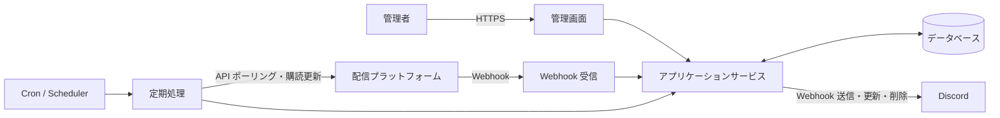

# StreamNotifyBot 基本設計書

## 1. 文書の目的

本書は、[要件定義書](要件定義書.md)を実現するための基本構造と処理境界を示します。PHP 8.5.9 と MariaDB 10.5 を前提とし、未選定のフレームワークやキュー製品に依存しない論理設計とします。

## 2. 設計原則

- 一般的な PHP Web ホスティングと Docker の双方で実行可能にする
- 常駐プロセスを必須とせず、定期処理は Cron 等から起動可能にする
- 配信プラットフォーム固有処理をアダプターとして分離する
- 対応プラットフォーム一覧はコードで固定し、管理画面から追加・削除しない
- Webhook とポーリングの入力を共通の配信状態へ正規化する
- 外部イベント、定期処理、Discord 通知を冪等にする
- 通知タイミングごとに既存投稿を削除し、現在の通知種別へ新規投稿する
- 秘密情報を業務データと分離し、表示、ログ、エクスポートを制限する
- 外部サービスの一時障害がシステム全体へ波及しないよう、処理単位を分離する

## 3. システムコンテキスト



## 4. 論理コンポーネント

| コンポーネント | 責務 |
| --- | --- |
| 管理 UI | 通知設定、通知種別ごとのWebhook URL、所属区分、配信者、アカウント、ポーリング設定、CSV の操作 |
| 認証・認可 | 管理画面へのアクセス制御、セッション管理、CSRF 対策 |
| Webhook Receiver | 検証要求への応答、署名検証、重複排除、イベント受付 |
| Platform Adapter | 識別子解決、購読管理、配信取得、応答の正規化 |
| Stream Service | 配信の登録、状態遷移、追跡期限の判定 |
| Notification Service | 通知タイミングの判定、Discord 投稿の削除と新規作成、重複防止 |
| Polling Scheduler | 対象抽出、呼び出し間隔、レート制限、再試行の制御 |
| Subscription Scheduler | Webhook 購読期限の監視と更新 |
| Cleanup Service | 追跡期限を過ぎた配信の通知削除と監視終了 |
| CSV Service | テーブル別の検証、インポート、エクスポート |
| Repository | データベースとの読み書きとトランザクション境界 |
| Secret Store | Webhook URL、API 資格情報などの安全な保管 |

## 5. 推奨レイヤー構成

```text
Presentation
├─ Admin HTTP
├─ Platform Webhook HTTP
└─ CLI / Scheduled Commands

Application
├─ Stream discovery and synchronization
├─ Subscription renewal
├─ Discord notification
├─ Cleanup
└─ CSV import/export

Domain
├─ Streamer and platform account
├─ Stream and status transition
├─ Notification setting and notification type
└─ Polling policy

Infrastructure
├─ Database repositories
├─ Platform API adapters
├─ Discord Webhook client
├─ Clock
└─ Logging and secret access
```

フレームワークを採用した場合は、その標準構成を優先しつつ、外部 API とドメイン判断の境界を維持します。

## 6. 主要処理フロー

### 6.1 配信者アカウント登録

1. 管理者が配信者の所属区分を選択する
2. 事務所に所属しない配信者の場合は「個人勢」区分を選択する
3. 管理者がプラットフォーム種別とハンドルまたは Screen ID を入力する
4. 所属区分が存在すること、プラットフォーム種別がコードで定義された対応対象であること、入力形式を検証する
5. 対象の Platform Adapter が API で安定 ID と表示情報を取得する
6. 既存のプラットフォームアカウントとの重複を確認する
7. 配信者へ所属区分とアカウントを関連付けて保存する
8. Webhook 対応プラットフォームの場合、購読を開始する
9. 結果と、失敗時は再実行可能な理由を表示する

保存と外部購読を単一トランザクションにはできないため、購読状態を保持し、失敗した購読だけを後から再試行できるようにします。

新しいプラットフォームを追加する場合は、プラットフォームコード、画面表示用ID、Platform Adapter、状態変換、認証、Webhook、ポーリング処理を実装し、テスト後にデプロイします。

### 6.2 Webhook 受信

1. チャレンジ応答など、プラットフォーム固有の検証要求を処理する
2. 署名、タイムスタンプ、検証トークンなどを確認する
3. イベント ID または内容の一意キーで重複を排除する
4. 外部イベントを共通イベントへ正規化する
5. 配信と状態を登録または更新する
6. 必要な Discord 通知処理を実行する
7. ポーリング対象と次回実行時刻を更新する

Webhook の応答時間制限が厳しい場合は、受信記録だけを同期的に行い、後続処理を別の短時間ジョブへ分離します。キューを使えない環境では、データベース上の処理待ちレコードを Cron から処理します。

### 6.3 配信ポーリング

1. `next_poll_at` が現在時刻以前の対象を、上限件数付きで取得する
2. プラットフォームと資格情報単位のレート制限を確認する
3. Platform Adapter から最新情報を取得する
4. 共通状態へ正規化し、保存済み状態との差分を判定する
5. 状態、時刻、BOTが表示する情報の差分から通知タイミングを判定する
6. 状態とポリシーに基づいて次回実行時刻を設定する
7. 配信終了後の追跡期限を超えた場合は、クリーンアップ対象にする

複数の Cron 実行が重なっても同じ対象を同時処理しないよう、ロックまたはリース期限を使用します。

### 6.4 通知タイミング判定

通知タイミングと送信先の通知種別を次のとおり判定します。

| 通知タイミング | 通知種別 | 判定 |
| --- | --- | --- |
| 動画投稿 | 動画投稿 | 通常動画の新規投稿を検知したとき |
| 待機所作成 | 配信開始前 | 開始30分より前に待機所を初めて検知したとき |
| 配信開始30分前 | 配信開始前 | 追跡中の待機所が開始30分前に達したとき、または開始30分以内に初めて検知したとき |
| 配信開始予定時間 | 配信開始前 | 追跡中の待機所が予定時刻に達したとき、または予定時刻以降かつ開始前に初めて検知したとき |
| 配信開始 | 配信中 | 配信開始を検知したとき |
| 配信終了 | 配信終了 | 配信終了を検知したとき |
| 表示情報変更 | 現在状態に対応する通知種別 | タイトル、開始時刻、サムネイルなどが変わったとき。ただし配信終了後は通知しない |

待機所の初回検知では、検知時点に該当する最も進んだ通知タイミングだけを採用します。これにより、30分以内の初回検知で待機所作成を重複通知したり、予定時刻以降の初回検知で過去の通知をまとめて送ったりしません。

### 6.5 Discord 通知

通知設定は、動画投稿、配信開始前、配信中、配信終了の4種類の通知種別ごとに複数のDiscord Webhook URLを保持します。通知時は、配信者に関連付けられたすべての通知設定から、対象通知種別の空ではない有効なURLを抽出します。

1. 通知タイミングと通知種別を確定する
2. 配信者に関連付けられた通知設定を取得する
3. その配信に対して現在有効な既存のDiscord投稿をすべて取得する
4. 保存済みのWebhook IDとメッセージ IDを使用して既存投稿を削除する
5. 対象通知種別の空ではないすべての有効なWebhook URLを取得する
6. 有効なURLがなければ、新規投稿を行わず処理を完了する
7. 配信状態と配信者情報から新しい通知内容を作成する
8. すべての有効なWebhook URLへ新規投稿し、Webhook IDとDiscordメッセージ IDを保存する
9. 通知イベントの冪等キーを保存し、同じ通知タイミングまたは情報変更の重複投稿を防ぐ
10. 配信終了から1週間を超えたら、残っている投稿を削除して削除日時を保存する

既存投稿の削除が一時的に失敗した場合は、新規投稿へ進まず削除を再試行します。Discord から Not Found が返された投稿は削除済みとして扱います。既存投稿の削除完了後に新規投稿を開始し、その一部が失敗した場合は、送信先単位で結果と再試行状態を記録して未完了の送信先だけを再試行します。

#### 6.5.1 Webhook表示

- Webhookの表示名にはプラットフォーム上の配信者名、アバターには配信者アイコンを使用する
- 通常の本文は空とし、通知内容はEmbedとリンクボタンで表現する
- 表示名またはアイコンを取得できない場合は、不正な値を送信せず、設定済みのWebhook既定値へフォールバックする

#### 6.5.2 Embed構成

| 要素 | 表示内容 |
| --- | --- |
| Author | プラットフォーム上の配信者名、配信者アイコン、配信者ページへのリンク |
| Title | 動画または配信のタイトル |
| URL | 動画または配信を直接開くURL |
| Description | 通知タイミングの文言と、予定時刻・タイトルの変更内容 |
| Field | 日時種別と `<t:UNIX:f> (<t:UNIX:R>)` 形式の絶対・相対時刻 |
| Image | 動画または配信のサムネイル。Twitchの配信終了時は取得できる場合にオフライン画像を使用 |
| Color | 配信者の表示色。未設定時はYouTube・Twitchが赤、TwitCastingが緑 |
| Footer | 通知作成時の日本標準時を `yyyy/MM/dd HH:mm:ss` 形式で表示し、配信者アイコンを併記 |

YouTubeとTwitchのサムネイルURLには、Discord側の画像キャッシュで古い画像が表示されないよう通知作成時刻をクエリ値として付加します。元URLにクエリがある場合も壊れないよう、URL構造に応じて `?` または `&` を使用します。画像URLを取得できない場合はImageを省略します。

#### 6.5.3 通知文言と日時

| 通知タイミング | Descriptionの基本文言 | 日時フィールド | 使用する日時 |
| --- | --- | --- | --- |
| 動画投稿 | 動画が投稿されました | 投稿時刻 | 動画の公開日時 |
| 待機所作成 | 配信が予約されました | 予定時刻 | 配信開始予定日時 |
| 配信開始30分前 | 30分以内に開始する配信があります | 予定時刻 | 配信開始予定日時 |
| 配信開始予定時間 | 配信開始予定時刻です | 予定時刻 | 配信開始予定日時 |
| 配信開始 | 配信が開始しました | 開始時刻 | 実際の配信開始日時 |
| 配信終了 | 配信が終了しました | 終了時刻 | 実際の配信終了日時 |

配信予定時刻が変更された場合は基本文言の前に「配信予定時刻が変更されました」、タイトルが変更された場合は基本文言の後に「配信タイトルが変更されました」を改行して追加します。両方が変わった場合は、予定時刻変更、基本文言、タイトル変更の順に表示します。サムネイルだけが変更された場合は、基本文言を維持して新しいImageへ差し替えます。

#### 6.5.4 X共有ボタン

- ラベルを「Xへ共有する」とするリンクボタンを1つ配置する
- 共有URLには動画または配信のURLとタイトルを含める
- URLエンコード後の共有URLが512文字を超える場合は、タイトル末尾を省略記号付きで切り詰める
- YouTubeはタイトルを共有文に使用し、TwitchとTwitCastingは「配信者名 / タイトル」を使用する

### 6.6 Webhook 購読更新

1. 有効期限が更新猶予期間内に入った購読を抽出する
2. Platform Adapter を通じて更新または再登録する
3. 新しい有効期限と外部購読 ID を保存する
4. 一時失敗はバックオフ付きで再試行する
5. 認証失敗など管理者対応が必要な場合は、状態をエラーにして記録する

### 6.7 CSV インポート

1. ファイルサイズ、文字コード、ヘッダーを検証する
2. 各行の型、値、参照先、一意性を検証する
3. 更新予定件数とエラーをプレビューする
4. 管理者の確定操作後、定義済みのトランザクション単位で反映する
5. 成功件数、失敗件数、失敗理由を表示する

秘密情報を含むデータの移行は、通常の CSV 機能から分離します。

## 7. 配信状態モデル

プラットフォーム固有状態を、少なくとも次の共通状態へ正規化する案とします。

| 状態 | 意味 | 主な次状態 |
| --- | --- | --- |
| `video` | ライブ配信ではない通常動画 | 終端状態。ただし表示情報の変更はあり得る |
| `scheduled` | 配信予定が登録されている | `live`, `ended`, `cancelled` |
| `live` | 配信中 | `ended` |
| `ended` | 配信終了 | 終端状態。ただし情報更新はあり得る |
| `cancelled` | 中止または削除 | 終端状態 |
| `unknown` | 外部状態を確定できない | 任意の確定状態 |

外部イベントは順不同で届く可能性があるため、単純な列挙値の大小では遷移を判定しません。外部サービスの更新時刻、取得時刻、確度、現在状態を用いて判断し、古いイベントで新しい状態を巻き戻さないようにします。

待機所作成、開始30分前、開始予定時間は配信状態ではなく、`scheduled` と現在時刻から導出する通知フェーズとして管理します。実行済みフェーズを保存し、定期処理の再実行で同じ通知を重複させません。

## 8. ポーリング方針

具体的な間隔は未決事項です。実装では、少なくとも次の区分を設定可能にします。

| 区分 | 目的 |
| --- | --- |
| 配信前 | 開始時刻やタイトルなどの変更検知 |
| 開始予定直前 | 開始を低遅延で検知 |
| 配信中 | 終了や情報変更の検知 |
| 配信終了後 1 週間以内 | アーカイブ情報や終了情報の補正 |
| 追跡期限超過 | ポーリング停止と通知削除 |
| エラー時 | エラー種別に応じたバックオフ |

各設定には、API レート制限を超えない最小値と、運用上許容できる最大値を設けます。

## 9. エラー処理

| 分類 | 基本方針 |
| --- | --- |
| 入力エラー | 再試行せず、管理者へ修正可能な内容を表示する |
| 認証・認可エラー | 秘密情報を出さず、管理者対応が必要な状態として記録する |
| レート制限 | `Retry-After` 等を尊重し、次回実行時刻を延期する |
| 一時的な外部障害 | 回数上限と指数バックオフ付きで再試行する |
| 恒久的な外部エラー | 自動再試行を止め、対象単位でエラー状態にする |
| データ競合 | 冪等キーと楽観ロックまたは一意制約で解決する |
| Discord 投稿消失 | 更新・削除時の Not Found を検知し、方針に従って再投稿または削除済みにする |

## 10. ログと監視

ログには、時刻、処理種別、相関 ID、対象プラットフォーム、内部 ID、結果、再試行可否を含めます。

次の値は記録しません。

- Discord Webhook URL
- API キー、アクセストークン、更新トークン
- Cookie、認証ヘッダー、セッション ID
- Webhook の署名用秘密値
- CSV に含まれる未検証の生データ全体

運用上は、購読更新失敗、ポーリングの継続失敗、Discord 送信失敗、クリーンアップ失敗を識別できるようにします。

## 11. セキュリティ境界

- 管理 UI は認証済み管理者だけに公開する
- Webhook Receiver は公開するが、プラットフォーム固有の検証を必須とする
- 定期処理は CLI から起動するか、HTTP 起動の場合は推測不能な URL だけに依存せず強い認証を行う
- 外部 URL をサーバーから取得する処理では、許可ホストと URL スキームを制限する
- 秘密情報は環境変数または専用設定から読み込み、画面ではマスクする
- Discord Webhook URL をデータベースへ保存する場合は、保存時暗号化の採用を検討する

## 12. 配置構成

### 一般的な PHP ホスティング

- 公開ディレクトリには HTTP エントリポイントと必要な静的ファイルだけを配置する
- 設定、ソース、ログ、秘密情報を公開ディレクトリ外に置く
- Cron から購読更新、ポーリング、通知削除などのコマンドを定期実行する

### Docker

- Web 実行環境と同じアプリケーションコードから CLI 定期処理を起動できるようにする
- イメージへ開発用ファイル、秘密情報、実行時データを含めない
- 非 root ユーザー、ヘルスチェック、永続データのマウント先を定義する
- PHP 8.5.9 と必要な拡張機能を固定し、MariaDB 10.5 と組み合わせて再現可能にする

## 13. テスト方針

- 状態遷移、通知内容、ポーリング間隔は単体テストする
- Platform Adapter と Discord Client は固定レスポンスでテスト可能にする
- Webhook 署名、重複、順序逆転、期限切れイベントを結合テストする
- データベースの一意制約、トランザクション、マイグレーションをテストする
- Cron の重複起動と途中失敗からの再実行をテストする
- CSV の不正形式、大容量、数式注入、参照不整合をテストする
- 実際の外部サービスを使うテストは分離し、秘密情報がない通常のテストで実行しない

## 14. 未決事項

実装開始前に、要件定義書の未決事項に加えて次を決定します。

- データベースを利用したジョブ管理で十分か、専用キューを利用するか
- Webhook URL の保存時暗号化方式と鍵管理
- 障害通知の送信先としきい値
- 外部 API のページネーションと初回同期範囲
- 配信や通知を物理削除するか、履歴として論理削除するか

## 15. 関連文書

- [要件定義書](要件定義書.md)
- [データ設計書](データ設計書.md)
- [初期構想メモ](../やりたいこと.md)
