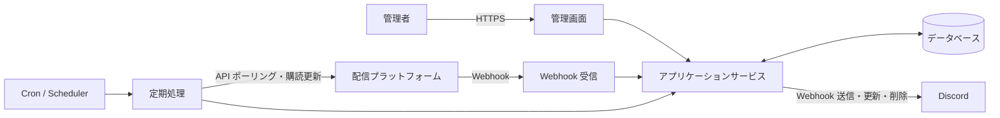

# StreamNotifyBot 基本設計書

## 1. 文書の目的

本書は、[要件定義書](要件定義書.md)を実現するための基本構造と処理境界を示します。PHP 8.5.9、Symfony 7.4 LTS、Doctrine DBAL 4.4系を使用します。MariaDB 10.5.29以降を互換性の下限とし、本番では保守期間内のMariaDB 10.11 LTS以降を推奨します。

## 2. 設計原則

- 一般的な PHP Web ホスティングと Docker の双方で実行可能にする
- Symfonyの標準構成とDIコンテナを利用しつつ、業務判断をフレームワークから分離する
- 常駐プロセスを必須とせず、定期処理は Cron 等から起動可能にする
- 配信プラットフォーム固有処理をアダプターとして分離する
- 対応プラットフォーム一覧はコードで固定し、管理画面から追加・削除しない
- Webhook とポーリングの入力を共通の配信状態へ正規化する
- 外部イベント、定期処理、Discord 通知を冪等にする
- 通知タイミングごとに既存投稿を削除し、現在の通知種別へ新規投稿する
- 秘密情報を業務データと分離し、表示、ログ、エクスポートを制限する
- 外部サービスの一時障害がシステム全体へ波及しないよう、処理単位を分離する

## 3. システムコンテキスト



## 4. 論理コンポーネント

| コンポーネント | 責務 |
| --- | --- |
| 管理 UI | 通知設定、通知種別ごとのWebhook URL、所属区分、配信者、アカウント、ポーリング設定、CSV の操作 |
| 認証・認可 | 管理画面へのアクセス制御、セッション管理、CSRF 対策 |
| Webhook Receiver | 検証要求への応答、署名検証、重複排除、イベント受付 |
| Platform Adapter | 識別子解決、購読管理、配信取得、応答の正規化 |
| Stream Service | 配信の登録、状態遷移、追跡期限の判定 |
| Notification Service | 通知タイミングの判定、Discord 投稿の削除と新規作成、重複防止 |
| Polling Scheduler | 対象抽出、呼び出し間隔、レート制限、再試行の制御 |
| Subscription Scheduler | Webhook 購読期限の監視と更新 |
| Cleanup Service | 追跡期限を過ぎた配信の通知削除と監視終了 |
| CSV Service | テーブル別の検証、インポート、エクスポート |
| Repository | データベースとの読み書きとトランザクション境界 |
| Secret Store | Webhook URL、API 資格情報などの安全な保管 |

## 5. アプリケーション構成

### 5.1 採用コンポーネント

| 用途 | コンポーネント | 方針 |
| --- | --- | --- |
| HTTP・DI・設定 | Symfony FrameworkBundle 7.4 LTS | `symfony/skeleton:7.4.*`を起点とし、必要なパッケージだけを追加する |
| 管理画面 | Twig、Form、Validator、CSRF、AssetMapper | サーバー側HTML生成を基本とし、Node.jsを必須にしない |
| 認証・認可 | Symfony Security、Scheb 2FA Bundle 8系、TOTPパッケージ | ローカル認証、ロール、TOTP、CSRFを構成し、メール・外部アカウント連携は追加しない |
| CLI | Symfony Console | 初期所有者作成、回復、マイグレーション、各Cron処理をコマンドとして提供する |
| HTTPクライアント | Symfony HttpClient | 配信プラットフォームAPIとDiscord Webhookの通信境界で使用する |
| 永続化 | Doctrine DBAL 4.4系、Doctrine Migrations | Repositoryで明示的なSQLとトランザクション境界を管理する。Doctrine ORMは初期構成へ導入しない |
| 識別子 | Symfony UID | UUIDv7をPHP側で生成し、MariaDBへ標準バイト順の`BINARY(16)`として保存する |
| 多言語 | Symfony Translation | 管理画面のUI文言を管理する。業務データの多言語名称はDBで管理する |
| ログ | Monolog | 構造化可能なログを出力し、秘密情報をマスクするプロセッサーを設ける |

Symfonyの7.4系だけを許可し、`composer.lock`と`symfony.lock`をコミットします。パッチ更新は7.4系内で行い、Symfonyのメジャー・マイナー更新とDoctrine DBALのメジャー更新は、PHP、MariaDB、追加Bundleの互換性を確認してから行います。依存関係の追加・更新時は、直接依存と推移依存のライセンスが本リポジトリのMITライセンスと両立することを確認します。

Symfony Messenger、Symfony Scheduler、Symfony Mailer、API Platform、Doctrine ORM、Redis、RabbitMQ、常駐ワーカーは初期構成へ導入しません。DBジョブのリースと再試行はアプリケーションのRepositoryとSymfony Consoleコマンドで実装します。

### 5.2 レイヤー構成

```text
Presentation
├─ Admin HTTP
├─ Platform Webhook HTTP
└─ CLI / Scheduled Commands

Application
├─ Stream discovery and synchronization
├─ Subscription renewal
├─ Discord notification
├─ Cleanup
└─ CSV import/export

Domain
├─ Streamer and platform account
├─ Stream and status transition
├─ Notification setting and notification type
└─ Polling policy

Infrastructure
├─ Database repositories
├─ Platform API adapters
├─ Discord Webhook client
├─ Clock
└─ Logging and secret access
```

Symfonyのルーティング、Controller、Console Command、DI設定はPresentationへ置きます。SymfonyまたはDoctrineの型をDomainの公開境界へ持ち込まず、外部APIとデータベースの実装詳細はInfrastructureへ閉じ込めます。

### 5.3 物理ディレクトリ

```text
bin/
└─ console

config/
├─ packages/
└─ routes/

migrations/
public/
├─ index.php
└─ assets/

src/
├─ Presentation/
│  ├─ Admin/
│  ├─ Webhook/
│  └─ Console/
├─ Application/
├─ Domain/
└─ Infrastructure/

templates/
tests/
├─ Unit/
├─ Integration/
└─ Functional/

var/
├─ cache/
└─ log/
```

Webサーバーの公開ルートは`public/`に限定します。`var/cache/`と`var/log/`にはWeb実行ユーザーとCLI実行ユーザーの双方が書き込めるようにし、アプリケーションコード、設定実値、Composerのメタデータを公開しません。

### 5.4 認証・セッションへの適用

- Symfony Securityを認証・認可の土台とし、`owner`と`administrator`の権限判定はVoterまたはアクセス制御へ集約する
- Scheb 2FA Bundle 8系のTOTP機能を使用し、Doctrine ORMに依存しないPersisterをRepository経由で実装する
- SymfonyのDBセッション機構を土台とし、Cookieの生セッションIDに対して鍵付きハッシュを生成してDBへ保存するカスタムハンドラーを実装する
- ログイン試行制限はSymfony RateLimiterを土台とし、複数のWebプロセスとCron環境で共有できるMariaDB上の記録を正とする
- TOTP秘密値、回復コード、再認証、監査ログは要件定義書の保存・失効規則を優先し、Bundleの既定動作だけに依存しない

### 5.5 配置と実行

- 本番環境は`APP_ENV=prod`、`APP_DEBUG=0`とし、デバッグツールとProfilerを含めない
- Composerを実行できないレンタルサーバーには、PHP 8.5.9環境で`composer install --no-dev --optimize-autoloader`を実行した配布物を配置する
- デプロイ時に依存関係、PHP拡張、マイグレーション、キャッシュ生成、Cron実行可否を検査する
- 定期処理は`php bin/console app:<用途>`形式の用途別コマンドをCronから起動する
- Apacheの共有ホスティングでは`public/`へのリライトだけを許可し、プロジェクトルートを公開しない

## 6. 主要処理フロー

### 6.1 配信者アカウント登録

1. 管理者が配信者の所属区分を選択する
2. 事務所に所属しない配信者の場合は「個人勢」区分を選択する
3. 管理者がプラットフォーム種別とハンドルまたは Screen ID を入力する
4. 所属区分が存在すること、プラットフォーム種別がコードで定義された対応対象であること、入力形式を検証する
5. 対象の Platform Adapter が API で安定 ID と表示情報を取得する
6. 既存のプラットフォームアカウントとの重複を確認する
7. 配信者へ所属区分とアカウントを関連付けて保存する
8. Webhook 対応プラットフォームの場合、購読を開始する
9. 結果と、失敗時は再実行可能な理由を表示する

保存と外部購読を単一トランザクションにはできないため、購読状態を保持し、失敗した購読だけを後から再試行できるようにします。

新しいプラットフォームを追加する場合は、プラットフォームコード、画面表示用ID、Platform Adapter、状態変換、認証、Webhook、ポーリング処理を実装し、テスト後にデプロイします。

#### 6.1.1 名称の言語管理

初期対応言語はBCP 47の`ja`と`en`とし、対応言語一覧はコードで固定します。言語タグは大文字小文字を区別せず受け付け、BCP 47の推奨表記へ正規化してから保存します。初期対応のデータ入力では`ja`と`en`だけを許可し、`ja-JP`や`en-US`などの地域コード付きタグは未対応として拒否します。基本言語へのフォールバックは、将来地域コードへ対応した場合に適用します。

言語別テーブルで管理する値は、事務所名、事務所短縮名、配信者名です。プラットフォーム上のチャンネル名、ハンドル、配信タイトル、通知設定の管理用表示名、プラットフォームの`code`と`display_id`は翻訳対象にしません。管理画面とDiscord通知の固定文言も初期仕様では日本語とし、将来のUI・通知文言の多言語化はコード側の言語リソースとして別に設計します。

事務所と配信者は`default_language_code`を持ち、同じ言語コードの名称行を必須とします。既存データと「個人勢」区分の既定言語は`ja`とし、「個人勢」には`ja: 個人勢`と`en: Independent`を初期登録します。英語名は自動翻訳せず、公式英語名または管理者が指定したローマ字表記を保存します。

名称は次の順に解決します。

1. 要求された言語と完全一致する名称
2. 将来地域コードへ対応した場合は要求言語の基本言語
3. エンティティの既定言語の名称
4. データ不整合時は固定文言「名称未設定」を表示し、秘密情報を含まないエラーを記録する

事務所短縮名が空の場合は、同じ言語行の正式名を使用します。別言語の短縮名にはフォールバックしません。DiscordのWebhook表示名とEmbed Authorはプラットフォーム上の配信者名を優先し、取得できない場合だけ管理対象の配信者名を上記規則で解決します。

既定言語の名称行は直接削除できません。既定言語を変更する場合は変更先の名称行が存在することを検証し、既定言語と名称行を同じトランザクションで更新します。名称の前後の空白を除去し、空白だけの値、改行、制御文字を拒否します。短縮名の空文字はNULLへ正規化し、表示時は出力先に応じてエスケープします。プラットフォームAPIの同期では言語別名称を上書きしません。

### 6.2 Webhook 受信

1. チャレンジ応答など、プラットフォーム固有の検証要求を処理する
2. 署名、タイムスタンプ、検証トークンなどを確認する
3. イベント ID または内容の一意キーで重複を排除する
4. 外部イベントを共通イベントへ正規化する
5. 受信イベントを処理待ちとして保存する
6. API から最新情報を取得する後続処理を登録する
7. Webhook への応答を完了する

Webhook の応答時間制限が厳しい場合は、受信記録だけを同期的に行い、後続処理をデータベース上の処理待ちレコードとして保存します。保存した処理は Cron から起動する短時間の PHP CLI コマンドで実行します。

Webhook のペイロードだけでは通知を確定しません。後続処理で API から最新情報を取得して共通状態へ反映し、通知条件を判定します。API 取得に失敗した場合は不完全な情報で通知せず、処理待ち状態を維持して上限付きで再試行します。

### 6.3 配信ポーリング

1. `next_poll_at` が現在時刻以前の対象を、上限件数付きで取得する
2. プラットフォームと資格情報単位のレート制限を確認する
3. Platform Adapter から最新情報を取得する
4. 共通状態へ正規化し、保存済み状態との差分を判定する
5. 状態、時刻、BOTが表示する情報の差分から通知タイミングを判定する
6. 状態とポリシーに基づいて次回実行時刻を設定する
7. 現在時刻が配信終了後の追跡期限以上の場合はポーリングせず、クリーンアップ対象にする

複数の Cron 実行が重なっても同じ対象を同時処理しないよう、ロックまたはリース期限を使用します。

#### 配信終了後168時間の算定

「1週間」はカレンダー日ではなく正確な168時間とし、終了起点、追跡期限、現在時刻はUTCで比較します。管理画面で表示するときだけ利用者のタイムゾーンへ変換します。終了起点は次の順に採用します。

1. プラットフォームAPIが返す正式な配信終了時刻
2. 署名などを検証済みのWebhookが示すイベント発生時刻
3. ポーリングで終了状態を初めて確認した時刻

期限前により優先度の高い終了時刻を取得した場合は、`終了起点 + 168時間`で追跡期限を再計算します。訂正によって期限が後ろへ移れば追跡を延長し、前へ移った結果すでに期限へ到達していれば次のクリーンアップ対象にします。古いイベントや優先度の低い情報では、優先度の高い終了時刻を上書きしません。

一時切断や誤判定後に配信中へ戻った場合は、終了時刻、終了時刻の取得元、追跡期限を解除し、配信中のポーリングへ戻します。再度終了した時点で新しい終了起点を設定します。通知投稿の削除が完了した後は、終了時刻だけが訂正されても投稿や低頻度追跡を復元しません。ただし、配信中への復帰は新しい状態遷移として追跡を再開します。

#### プラットフォーム別の取得分担

| プラットフォーム | Webhook による変更検知 | API ポーリングによる最新状態取得と補完 |
| --- | --- | --- |
| YouTube | WebSub で動画・待機所の発見とタイトル・説明変更を検知する | 動画種別、予定時刻、開始、終了、タイトル、サムネイルを取得し、Webhook 欠落を補完する |
| Twitch | EventSub の `stream.online`、`stream.offline`、`channel.update` を受信する | 配信予定、配信状態、タイトル、サムネイルを取得し、Webhook 欠落を補完する |
| TwitCasting | `livestart`、`liveend`、`liveschedulecreate`、`livescheduleupdate`、`livescheduledelete` を受信する | 現在の配信、配信予定、タイトル、サムネイルを取得し、Webhook 欠落を補完する |

Twitch と TwitCasting の動画投稿通知は初期対象外とします。Webhook とポーリングが同じ変更を検知した場合は同じ冪等キーへ正規化し、古いイベントによって保存済み状態を過去へ戻しません。

#### 初回・復旧同期の共通規則

初回登録時と障害復旧時は、APIによる状態取得より先に対象プラットフォームのWebhook、WebSubまたはEventSub購読を開始します。同期開始後に受信したイベントも保存し、API取得結果とプラットフォーム外部IDおよび冪等キーで統合します。

同期実行とページまたはバッチごとの状態を保存し、成功済みの処理を繰り返さず、Cronの処理上限または一時失敗後は未完了部分から再開します。初回・復旧同期で初めて検出したコンテンツは過去の通知段階を順に再生せず、検出時点で最も進んだ通知段階だけを1回処理します。

##### YouTube

YouTube アカウントの初回登録時と、Webhook 停止などの障害から復旧した時は、次の順序で同期します。

1. WebSub 購読を開始し、受信イベントを保存できる状態にする
2. チャンネル ID を指定して Atom フィードを1回取得する
3. フィード内の動画 ID を保存済みデータと照合して重複排除する
4. 未取得の動画 ID を最大50件のバッチへ分割する
5. バッチごとに `videos.list` を呼び出し、動画種別、配信状態、予定・開始・終了日時、表示情報を取得する
6. 成功したバッチを完了として記録し、失敗したバッチだけを再試行する

初回・復旧同期の対象は Atom フィードに含まれる範囲とし、`search.list` やアップロード再生リストを使った過去方向のページネーションは行いません。WebSub と同期処理が同じ動画を検知した場合は、プラットフォーム動画 ID と冪等キーで重複を排除します。`videos.list`の正常な応答に含まれない動画IDは取得不能として記録し、同じIDを無期限に再試行しません。

##### Twitch

EventSub購読を開始した後、次の順序で同期します。

1. 管理対象の配信者IDを最大100件のバッチに分割し、現在の配信状態を取得する
2. 配信者ごとに現在時刻以降の配信予定を1ページ25件で取得する
3. 配信予定の開始日時が同期期間上限へ到達するか、継続カーソルがなくなるまで取得する
4. 各ページの成功状態と次のカーソルを保存する

初回・復旧同期の配信予定範囲は既定30日とし、管理画面では1日以上90日以下で変更可能にします。スケジュールAPIが「予定なし」を示すNot Foundを返した場合は正常な空結果として扱います。動画・VOD履歴は同期対象にしません。

##### TwitCasting

WebHook購読を開始した後、配信者ごとに`current_live`で現在の配信を取得し、`upcoming_live_schedules`で今後の配信予定を取得します。配信予定の`in_days`は既定30日とし、管理画面では1日以上90日以下で変更可能にします。このAPIについてはアプリケーション側のページネーションを行いません。過去ライブ・録画履歴は同期対象にしません。

##### 障害復旧とページネーション

TwitchとTwitCastingでは、障害中に開始と終了の両方が発生した配信を過去履歴から推測せず、復旧時点で取得できる最新状態だけを反映します。保存上は配信中で、対象アカウントの現在状態取得が正常終了したにもかかわらず配信が存在しない場合は、復旧確認時刻を`first_observed`の終了起点として扱います。対象アカウントの取得自体が失敗した場合は終了と判定しません。

カーソル方式のAPIでは、ページ番号、直前と次のカーソル、処理済み外部IDを保存します。同じカーソルの反復は異常終了とし、ページ間の重複項目は外部IDで排除します。空ページ、継続カーソルなし、同期期間上限到達のいずれかで正常終了します。カーソルが無効になった場合は処理済み外部IDを維持したまま対象範囲の先頭から再取得します。

配信予定の削除・取消は、対象範囲を最後まで正常に取得できた場合だけ、保存済みデータとの差分として確定します。ページ取得の途中失敗やCronの処理上限到達時は、取得結果に存在しない予定を削除・取消扱いにしません。

### 6.4 通知タイミング判定

通知タイミングと送信先の通知種別を次のとおり判定します。

| 通知タイミング | 通知種別 | 判定 |
| --- | --- | --- |
| 動画投稿 | 動画投稿 | 通常動画の新規投稿を検知したとき |
| 待機所作成 | 配信開始前 | 開始30分より前に待機所を初めて検知したとき |
| 配信開始30分前 | 配信開始前 | 追跡中の待機所が開始30分前に達したとき、または開始30分以内に初めて検知したとき |
| 配信開始予定時間 | 配信開始前 | 追跡中の待機所が予定時刻に達したとき、または予定時刻以降かつ開始前に初めて検知したとき |
| 配信開始 | 配信中 | 配信開始を検知したとき |
| 配信終了 | 配信終了 | 配信終了を検知したとき |
| 表示情報変更 | 現在状態に対応する通知種別 | タイトル、開始時刻、サムネイルなどが変わったとき。ただし配信終了後は通知しない |

待機所の初回検知では、検知時点に該当する最も進んだ通知タイミングだけを採用します。これにより、30分以内の初回検知で待機所作成を重複通知したり、予定時刻以降の初回検知で過去の通知をまとめて送ったりしません。

### 6.5 Discord 通知

通知設定は、動画投稿、配信開始前、配信中、配信終了の4種類の通知種別ごとに複数のDiscord Webhook URLを保持します。通知時は、配信者に関連付けられたすべての通知設定から、対象通知種別の空ではない有効なURLを抽出し、現行鍵で算出したフィンガープリントによって同じURLを1件へ集約します。

1. 通知タイミングと通知種別を確定する
2. 配信者に関連付けられた通知設定を取得する
3. その配信に対して現在有効な既存のDiscord投稿をすべて取得する
4. 保存済みのWebhook IDとメッセージ IDを使用して既存投稿を削除する
5. 対象通知種別の空ではないすべての有効なWebhook URLを取得する
6. 有効なURLがなければ、新規投稿を行わず処理を完了する
7. 配信状態と配信者情報から新しい通知内容を作成する
8. すべての有効なWebhook URLへ新規投稿し、Webhook IDとDiscordメッセージ IDを保存する
9. 通知イベントの冪等キーを保存し、同じ通知タイミングまたは情報変更の重複投稿を防ぐ
10. 配信終了の起点から168時間に到達したら、残っている投稿を削除して削除日時を保存する

既存投稿の削除が一時的に失敗した場合は、新規投稿へ進まず削除を再試行します。Discord から Not Found が返された投稿は削除済みとして扱います。既存投稿の削除完了後に新規投稿を開始し、その一部が失敗した場合は、送信先単位で結果と再試行状態を記録して未完了の送信先だけを再試行します。

168時間経過後の削除失敗も通知削除ジョブの上限付き再試行に従います。削除の再試行中も低頻度ポーリングは再開せず、削除期限は延長しません。実際の削除時刻は外部Cronの起動粒度により期限以降の最初の実行時刻となります。

#### 6.5.1 Webhook URL検証と重複排除

管理画面へ入力されたURLは前後の空白を除去した後、URLとして分解し、次をすべて満たす場合だけ受け付けます。

- スキームが`https`
- ホストが`discord.com`
- ユーザー情報と明示ポートがない
- パスが`/api/webhooks/{webhook_id}/{webhook_token}`の形式
- Webhook IDが10進数字で、トークンが空でない
- パーセントエンコード、余分なパス、クエリ、フラグメントがない

検証後は`https://discord.com/api/webhooks/{webhook_id}/{webhook_token}`へ再構築します。トークンの大文字と小文字は変更しません。送信時にメッセージIDを取得するための`wait=true`はアプリケーションが付加し、保存URLには含めません。Discordのフォーラム・メディアチャンネル用`thread_id`は初期対象外とし、対応時はURLのクエリではなく独立した送信先設定として設計します。

フィンガープリント入力は、区切りの曖昧さを避けるため、次のバイト列とします。

```text
discord-webhook:v1\0{webhook_id}\0{webhook_token}
```

32バイト以上のランダムな専用鍵を用い、`HMAC-SHA-256`の32バイトバイナリ値を生成します。フィンガープリント鍵はWebhook URLの暗号化鍵と分離し、リポジトリ、DB、Dockerイメージの外から読み込みます。鍵IDは秘密情報ではないためレコードへ保存しますが、鍵、URL、トークン、フィンガープリントはログへ出力しません。

登録時の重複範囲は、通知設定ID、通知種別、Webhook URLです。同じURLの無効レコードがある場合は再有効化を案内します。異なる通知設定や通知種別では同じURLを許可しますが、通知イベントの送信先確定時に、復号した各URLから現行鍵のフィンガープリントを算出して同じ送信先を1件へ集約します。

鍵は次の順で無停止ローテーションします。

1. 新しい鍵を現行鍵として追加し、旧鍵を照合用として保持する
2. 登録時は現行鍵とすべての照合用鍵で候補フィンガープリントを生成して重複検索する
3. 新規・更新レコードは現行鍵で保存する
4. 既存URLを復号し、現行鍵のフィンガープリントへバッチ更新する
5. 全件移行と件数検証の完了後にだけ旧鍵を削除する

同じ現行鍵による同時登録はDBの一意制約で防ぎ、制約違反は通常の重複入力として処理します。アプリケーション内で秘密値由来のフィンガープリントを直接比較する場合は、タイミング差を抑える比較関数を使用します。

#### 6.5.2 Webhook表示

- Webhookの表示名にはプラットフォーム上の配信者名、アバターには配信者アイコンを使用する
- 通常の本文は空とし、通知内容はEmbedとリンクボタンで表現する
- 表示名またはアイコンを取得できない場合は、不正な値を送信せず、設定済みのWebhook既定値へフォールバックする

#### 6.5.3 Embed構成

| 要素 | 表示内容 |
| --- | --- |
| Author | プラットフォーム上の配信者名、配信者アイコン、配信者ページへのリンク |
| Title | 動画または配信のタイトル |
| URL | 動画または配信を直接開くURL |
| Description | 通知タイミングの文言と、予定時刻・タイトルの変更内容 |
| Field | 日時種別と `<t:UNIX:f> (<t:UNIX:R>)` 形式の絶対・相対時刻 |
| Image | 動画または配信のサムネイル。Twitchの配信終了時は取得できる場合にオフライン画像を使用 |
| Color | 配信者の表示色。未設定時はYouTube・Twitchが赤、TwitCastingが緑 |
| Footer | 通知作成時の日本標準時を `yyyy/MM/dd HH:mm:ss` 形式で表示し、配信者アイコンを併記 |

YouTubeとTwitchのサムネイルURLには、Discord側の画像キャッシュで古い画像が表示されないよう通知作成時刻をクエリ値として付加します。元URLにクエリがある場合も壊れないよう、URL構造に応じて `?` または `&` を使用します。画像URLを取得できない場合はImageを省略します。

#### 6.5.4 通知文言と日時

| 通知タイミング | Descriptionの基本文言 | 日時フィールド | 使用する日時 |
| --- | --- | --- | --- |
| 動画投稿 | 動画が投稿されました | 投稿時刻 | 動画の公開日時 |
| 待機所作成 | 配信が予約されました | 予定時刻 | 配信開始予定日時 |
| 配信開始30分前 | 30分以内に開始する配信があります | 予定時刻 | 配信開始予定日時 |
| 配信開始予定時間 | 配信開始予定時刻です | 予定時刻 | 配信開始予定日時 |
| 配信開始 | 配信が開始しました | 開始時刻 | 実際の配信開始日時 |
| 配信終了 | 配信が終了しました | 終了時刻 | 実際の配信終了日時 |

配信予定時刻が変更された場合は基本文言の前に「配信予定時刻が変更されました」、タイトルが変更された場合は基本文言の後に「配信タイトルが変更されました」を改行して追加します。両方が変わった場合は、予定時刻変更、基本文言、タイトル変更の順に表示します。サムネイルだけが変更された場合は、基本文言を維持して新しいImageへ差し替えます。

#### 6.5.5 X共有ボタン

- ラベルを「Xへ共有する」とするリンクボタンを1つ配置する
- 共有URLには動画または配信のURLとタイトルを含める
- URLエンコード後の共有URLが512文字を超える場合は、タイトル末尾を省略記号付きで切り詰める
- YouTubeはタイトルを共有文に使用し、TwitchとTwitCastingは「配信者名 / タイトル」を使用する

### 6.6 Webhook 購読更新

1. 有効期限が更新猶予期間内に入った購読を抽出する
2. Platform Adapter を通じて更新または再登録する
3. 新しい有効期限と外部購読 ID を保存する
4. 一時失敗はバックオフ付きで再試行する
5. 認証失敗など管理者対応が必要な場合は、状態をエラーにして記録する

### 6.7 CSV インポート

通常CSVは設定データの移行と一括編集を目的とし、次を双方向の対象とします。

| CSV種別 | 対象 |
| --- | --- |
| `notification_settings` | 通知設定のID、表示名、有効状態 |
| `agencies`, `agency_names` | 所属区分と多言語名称 |
| `streamers`, `streamer_names` | 配信者、所属、カラー、既定言語、多言語名称 |
| `platform_accounts` | 配信者、プラットフォーム、利用者が入力した登録用識別子、有効状態 |
| `notification_routes` | 配信者と通知設定の関連 |
| `polling_policies` | 状態別ポーリング方針 |
| `job_policies` | Cronジョブの処理件数、時間、再試行、リース |
| `platform_api_policies` | Quota予算としきい値 |
| `operational_alert_policies` | 障害通知の重要度、しきい値、再通知、復旧通知 |
| `retention_policies` | データ種別ごとの保持期間と実効バックアップ保持期間 |

秘密情報を持つDiscord・運用通知Webhook、API資格情報、管理者認証、セッション、および配信・通知・障害・ログなどの実行履歴は対象外とします。暗号文、ノンス、鍵ID、フィンガープリント、作成・更新日時、リース、再試行状態、エラーコード、論理削除日時も入出力しません。`platform_accounts`ではAPI由来の安定ID、表示上のID、名称、URL、画像を出力せず、利用者が登録時に入力してAPI同期で上書きしない登録用識別子から移行先で再解決します。

#### 6.7.1 CSV形式

- エクスポートはUTF-8 BOM付き、カンマ区切り、CRLFとする
- インポートはBOM付きまたはBOMなしのUTF-8だけを許可し、Shift_JIS、CP932、UTF-16や別区切りを推測変換しない
- 囲み文字は`"`とし、値中の`"`を`""`へ変換する
- 全フィールドを引用符で囲み、ヘッダーを必須とする
- 制御文字、NUL、フィールド内改行を拒否して1レコードを1物理行にする
- nullable列の空フィールドをNULLとし、空文字そのものは値として許可しない
- 日時はUTCの`YYYY-MM-DDTHH:mm:ssZ`、真偽値は`true`または`false`、UUIDは小文字の標準形式、小数点は`.`とする

先頭列を整数の`schema_version`とし、初期値を`1`とします。全行で同じ値を必須とし、未対応・混在バージョンを拒否します。CSV種別は管理画面またはCLIで明示し、ファイル名だけでは判定しません。列名と順序は種別・バージョンごとに固定し、重複、未知列、不足、順序違いを拒否します。

ファイル名は`stream-notify-bot_{resource}_v{version}_{UTC日時}.csv`とします。

#### 6.7.2 IDと取込順序

既存環境からの移行ではエクスポートしたUUIDを維持します。新規行はUUIDを指定するか空欄とし、空欄の場合はプレビュー時にUUIDを生成して対応表をダウンロード可能にします。

参照関係を持つファイルは、所属区分、所属区分名称、通知設定、配信者、配信者名称、プラットフォームアカウント、通知経路、各方針設定の順に取り込みます。単一ファイルでは参照先がDBに存在することを必須とします。

#### 6.7.3 更新方式

| 方式 | 動作 |
| --- | --- |
| 追加 | 新規行だけを登録し、既存の主キー・一意キーとの重複をエラーにする |
| 追加・更新 | 一致する行を更新し、存在しない行を追加する。CSVにない既存行は変更しない |
| 置換 | CSVにない対象種別の既存行を論理削除または無効化する |

既定は追加・更新です。置換は関連する秘密情報を変更せず、参照整合性を壊す場合は拒否し、無効化・論理削除予定件数の追加確認を必須とします。CSVから物理削除は実行しません。プラットフォームコード、内部処理状態、API同期日時など変更不可列は更新できません。

YouTube APIデータの期限内削除など、外部規約を満たすために必須の保持・クリーンアップ方針は、CSVから無効化または絶対上限超過できません。

#### 6.7.4 プレビューと原子性

1. ファイルをWeb公開ディレクトリ外の期限付きステージへストリーム読み込みする
2. 文字コード、形式、型、一意性、参照整合性を全行検証する
3. 追加、更新、変更なし、無効化、エラー、警告、API解決件数、推定Quotaを表示する
4. ファイルハッシュ、CSV種別、更新方式、DB基準状態を含む30分有効のプレビューを発行する
5. 管理者の確定後、登録用識別子からプラットフォームアカウントの安定IDを外部APIで全件解決する
6. ファイルまたはDB状態が変わっていないことを再確認し、1トランザクションで反映する

1件でも検証、API解決、DB反映に失敗した場合は全件を反映しません。初期実装では部分成功を提供しません。外部APIの成功結果は同一処理内で再利用し、利用量をQuotaへ記録します。

初期ファイル上限は10 MiB・50,000行・1フィールド16 KiB、絶対上限は100 MiB・500,000行・1フィールド1 MiBとします。プレビュー期限は初期30分、絶対上限24時間です。サーバー性能に応じて絶対上限以下へ設定可能とします。

#### 6.7.5 一時ファイルとエラー

一時ファイルはWeb公開ディレクトリ外へ推測困難な名前と実行ユーザー限定の権限で保存し、期限切れ、反映完了、失敗時に削除します。生CSVを処理結果として保持せず、内容をログへ出力しません。

エラー結果は物理行番号、データ行番号、列名、エラーコード、秘密情報を含まない説明、マスク・長さ制限済み入力値をUTF-8 BOM付きCSVで返します。同じ行の複数エラーを可能な範囲ですべて報告します。

#### 6.7.6 数式注入対策

文字列列が先頭空白を除いて`=`、`+`、`-`、`@`で始まる場合は、エクスポート時に値全体の先頭へ`'`を付けます。元値が`'`で始まる場合は`''`へ二重化します。再インポートでは、二重化した`'`を1文字へ戻し、単一の`'`に続く値が数式開始条件を満たす場合だけ注入対策用接頭辞を除去します。この規則を通常エクスポート、エラー結果、ID対応表を含むすべてのCSV出力へ適用します。

秘密情報を含むデータの移行は通常CSVから分離し、移行先で再入力するか、暗号化済みDBバックアップと別経路で保管した鍵を使用します。

### 6.8 管理画面の認証と管理者運用

#### 6.8.1 認証方式と権限

管理画面はアプリケーション内のローカルアカウントを使用し、ログインID、パスワード、TOTPの二要素認証を必須とします。初期仕様ではメール送信、メールによる招待・回復、GitHub・Google・Discord等の外部アカウント連携、HTTP Basic認証を使用しません。

権限は`owner`と`administrator`の2種類とします。`owner`はすべての設定、管理者管理、監査ログ、他管理者のセッション失効を操作できます。`administrator`は配信者、通知、外部API、ポーリング、CSV、運用設定を操作できますが、管理者管理とセキュリティ方針の変更はできません。認可は画面要素の表示だけに依存せず、すべてのHTTPリクエストで検証します。

最後の有効な`owner`は無効化、削除、降格できません。管理者は自分自身を無効化、削除、降格できません。

#### 6.8.2 初期設定、追加、回復

既定のログインIDとパスワードは用意しません。初期`owner`はCLIコマンドで一度限りのセットアップトークンを作成し、セットアップ画面でパスワードとTOTPを登録します。対話的なCLIを利用できない場合は、Web公開ディレクトリ外に置いたセットアップトークンを使用できます。DBの未設定状態と有効なトークンの両方を条件とし、最初の`owner`作成後は初期設定経路を恒久的に無効化します。

管理者追加では、`owner`がログインID、表示名、権限を指定し、30分有効で一度限りのセットアップURLを発行します。URLは作成時に1回だけ表示し、メールでは送信しません。生トークンは保存せず、256ビット以上の乱数から生成したトークンのSHA-256ハッシュを保存します。

パスワードを忘れた場合は、別の`owner`が同じ形式のリセットURLを発行します。単独`owner`はサーバー上のCLIからパスワードとTOTPを再設定します。リセット時は対象管理者の全セッション、未使用の招待・回復トークン、既存の回復コードを失効します。秘密の質問と、別の管理者が新しいパスワードを直接指定する方式は使用しません。

#### 6.8.3 パスワードとTOTP

パスワードは12文字以上128文字以下とし、Unicode、空白、記号を許可します。文字種の組み合わせと定期変更は強制せず、ローカルに保持する一般的なパスワードの拒否リストと照合します。パスワードやその派生値を外部サービスへ送信しません。

PHPの`password_hash()`と`PASSWORD_ARGON2ID`を使用し、初期下限をメモリ19 MiB、反復2回、並列度1とし、ハッシュ列は255文字以上とします。実環境で対話的ログインに過大な遅延を生じないことを確認し、ログイン成功時に`password_needs_rehash()`で必要な再ハッシュを行います。Argon2idが利用できない環境ではインストール要件エラーとし、独自方式や弱い方式へフォールバックしません。

TOTP秘密値には秘密情報の暗号化エンベロープを適用し、用途を`administrator_totp_secret`とします。判定では現在期間と前後1期間を許容し、同じTOTPコードの再利用を防ぎます。管理者ごとに使い切り回復コードを10件発行し、画面に一度だけ表示してDBには一方向ハッシュだけを保存します。TOTP再設定時は既存の回復コードをすべて失効します。

#### 6.8.4 セッション

セッションはMariaDBへ保存し、Cookieには256ビット以上の暗号学的乱数で生成した不透明なIDだけを格納し、DBにはSHA-256ハッシュだけを保存します。Cookie名には`__Host-`接頭辞を使用し、`Secure`、`HttpOnly`、`SameSite=Strict`、`Path=/`を設定して`Domain`を設定しません。URL、HTML、ログ、`localStorage`へセッションIDを出力しません。

無操作期限は既定30分、絶対期限はログインから12時間とします。管理画面では無操作5～120分、絶対期限1～24時間の範囲で変更でき、絶対期限を無操作期限以上にします。永続的な「ログイン状態を保持する」機能は初期対応しません。

ログイン、権限変更、パスワード変更、TOTP変更後はセッションIDを再生成します。パスワード、TOTP、権限、有効状態の変更時は対象管理者の既存セッションを失効します。管理者は自分のセッション一覧を確認して個別失効でき、`owner`は他管理者の全セッションを失効できます。

#### 6.8.5 再認証と試行制限

管理者の追加・無効化・削除・権限変更、パスワード・TOTPのリセット、全セッション失効、API資格情報・Webhook検証用秘密値の変更、暗号鍵ローテーション開始、CSV置換インポート、監査ログエクスポートでは、直近10分以内のパスワードとTOTPによる再認証を要求します。

ログインIDと送信元IPの両方を単位として、15分以内に5回失敗した後は待機時間を段階的に増加させ、上限を15分とします。永久的な自動ロックは行いません。ログイン失敗画面では、アカウントの不存在、無効状態、パスワード不一致、TOTP不一致を同じメッセージと応答特性で返します。大量の認証失敗は運用障害として集約します。

#### 6.8.6 CSRFとHTTP境界

状態変更にはCSRFトークンとOrigin検証を必須とし、GETリクエストで状態を変更しません。ログイン画面もログインCSRFの対象にします。管理画面の応答へ`Cache-Control: no-store`、Content Security Policy、`frame-ancestors 'none'`、`X-Content-Type-Options: nosniff`を設定します。

管理画面はHTTPSだけで提供します。リバースプロキシ配下では信頼するプロキシを明示設定し、任意の送信元が指定した`X-Forwarded-Proto`等を信用しません。

#### 6.8.7 無効化と削除

無効化時はログインを即時禁止し、全セッションと未使用トークンを失効します。パスワードハッシュとTOTP秘密値は再有効化に備えて保持します。

削除時は先に無効化し、パスワードハッシュ、TOTP秘密値、回復コード、全セッション、未使用トークンを物理削除します。管理者レコードは監査ログの参照用墓標として保持し、監査ログの保持終了後に参照がなければ物理削除できます。削除した管理者は復元せず、必要な場合は新しいアカウントとして招待します。

#### 6.8.8 監査ログ

ログイン成功・失敗、ログアウト、TOTP・回復コード認証、管理者の作成・招待・権限変更・無効化・削除、パスワード・TOTP変更とリセット、セッション失効、秘密情報と各種設定の登録・変更・削除、CSV入出力、手動ジョブ実行、監査ログの閲覧・出力を記録します。

監査ログにはUTCの操作日時、操作者の内部ID、操作コード、対象種別と内部ID、成否、相関ID、送信元IP、長さを制限したUser-Agent、秘密情報を除外した変更前後の要約、失敗時の非秘密エラーコードを記録します。パスワード、TOTP、回復コード、セッションID、セットアップ・リセットトークン、Webhook URL、アクセストークン、暗号文、ノンス、鍵を記録しません。

監査ログはアプリケーションから更新できない追記専用とし、削除は保持期限に達したクリーンアップ処理だけに限定します。状態変更と対応する監査ログは同じDBトランザクションで保存し、監査記録に失敗した場合は状態変更をロールバックします。既定365日、設定可能範囲90～3650日で保持します。

### 6.9 Cron ジョブ

レンタルサーバーの Cron から、次の責務ごとに PHP CLI コマンドを起動します。

| コマンド責務 | 主な処理 |
| --- | --- |
| Webhook イベント処理 | 受信済みイベントの検証後処理、配信状態の更新 |
| 配信ポーリング | `next_poll_at` を迎えた配信情報の取得と通知判定 |
| 購読更新 | 更新期限を迎える Webhook 購読の更新 |
| 通知処理 | 通知イベントの送信、削除、失敗した処理の再試行 |
| クリーンアップ | 追跡期限を超えた配信の監視終了と Discord 投稿削除 |

- 各コマンドは処理件数または実行時間に上限を設け、レンタルサーバーの実行時間制限内で終了する
- 処理待ち、再試行時刻、失敗回数、リース期限は MariaDB へ保存する
- 同じ Cron が重複起動しても、期限付きリースと冪等キーにより同じ対象を並行処理しない
- 中断後は完了済み処理を重複実行せず、未完了または再試行対象だけを次回 Cron で処理する
- 専用キューと常駐ワーカーは初期構成に含めない

処理件数、最大実行時間、最大再試行回数、初期待機時間、最大待機時間、バックオフ倍率、ジッター率、リース時間はジョブ種別ごとに管理画面から変更可能にします。保存時には少なくとも次を検証します。

- すべての件数と時間が正の値である
- 最大待機時間が初期待機時間以上である
- リース時間が最大実行時間と終了処理に必要な余裕より長い
- 設定可能な絶対上限を超えてサーバーやデータベースを占有しない

#### 6.9.1 初期値

| ジョブ種別 | 処理件数 | 最大実行時間 | 最大試行回数 | リース時間 | 有効状態 |
| --- | ---: | ---: | ---: | ---: | --- |
| Webhook後続処理 | 50件 | 45秒 | 8回 | 120秒 | 有効 |
| 配信ポーリング | 20件 | 45秒 | 5回 | 120秒 | 有効 |
| Webhook購読更新 | 20件 | 45秒 | 8回 | 120秒 | 有効 |
| Discord通知・削除 | 20件 | 45秒 | 8回 | 120秒 | 有効 |
| クリーンアップ | 100件 | 45秒 | 20回 | 120秒 | 有効 |

最大試行回数には最初の実行を含めます。共通の再試行初期値は、初回待機60秒、最大待機3600秒、バックオフ倍率2.0、ジッター率20%とします。

#### 6.9.2 絶対上下限

| 設定 | 絶対下限 | 絶対上限 |
| --- | ---: | ---: |
| 処理件数 | 1件 | 1000件 |
| 最大実行時間 | 5秒 | 900秒 |
| 最大試行回数 | 1回 | 20回 |
| 初回再試行待機 | 1秒 | 86400秒 |
| 最大再試行待機 | 初回再試行待機以上 | 604800秒 |
| バックオフ倍率 | 1.0 | 10.0 |
| ジッター率 | 0% | 50% |
| リース時間 | 相関制約による最小値 | 3600秒 |

リース時間は、`最大実行時間 + max(30秒, 最大実行時間の20%)` 以上とし、20%の計算結果に端数がある場合は秒単位で切り上げます。処理件数の推奨上限は、Webhook後続処理500件、配信ポーリング200件、購読更新200件、通知処理200件、クリーンアップ1000件とし、超過時は警告します。

最大実行時間は新しい処理の開始を止める期限であり、処理中の外部通信や状態保存を強制的に打ち切る期限ではありません。設定変更は新しくリースを取得する処理から適用し、既存リースの期限は変更しません。

一時的な外部障害だけを設定済みバックオフの対象とし、レート制限では外部サービスの再開時刻、恒久的な4xxでは再試行停止、Discord削除時のNot Foundでは削除成功相当など、エラー分類固有の規則を優先します。

Cron の起動間隔はレンタルサーバー側の設定であり、アプリケーションの管理画面からは変更しません。管理画面には設定例と、アプリケーション側の最大実行時間より長い間隔で起動した場合に通知が遅延する可能性を表示します。

## 7. 配信状態モデル

プラットフォーム固有状態を、少なくとも次の共通状態へ正規化する案とします。

| 状態 | 意味 | 主な次状態 |
| --- | --- | --- |
| `video` | ライブ配信ではない通常動画 | 終端状態。ただし表示情報の変更はあり得る |
| `scheduled` | 配信予定が登録されている | `live`, `ended`, `cancelled` |
| `live` | 配信中 | `ended` |
| `ended` | 配信終了 | 終端状態。ただし情報更新はあり得る |
| `cancelled` | 中止または削除 | 終端状態 |
| `unknown` | 外部状態を確定できない | 任意の確定状態 |

外部イベントは順不同で届く可能性があるため、単純な列挙値の大小では遷移を判定しません。外部サービスの更新時刻、取得時刻、確度、現在状態を用いて判断し、古いイベントで新しい状態を巻き戻さないようにします。

待機所作成、開始30分前、開始予定時間は配信状態ではなく、`scheduled` と現在時刻から導出する通知フェーズとして管理します。実行済みフェーズを保存し、定期処理の再実行で同じ通知を重複させません。

## 8. ポーリング方針

プラットフォームと配信状態ごとの初期値は次のとおりです。

| 状態 | YouTube | Twitch | TwitCasting | 推奨設定範囲 |
| --- | ---: | ---: | ---: | --- |
| 配信開始予定まで60分超（`scheduled`） | 900秒 | 900秒 | 900秒 | 300～86400秒 |
| 配信開始予定まで60分以内（`imminent`） | 60秒 | 300秒 | 300秒 | 60～900秒 |
| 配信中（`live`） | 60秒 | 300秒 | 300秒 | 60～900秒 |
| 配信終了後の追跡期間内（`ended`） | 21600秒 | 21600秒 | 21600秒 | 3600～86400秒 |
| APIエラー後（`error`） | 300秒 | 300秒 | 300秒 | 60～86400秒 |

すべてのポーリング間隔へ60秒以上604800秒以下の絶対制約を設けます。0による停止は認めず、停止は方針の有効状態で管理します。推奨範囲外で絶対制約内の値は保存前に警告し、実際の実行間隔は外部Cronの起動間隔より短くならないことも表示します。現在時刻がUTCの追跡期限以上となった配信はポーリング対象から外し、通知削除処理へ引き渡します。

### 8.1 API 利用予算

API利用予算はプラットフォーム単位ではなく、同じプラットフォーム内で制限規則が異なるQuota区分単位で管理します。管理項目は、外部サービス上の割当量、アプリケーション上限、通常処理枠、優先処理用予約枠、警告しきい値、危険しきい値です。Platform AdapterがAPI操作別のコストを記録し、アプリケーション内での推定使用量を集計します。

初期値は次のとおりです。

| プラットフォーム | Quota区分 | 割当量 | 通常処理枠 | 優先処理を含む上限・予約枠 | 警告・危険 |
| --- | --- | ---: | ---: | --- | --- |
| YouTube | 一般Quota | 10000 unit/日 | 割当量の60% | アプリケーション上限80%、うち20%を優先処理用に予約 | アプリケーション上限の70%・90% |
| Twitch | API応答ヘッダーが示す区分 | 応答値を使用 | 割当量の60%まで | 優先処理を含め80%まで使用し、20%を残す | 応答値と残量を基準に表示 |
| TwitCasting | API全体の初期区分 | 60 request/60秒 | 36 request | 優先処理を含め48 requestまで使用し、12 requestを予約 | 残量と延期状況を表示 |

YouTubeの`videos.list`は1リクエスト1 unit、1リクエスト最大50件として見積もります。初期仕様で使用しない`search.list`は予算対象に含めません。Twitchはレート制限応答ヘッダー、TwitCastingはエンドポイント固有制限が示される場合の値を優先します。

推定使用量は、同じ資格情報を使う別アプリケーションや管理画面外の呼び出しを把握できないため、外部サービスが示す実際の残量とは一致しない可能性があります。管理画面では推定値であることを明示し、予算へ近づいた場合は次の順で処理を延期します。

1. 初回・復旧同期の未処理 `videos.list` バッチ
2. 配信終了後の低頻度追跡
3. 配信開始予定まで60分超の通常追跡

配信開始予定まで60分以内、配信中、Webhook受信後の最新状態取得、配信終了確認には予約枠を使用できるようにします。レート制限応答を受けた場合は、管理画面の予算に余裕があっても外部サービスの指示とリセット時刻を優先します。

### 8.2 MariaDB物理設計と同時実行

MariaDB 10.5.29を互換性の下限とし、10.5で利用できないネイティブ`UUID`型と`SKIP LOCKED`へ依存しません。MariaDB 10.5系は保守が終了しているため、接続時にサーバーバージョンを取得し、10.5系では管理画面へ重要なセキュリティ警告を表示します。本番環境には保守期間内のMariaDB 10.11 LTS以降を推奨します。

- テーブルはInnoDB、`utf8mb4`、`utf8mb4_unicode_520_ci`、`ROW_FORMAT=DYNAMIC`を使用する
- 内部IDはPHPで生成したUUIDv7を`BINARY(16)`へ標準バイト順で保存する
- 日時はUTCの`DATETIME(6)`とし、接続タイムゾーンを`+00:00`へ固定する
- 状態とコードは`ENUM`ではなく、バイナリ照合の`VARCHAR`と`CHECK`制約で保存する
- MariaDBの`JSON`別名を前提にせず、補助的な構造化データだけを検証制約付き`LONGTEXT`へ保存する
- 外部ID、一意キー、フィンガープリントは用途に適したバイナリ照合・固定長型を使用する
- 通常の管理画面更新は`lock_version`による楽観ロックを使用する

Cronの処理対象にはリーストークンとリース期限を持たせます。処理単位ごとの推測困難なトークンを、期限到達かつ未リースまたは期限切れの行へ原子的な`UPDATE ... ORDER BY ... LIMIT`で設定し、即座にコミットします。その後に同じトークンを持つ行だけを取得し、DBトランザクション外で外部通信を行います。

成功、失敗、リース延長は`id`とリーストークンの一致を条件にします。期限切れ後に別のCronが取得した行を古い処理が上書きしないよう、更新件数0件の場合は外部取得結果を破棄します。

最後の`owner`の保護、通知状態の切替、同期完了後の差分確定など短い整合性処理は、明示的なトランザクション内の`SELECT ... FOR UPDATE`で直列化します。デッドロックまたはロック待機タイムアウトはトランザクション全体を最大3回まで短いジッター付きで再試行します。

マイグレーションはWebリクエストから自動実行せず、CLIで名前付きロックを取得した単一プロセスだけが適用します。適用版とチェックサムを保存し、DDLの暗黙コミットを前提として、追加、データ移行、読取切替、不要列削除を段階的に行います。破壊的変更前はバックアップと復元手順を確認し、失敗時はdownマイグレーションだけに依存せず、前進修正または確認済みバックアップから復元します。

## 9. エラー処理

| 分類 | 基本方針 |
| --- | --- |
| 入力エラー | 再試行せず、管理者へ修正可能な内容を表示する |
| 認証・認可エラー | 秘密情報を出さず、管理者対応が必要な状態として記録する |
| レート制限 | `Retry-After` 等を尊重し、次回実行時刻を延期する |
| 一時的な外部障害 | 回数上限と指数バックオフ付きで再試行する |
| 恒久的な外部エラー | 自動再試行を止め、対象単位でエラー状態にする |
| データ競合 | 冪等キーと楽観ロックまたは一意制約で解決する |
| Discord 投稿消失 | 更新・削除時の Not Found を検知し、方針に従って再投稿または削除済みにする |

## 10. ログと監視

ログには、時刻、処理種別、相関 ID、対象プラットフォーム、内部 ID、結果、再試行可否を含めます。

次の値は記録しません。

- Discord Webhook URL
- API キー、アクセストークン、更新トークン
- Cookie、認証ヘッダー、セッション ID
- Webhook の署名用秘密値
- CSV に含まれる未検証の生データ全体

運用上は、購読更新失敗、ポーリングの継続失敗、Discord 送信失敗、クリーンアップ失敗を識別できるようにします。

### 10.1 運用通知先

- 通常の配信通知先とは分離した複数の Discord Webhook を管理画面から登録できるようにする
- URL の検証、暗号化、マスク表示、重複検知は通常の Discord Webhook と同じ規則を使用する
- 運用通知先が 0 件の場合は外部通知を行わないが、障害記録と管理画面表示は継続する
- 一部の送信先が失敗しても残りへ送信し、運用通知の送信失敗から別の障害事象を再帰的に生成しない

### 10.2 障害分類と初期しきい値

| 障害 | 重要度 | 初期通知条件 |
| --- | --- | --- |
| 暗号鍵不足・形式不正、DB 接続不能、マイグレーション不整合 | `critical` | 最初の検出時 |
| 暗号文の改ざん・復号失敗 | `critical` | 対象レコードごとの最初の検出時 |
| API の認証・認可エラー、恒久的な外部エラー | `error` | 最初の検出または再試行停止時 |
| Webhook 購読更新 | `error` | 連続3回失敗、または失効まで24時間未満 |
| 配信ポーリング | `warning` | 連続5回失敗、または最初の失敗から30分継続 |
| Discord 送信・削除 | `error` | 設定された最大試行回数へ到達 |
| クリーンアップ | `error` | 最大試行回数到達、または削除期限から24時間経過 |
| API Quota | `warning` / `error` | Quota 方針の警告・危険しきい値を初めて超えた時 |
| Webhook 署名検証失敗 | `warning` | 同一プラットフォームで5分間に20件以上 |
| Cron ジョブ遅延 | `warning` | `max(想定実行間隔の2倍, 10分)`を超えて正常完了がない時 |

管理画面では障害種別ごとに有効状態、重要度、連続失敗回数、継続時間、再通知間隔、復旧通知の有無を変更できます。連続失敗回数は1～100回、継続時間は1分～7日、再通知間隔は15分～7日、Cron遅延猶予は5分～7日の絶対範囲とします。認証失敗、鍵不足、暗号文改ざんなど再試行で回復しない問題は、可変しきい値を待たず即時通知します。

ただし、運用通知先の取得に必要な DB、または復号に必要な暗号鍵そのものが利用できない場合は、Discordへの自己通知を保証できません。この場合はヘルスチェックを内部詳細のない異常応答にし、外部死活監視から検知します。障害時も平文の緊急通知先や固定資格情報へフォールバックしません。

### 10.3 抑制、再通知、復旧

- `障害種別 + 対象種別 + 対象 ID` を障害キーとし、同じ継続障害を1件へ集約する
- しきい値到達時に最初の通知を送り、継続中は既定6時間ごとに再通知する
- 同種障害が大量に発生した場合は Cron 実行単位で集約し、詳細は最大20件、残りは件数だけを表示する
- 実際に障害通知を送信した事象だけを復旧通知の対象とし、次の正常処理で発生日時、復旧日時、継続時間、失敗回数を通知する
- Quota 障害は新しい集計期間への移行または使用率のしきい値未満への低下で復旧とする
- 管理者の確認済み操作だけでは復旧とせず、正常処理の確認または対象の無効化で終了する

Discord Embed には重要度、障害種別、発生日時、マスク済み対象、失敗回数、継続時間、秘密情報を含まないエラーコード、相関 ID、管理画面へのリンクを含めます。Webhook URL、資格情報、暗号関連値、生リクエスト・レスポンス、スタックトレース、未検証値は含めません。

### 10.4 Cron と外部死活監視

各 Cron ジョブは開始日時、正常完了日時、結果を記録し、独立したヘルスチェック Cron が遅延を検出します。外部監視用エンドポイントは HTTP 応答に加えて DB 接続と各ジョブの最終正常完了時刻を確認し、秘密情報や内部エラー詳細を返しません。

サーバー停止や Cron 全体の停止時はヘルスチェック Cron 自身も動作しないため、アプリケーションからの自己通知は保証できません。外部死活監視サービスを任意で利用できるようにしますが、必須依存にはしません。

## 11. データ保持と削除

### 11.1 保持期間

| データ | 起算点 | 初期値 | 設定範囲 |
| --- | --- | ---: | ---: |
| 通知イベント・Discord送信結果 | 処理終了または投稿削除完了 | 30日 | 7～30日 |
| 処理済み外部Webhookイベント | 処理完了 | 30日 | 7～30日 |
| 期限切れWebhook購読履歴 | 失効・削除 | 30日 | 7～365日 |
| API Quota使用量 | 集計期間終了 | 400日 | 30～3650日 |
| 復旧済み障害・障害通知結果 | 復旧 | 180日 | 30～1825日 |
| 構造化ログ、CSVインポート結果、Cron実行履歴 | 処理完了 | 30日 | 7～365日 |
| 論理削除したマスターデータ | `deleted_at` | 30日 | 1～365日 |
| 管理操作の監査ログ | 操作日時 | 365日 | 90～3650日 |

監査ログの対象操作は6.8.8に従います。Discord投稿を配信終了から168時間で削除する規則はDBの履歴保持とは別に扱い、送信結果は処理終了から30日で削除します。

追跡中の配信、処理待ち・再試行待ち・リース中のイベント、削除失敗中のDiscord投稿、有効な購読、発生中の障害、未完了のインポートは期限だけで削除しません。正常終了、管理者による無効化、または明示的な処理終了後に保持期間を起算します。

### 11.2 YouTube APIデータ

YouTube API Services Developer Policiesでは、保存したAPIデータを原則30暦日以内に削除または更新することが求められます。本システムはQuota消費を抑えるため、終了済みコンテンツの保持期限延長を目的とする再取得を行わず削除します。

- Discord通知を削除してから14日後を通常のDB削除目安とする
- 最終取得日時を`api_data_refreshed_at`、規約上の期限を`api_data_expires_at`としてUTCで保持する
- すべてのDiscord投稿を削除した日時、送信先なしの処理完了日時、または恒久失敗の処理終了日時を`notification_lifecycle_completed_at`とする
- 実効バックアップ保持期間を差し引き、DB削除期限を`api_data_purge_at = min(notification_lifecycle_completed_at + 14日, api_data_refreshed_at + 30日 - effective_backup_retention)`で算定する
- 初期バックアップ保持期間7日では、DB上の絶対上限を最終取得から23日とする
- タイトル、チャンネル名、説明、サムネイルURL、配信日時、公開状態などAPI由来値を削除対象とする
- 有効なプラットフォームアカウントのAPI由来値も30日以内の通常同期で更新し、無効化後は再取得せず期限内に削除する
- 履歴参照用レコードを残す場合、外部IDは元値と無関係なランダムな墓標IDへ置換し、表示情報、URL、画像、API由来値から作成した`content_hash`を消去する
- 冪等キーや内部相関IDにはAPI由来の外部IDやメタデータを直接埋め込まず、内部UUIDまたは削除可能な対応表を使用する
- 通知結果にはAPI由来値を複製せず、APIデータ削除後も内部ID、状態、日時、DiscordメッセージID、秘密情報を含まないエラーコードだけを30日以内で保持する
- API由来データを削除または匿名化した履歴は、利用者向け画面へ古い値を表示しない

公式方針は[YouTube API Services Developer Policies](https://developers.google.com/youtube/terms/developer-policies)を基準とし、変更時は保持規則を見直します。OAuth認可取消または利用者による削除要求では通常期限を待たず、可能な限り即時、遅くとも7暦日以内に関連データとトークンを削除します。

### 11.3 マスターデータと秘密情報

- 配信者、所属区分、プラットフォームアカウント、通知設定は削除時に即時無効化し、`deleted_at`を設定する
- 論理削除後30日間は復元可能とするが、削除済みの秘密情報は復元せず再入力を必要とする
- 猶予期間後は表示名、ハンドル、外部ID、プロフィールURL、画像URLを匿名化し、履歴参照用の内部UUIDと削除状態だけを墓標として残す
- 関連履歴の保持終了後、参照のない墓標を子レコードから順に物理削除する
- Webhook URL、API資格情報、セッション、暗号文、ノンス、鍵ID、フィンガープリントは削除操作時に物理削除する
- 所属区分は配信者が関連付いている間は削除できず、「個人勢」の既定区分は削除不可とする

### 11.4 バックアップとクリーンアップ

- YouTube APIデータを含むアプリ管理バックアップは初期7日、絶対上限14日とする
- ホスティング事業者などアプリ外の実効バックアップ保持期間を管理設定へ記録し、APIデータの削除期限算定に使用する
- 30日期限を満たせない外部バックアップではYouTube API由来テーブル・カラムを対象外にする
- YouTube APIデータを含む外部バックアップは保持期間14日以下を必須とし、変更できない場合はAPI由来値をバックアップ対象から除外する
- DBバックアップと暗号鍵を同じファイルまたは保管場所へ置かない
- 古い暗号鍵は、その鍵を必要とする保持中バックアップがなくなるまで削除しない
- 復元直後は期限切れデータを表示・通常処理せず、先にクリーンアップする
- 保持期間短縮時は削除予定件数、最古・最新日時、バックアップ状態をプレビューし、明示的な確定後に適用する
- クリーンアップはUTCで期限を判定し、小さなバッチ、期限付きリース、状態の再確認により中断・再実行可能にする
- 削除結果には件数と秘密情報を含まないエラーコードだけを記録する

## 12. セキュリティ境界

- 管理 UI は認証済み管理者だけに公開する
- Webhook Receiver は公開するが、プラットフォーム固有の検証を必須とする
- 定期処理は CLI から起動するか、HTTP 起動の場合は推測不能な URL だけに依存せず強い認証を行う
- 外部 URL をサーバーから取得する処理では、許可ホストと URL スキームを制限する
- Discord Webhook URL、API クライアントシークレット、アクセストークン、更新トークン、Webhook 検証用シークレット、DB 接続パスワード、セッション用秘密値、暗号鍵を秘密情報として扱う
- 管理者パスワードは復号可能な暗号化ではなく、PHP のパスワードハッシュ機能で一方向にハッシュ化する
- 秘密情報は画面、API、ログ、例外、通常 CSV へ平文で出力しない
- Discord Webhook URLのフィンガープリント鍵はURL暗号化鍵と分離し、リポジトリ、DB、Dockerイメージの外で管理する

### 12.1 保存時暗号化

- PHP の Sodium 拡張を必須とし、XChaCha20-Poly1305 認証付き暗号を使用する
- 256 ビットの暗号化鍵と、暗号化ごとに暗号学的に安全な乱数で生成する 24 バイトのノンスを使用する
- 暗号文には認証タグを含め、追加認証データを `stream-notify-bot:secret:v1\0{purpose}\0{record_uuid}\0{key_id}` とする
- `purpose` は `discord_webhook_url`、`platform_access_token` など秘密情報の用途ごとに固定値を定義する
- Sodium 拡張、有効な鍵、または必要な旧鍵がない場合は、平文保存や固定鍵へフォールバックしない
- 復号は外部サービスへ送信する直前に限定し、復号値をキャッシュ、ログ、例外へ残さない

### 12.2 鍵配置とローテーション

- 初期実装では外部 KMS を必須とせず、リポジトリ、DB、Web 公開ディレクトリ、Docker イメージの外にある鍵ファイルを使用する
- 一般的な PHP ホスティングでは実行ユーザーだけが読めるファイル権限とし、環境変数には鍵そのものではなく鍵ファイルの場所を設定する
- Docker では読み取り専用の Secret または外部マウントとして渡し、Dockerfile やコミット対象の Compose 設定へ実値を含めない
- 鍵の読み込み時は形式を厳密に検証し、復号後の鍵長が 32 バイトでない場合は設定エラーとして拒否する
- 鍵 ID は非秘密情報として DB に保存し、新規暗号化に使用する現行鍵と復号専用の旧鍵を鍵リングで管理する
- ローテーションでは新規書き込みを現行鍵へ切り替えた後、CLI または Cron で既存レコードを新しいノンスにより段階的かつ冪等に再暗号化する
- 旧鍵は、その鍵を使用するレコードが 0 件となり、保持中のバックアップからも不要になったことを確認してから破棄する
- 暗号化鍵、フィンガープリント鍵、外部サービスの資格情報はそれぞれ独立してローテーションする
- 鍵の侵害時は再暗号化だけで完了とせず、影響する Webhook URL や API 資格情報を外部サービス側でも失効・再発行する

### 12.3 管理画面と障害時動作

- 既存の秘密値を入力フォームへ設定せず、表示にはトークン部分を含まないマスク済み識別子を使用する
- 秘密情報の置換、無効化、削除を別操作とし、空欄を削除の意味に使用しない
- 通知種別に Webhook レコードがない状態を「送信しない」とし、空文字の秘密値は保存しない
- 無効化では暗号文を保持し、削除では対象レコードと暗号化関連値を削除する
- 接続テストは成否と秘密情報を含まないエラーだけを返す
- 復号失敗または必要な旧鍵の不足は対象レコードの設定エラーとして扱い、無関係な通知先の処理は継続する
- 鍵を紛失した暗号文を自動削除せず、正しい鍵の復元または外部資格情報の再発行を管理者へ要求する

## 13. 配置構成

### 一般的な PHP ホスティング

- 公開ディレクトリには HTTP エントリポイントと必要な静的ファイルだけを配置する
- 設定、ソース、ログ、秘密情報を公開ディレクトリ外に置く
- Cron から購読更新、ポーリング、通知削除などのコマンドを定期実行する

### Docker

- Web 実行環境と同じアプリケーションコードから CLI 定期処理を起動できるようにする
- イメージへ開発用ファイル、秘密情報、実行時データを含めない
- 非 root ユーザー、ヘルスチェック、永続データのマウント先を定義する
- PHP 8.5.9 と必要な拡張機能を固定し、MariaDB 10.5.29互換環境と推奨LTS環境の双方で再現可能にする

## 14. テスト方針

- 状態遷移、通知内容、ポーリング間隔は単体テストする
- 言語コードの正規化、名称フォールバック、既定言語変更、既定名称の削除防止を単体テストする
- Platform Adapter と Discord Client は固定レスポンスでテスト可能にする
- Webhook 署名、重複、順序逆転、期限切れイベントを結合テストする
- データベースの一意制約、トランザクション、マイグレーションをテストする
- Webhook URLの正規化、登録時と送信時の重複排除、同時登録、フィンガープリント鍵のローテーションをテストする
- 秘密情報の暗号化・復号、ノンスの一意性、追加認証データの不一致、暗号文の改ざん、鍵不足時の安全な停止をテストする
- 暗号化鍵の段階的ローテーション、中断・再開・重複実行、バックアップと鍵を用いた復元をテストする
- 画面、API、通常 CSV、ログ、例外に秘密情報が含まれないことをテストする
- Cron の重複起動と途中失敗からの再実行をテストする
- 障害しきい値の境界、重複抑制、再通知、復旧通知、大量障害の集約をテストする
- 複数の運用通知先の一部失敗と、運用通知失敗から再帰的な障害通知が発生しないことをテストする
- Cron遅延の検出・復旧と、外部監視用エンドポイントが内部情報を露出しないことをテストする
- Discord投稿削除、YouTube APIデータ削除、通知結果削除の各期限境界を個別にテストする
- 実効バックアップ保持期間を含むYouTube APIデータ削除期限と、30暦日以内に全コピーが削除されることをテストする
- 論理削除、秘密情報の即時削除、猶予期間後の匿名化、参照中の墓標保護をテストする
- 保持期間短縮のプレビューと、クリーンアップの中断・再開・重複実行をテストする
- CSV の不正形式、大容量、数式注入、参照不整合をテストする
- CSVのUTF-8 BOM、CRLF、引用符、固定ヘッダー、スキーマバージョン、NULL、型正規化をテストする
- 追加、追加・更新、置換、全件ロールバック、プレビュー後のファイル・DB変更をテストする
- プラットフォームアカウントのAPI解決失敗、推定Quota、成功結果の再利用をテストする
- 一時ファイルの期限切れ削除と、エラー結果に秘密情報が含まれないことをテストする
- YouTube同期の動画IDが0件、1件、50件、51件の場合のバッチ分割、部分失敗からの再開、取得不能IDをテストする
- 初回・復旧同期中のWebhook競合と、最も進んだ通知段階だけが1回処理されることをテストする
- Twitchの空ページ、予定なし、重複項目、同一カーソル反復、無効カーソル、期間上限到達をテストする
- 同期の途中失敗では配信予定を取り消さず、完全取得後だけ欠落差分を反映することをテストする
- TwitchとTwitCastingの現在状態取得失敗では配信終了と判定せず、正常な不在確認だけを`first_observed`として扱うことをテストする
- 最後の`owner`と自己アカウントの無効化・削除・降格防止、および同時操作時の競合をテストする
- 初期設定、招待、回復トークンの期限、一度限りの消費、再利用、同時使用、失効をテストする
- パスワード境界、拒否リスト、Argon2id再ハッシュ、TOTP時刻窓、コード再利用、回復コードをテストする
- セッション固定、Cookie属性、無操作・絶対期限、認証版変更による一括失効、高リスク操作の再認証をテストする
- ログイン試行制限、アカウント列挙を防ぐ応答、CSRF、Origin、HTTPセキュリティヘッダーをテストする
- 監査対象操作が追記され、秘密情報と生トークンが監査ログへ含まれないことをテストする
- MariaDB 10.5.29と推奨LTS版でUUIDv7のDB・CSV往復、UTC・マイクロ秒・168時間境界、JSON検証をテストする
- 一意制約の同時挿入、原子的リース取得、期限切れ、古いリース所有者の上書き防止をテストする
- 楽観ロック、最後の`owner`の同時変更、デッドロック・ロック待機のトランザクション全体再試行をテストする
- DDL失敗後のマイグレーション状態、チェックサム不一致、名前付きロック、バックアップ復元手順をテストする
- 主要な処理待ち・期限削除SQLが想定索引を使うことを`EXPLAIN`で確認する
- 実際の外部サービスを使うテストは分離し、秘密情報がない通常のテストで実行しない

## 15. 関連文書

- [要件定義書](要件定義書.md)
- [データ設計書](データ設計書.md)
- [初期構想メモ](../やりたいこと.md)
