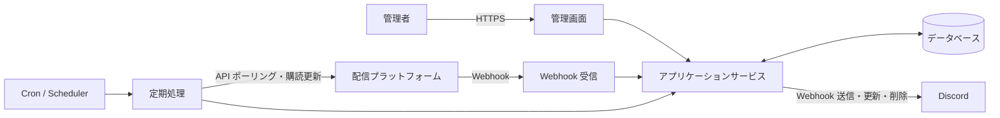

# StreamNotifyBot 基本設計書

## 1. 文書の目的

本書は、[要件定義書](要件定義書.md)を実現するための基本構造と処理境界を示します。未選定のフレームワーク、データベース、キュー製品などに依存しない論理設計とします。

## 2. 設計原則

- 一般的な PHP Web ホスティングと Docker の双方で実行可能にする
- 常駐プロセスを必須とせず、定期処理は Cron 等から起動可能にする
- 配信プラットフォーム固有処理をアダプターとして分離する
- Webhook とポーリングの入力を共通の配信状態へ正規化する
- 外部イベント、定期処理、Discord 通知を冪等にする
- 秘密情報を業務データと分離し、表示、ログ、エクスポートを制限する
- 外部サービスの一時障害がシステム全体へ波及しないよう、処理単位を分離する

## 3. システムコンテキスト



## 4. 論理コンポーネント

| コンポーネント | 責務 |
| --- | --- |
| 管理 UI | 通知先、配信者、アカウント、ポーリング設定、CSV の操作 |
| 認証・認可 | 管理画面へのアクセス制御、セッション管理、CSRF 対策 |
| Webhook Receiver | 検証要求への応答、署名検証、重複排除、イベント受付 |
| Platform Adapter | 識別子解決、購読管理、配信取得、応答の正規化 |
| Stream Service | 配信の登録、状態遷移、追跡期限の判定 |
| Notification Service | Discord 投稿の作成、更新、削除、重複防止 |
| Polling Scheduler | 対象抽出、呼び出し間隔、レート制限、再試行の制御 |
| Subscription Scheduler | Webhook 購読期限の監視と更新 |
| Cleanup Service | 追跡期限を過ぎた配信の通知削除と監視終了 |
| CSV Service | テーブル別の検証、インポート、エクスポート |
| Repository | データベースとの読み書きとトランザクション境界 |
| Secret Store | Webhook URL、API 資格情報などの安全な保管 |

## 5. 推奨レイヤー構成

```text
Presentation
├─ Admin HTTP
├─ Platform Webhook HTTP
└─ CLI / Scheduled Commands

Application
├─ Stream discovery and synchronization
├─ Subscription renewal
├─ Discord notification
├─ Cleanup
└─ CSV import/export

Domain
├─ Streamer and platform account
├─ Stream and status transition
├─ Notification destination
└─ Polling policy

Infrastructure
├─ Database repositories
├─ Platform API adapters
├─ Discord Webhook client
├─ Clock
└─ Logging and secret access
```

フレームワークを採用した場合は、その標準構成を優先しつつ、外部 API とドメイン判断の境界を維持します。

## 6. 主要処理フロー

### 6.1 配信者アカウント登録

1. 管理者がプラットフォーム種別とハンドルまたは Screen ID を入力する
2. 入力形式を検証する
3. 対象の Platform Adapter が API で安定 ID と表示情報を取得する
4. 既存のプラットフォームアカウントとの重複を確認する
5. 配信者へアカウントを関連付けて保存する
6. Webhook 対応プラットフォームの場合、購読を開始する
7. 結果と、失敗時は再実行可能な理由を表示する

保存と外部購読を単一トランザクションにはできないため、購読状態を保持し、失敗した購読だけを後から再試行できるようにします。

### 6.2 Webhook 受信

1. チャレンジ応答など、プラットフォーム固有の検証要求を処理する
2. 署名、タイムスタンプ、検証トークンなどを確認する
3. イベント ID または内容の一意キーで重複を排除する
4. 外部イベントを共通イベントへ正規化する
5. 配信と状態を登録または更新する
6. 必要な Discord 通知処理を実行する
7. ポーリング対象と次回実行時刻を更新する

Webhook の応答時間制限が厳しい場合は、受信記録だけを同期的に行い、後続処理を別の短時間ジョブへ分離します。キューを使えない環境では、データベース上の処理待ちレコードを Cron から処理します。

### 6.3 配信ポーリング

1. `next_poll_at` が現在時刻以前の対象を、上限件数付きで取得する
2. プラットフォームと資格情報単位のレート制限を確認する
3. Platform Adapter から最新情報を取得する
4. 共通状態へ正規化し、保存済み状態との差分を判定する
5. 状態が変化した場合だけ通知へ反映する
6. 状態とポリシーに基づいて次回実行時刻を設定する
7. 配信終了後の追跡期限を超えた場合は、クリーンアップ対象にする

複数の Cron 実行が重なっても同じ対象を同時処理しないよう、ロックまたはリース期限を使用します。

### 6.4 Discord 通知

設計案として、配信と送信先 Webhook の組み合わせごとに Discord メッセージ ID を保存し、同じ投稿を状態に応じて更新します。

1. 配信状態と配信者情報から通知内容を作成する
2. 配信、Webhook、通知種別の一意キーで既存通知を検索する
3. 未送信なら投稿し、Discord メッセージ ID を保存する
4. 送信済みなら、内容に変更がある場合だけ更新する
5. 終了後 1 週間を超えたら投稿を削除し、削除日時を保存する

状態ごとに新規投稿する方針へ変更する場合も、各投稿のメッセージ ID と削除状態を追跡できるデータ構造を維持します。

### 6.5 Webhook 購読更新

1. 有効期限が更新猶予期間内に入った購読を抽出する
2. Platform Adapter を通じて更新または再登録する
3. 新しい有効期限と外部購読 ID を保存する
4. 一時失敗はバックオフ付きで再試行する
5. 認証失敗など管理者対応が必要な場合は、状態をエラーにして記録する

### 6.6 CSV インポート

1. ファイルサイズ、文字コード、ヘッダーを検証する
2. 各行の型、値、参照先、一意性を検証する
3. 更新予定件数とエラーをプレビューする
4. 管理者の確定操作後、定義済みのトランザクション単位で反映する
5. 成功件数、失敗件数、失敗理由を表示する

秘密情報を含むデータの移行は、通常の CSV 機能から分離します。

## 7. 配信状態モデル

プラットフォーム固有状態を、少なくとも次の共通状態へ正規化する案とします。

| 状態 | 意味 | 主な次状態 |
| --- | --- | --- |
| `scheduled` | 配信予定が登録されている | `live`, `ended`, `cancelled` |
| `live` | 配信中 | `ended` |
| `ended` | 配信終了 | 終端状態。ただし情報更新はあり得る |
| `cancelled` | 中止または削除 | 終端状態 |
| `unknown` | 外部状態を確定できない | 任意の確定状態 |

外部イベントは順不同で届く可能性があるため、単純な列挙値の大小では遷移を判定しません。外部サービスの更新時刻、取得時刻、確度、現在状態を用いて判断し、古いイベントで新しい状態を巻き戻さないようにします。

## 8. ポーリング方針

具体的な間隔は未決事項です。実装では、少なくとも次の区分を設定可能にします。

| 区分 | 目的 |
| --- | --- |
| 配信前 | 開始時刻やタイトルなどの変更検知 |
| 開始予定直前 | 開始を低遅延で検知 |
| 配信中 | 終了や情報変更の検知 |
| 配信終了後 1 週間以内 | アーカイブ情報や終了情報の補正 |
| 追跡期限超過 | ポーリング停止と通知削除 |
| エラー時 | エラー種別に応じたバックオフ |

各設定には、API レート制限を超えない最小値と、運用上許容できる最大値を設けます。

## 9. エラー処理

| 分類 | 基本方針 |
| --- | --- |
| 入力エラー | 再試行せず、管理者へ修正可能な内容を表示する |
| 認証・認可エラー | 秘密情報を出さず、管理者対応が必要な状態として記録する |
| レート制限 | `Retry-After` 等を尊重し、次回実行時刻を延期する |
| 一時的な外部障害 | 回数上限と指数バックオフ付きで再試行する |
| 恒久的な外部エラー | 自動再試行を止め、対象単位でエラー状態にする |
| データ競合 | 冪等キーと楽観ロックまたは一意制約で解決する |
| Discord 投稿消失 | 更新・削除時の Not Found を検知し、方針に従って再投稿または削除済みにする |

## 10. ログと監視

ログには、時刻、処理種別、相関 ID、対象プラットフォーム、内部 ID、結果、再試行可否を含めます。

次の値は記録しません。

- Discord Webhook URL
- API キー、アクセストークン、更新トークン
- Cookie、認証ヘッダー、セッション ID
- Webhook の署名用秘密値
- CSV に含まれる未検証の生データ全体

運用上は、購読更新失敗、ポーリングの継続失敗、Discord 送信失敗、クリーンアップ失敗を識別できるようにします。

## 11. セキュリティ境界

- 管理 UI は認証済み管理者だけに公開する
- Webhook Receiver は公開するが、プラットフォーム固有の検証を必須とする
- 定期処理は CLI から起動するか、HTTP 起動の場合は推測不能な URL だけに依存せず強い認証を行う
- 外部 URL をサーバーから取得する処理では、許可ホストと URL スキームを制限する
- 秘密情報は環境変数または専用設定から読み込み、画面ではマスクする
- Discord Webhook URL をデータベースへ保存する場合は、保存時暗号化の採用を検討する

## 12. 配置構成

### 一般的な PHP ホスティング

- 公開ディレクトリには HTTP エントリポイントと必要な静的ファイルだけを配置する
- 設定、ソース、ログ、秘密情報を公開ディレクトリ外に置く
- Cron から購読更新、ポーリング、通知削除などのコマンドを定期実行する

### Docker

- Web 実行環境と同じアプリケーションコードから CLI 定期処理を起動できるようにする
- イメージへ開発用ファイル、秘密情報、実行時データを含めない
- 非 root ユーザー、ヘルスチェック、永続データのマウント先を定義する
- PHP バージョンと拡張機能を固定し、再現可能にする

## 13. テスト方針

- 状態遷移、通知内容、ポーリング間隔は単体テストする
- Platform Adapter と Discord Client は固定レスポンスでテスト可能にする
- Webhook 署名、重複、順序逆転、期限切れイベントを結合テストする
- データベースの一意制約、トランザクション、マイグレーションをテストする
- Cron の重複起動と途中失敗からの再実行をテストする
- CSV の不正形式、大容量、数式注入、参照不整合をテストする
- 実際の外部サービスを使うテストは分離し、秘密情報がない通常のテストで実行しない

## 14. 未決事項

実装開始前に、要件定義書の未決事項に加えて次を決定します。

- データベースを利用したジョブ管理で十分か、専用キューを利用するか
- Discord の通知テンプレートと Embed の構成
- Webhook URL の保存時暗号化方式と鍵管理
- 障害通知の送信先としきい値
- 外部 API のページネーションと初回同期範囲
- 配信や通知を物理削除するか、履歴として論理削除するか

## 15. 関連文書

- [要件定義書](要件定義書.md)
- [データ設計書](データ設計書.md)
- [初期構想メモ](../やりたいこと.md)
